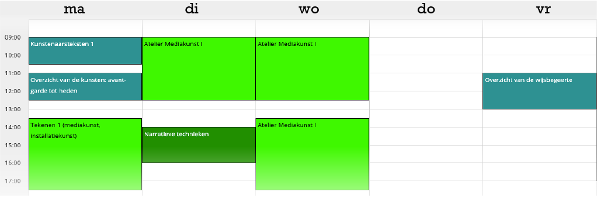
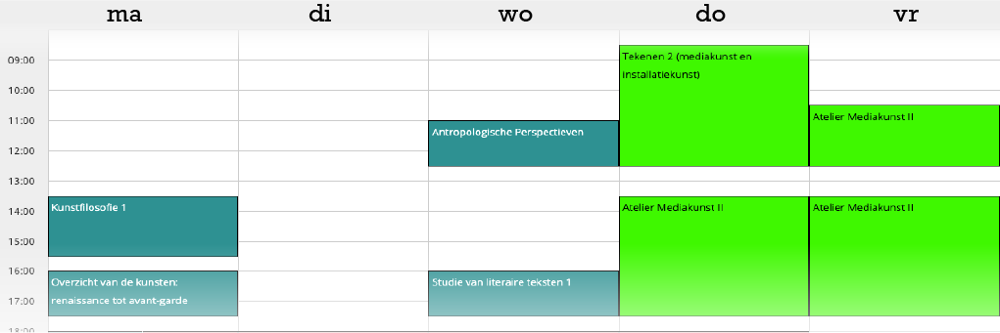
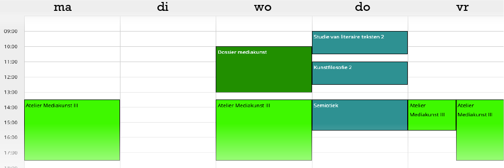
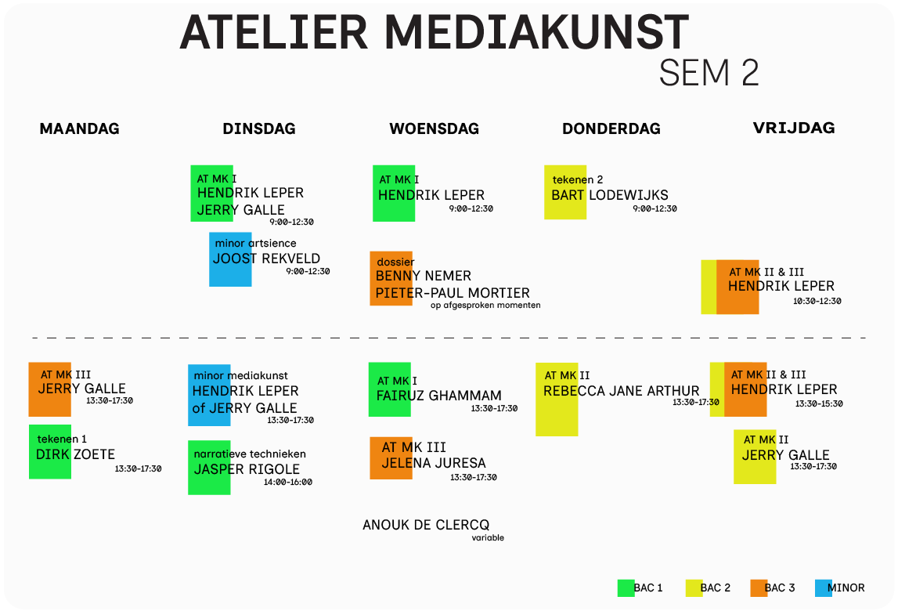

# PROGRAMMA & ROOSTER
[toc]

Het volledige **studieprogramma** van de **Bachelor Mediakunst** en **Master Vrije Kunsten** kan je makkelijk bekijken op [de website van de School of Arts](https://schoolofartsgent.be/studeren/opleidingen/mediakunst) (onderaan de pagina).

## Lessenrooster

<a class="exclude" href="https://hogent.asimut.net/public/" target=_blank>ASIMUT LOGIN</a> 📃 <a class="exclude"  href="https://schoolofartsgent.be/uploads/images/Asimut_gebruikershandleiding.pdf" target=_blank> Asimut handleiding</a>

## Modelweek rooster

#### BA1

#### BA2

#### BA3

## Atelierrooster

## Studiefiches

<a class="exclude" href="https://www.hogent.be/studiefiches/" target=_blank>Studiefiches HoGent</a>

 

  <article class="col-span-1">
    <h4>BA1</h4>
    <ul>
      <li><a href="https://bamaflexweb.hogent.be/BMFUIDetailxOLOD.aspx?a=196438&b=5&c=1">Atelier mediakunst I</a></li>
      <li><a href="https://bamaflexweb.hogent.be/BMFUIDetailxOLOD.aspx?a=196254&b=5&c=1">Atelier narratieve technieken</a></li>
      <li><a href="https://bamaflexweb.hogent.be/BMFUIDetailxOLOD.aspx?a=196354&b=5&c=1">Tekenen 1</a></li>
      <li><a href="https://bamaflexweb.hogent.be/BMFUIDetailxOLOD.aspx?a=196289&b=5&c=1">Theorie van de Mediakunst</a></li>
    </ul>
  </article>

  <article class="col-span-1">
    <h4>BA2</h4>
    <ul>
      <li><a href="https://bamaflexweb.hogent.be/BMFUIDetailxOLOD.aspx?a=196439&b=5&c=1">Atelier mediakunst II</a></li>
      <li><a href="https://bamaflexweb.hogent.be/BMFUIDetailxOLOD.aspx?a=196355&b=5&c=1">Tekenen 2</a> (zie ook hieronder)</li>
      <li><a href="https://bamaflexweb.hogent.be/BMFUIDetailxOLOD.aspx?a=196400&b=5&c=1">Film als compositie</a></li>
      <li><a href="https://bamaflexweb.hogent.be/BMFUIDetailxOLOD.aspx?a=196287&b=5&c=1">Theorie en Actualiteit van de Mediakunst</a></li>
    </ul>
  </article>

  <article class="col-span-1">
    <h4>BA3</h4>
    <ul>
      <li><a href="https://bamaflexweb.hogent.be/BMFUIDetailxOLOD.aspx?a=196440&b=5&c=1">Atelier mediakunst III</a></li>
      <li><a href="https://bamaflexweb.hogent.be/BMFUIDetailxOLOD.aspx?a=196265&b=5&c=1">Dossier</a></li>
    </ul>
  </article>

  <article class="col-span-1">
    <h4>Master Vrije Kunsten</h4>
    <ul>
      <li><a href="https://bamaflexweb.hogent.be/BMFUIDetailxOLOD.aspx?a=196858&b=5&c=1">Masterproef vrije kunsten</a></li>
      <li><a href="https://bamaflexweb.hogent.be/BMFUIDetailxOLOD.aspx?a=196739&b=5&c=1">Scriptie vrije kunsten</a></li>
      <li><a href="https://bamaflexweb.hogent.be/BMFUIDetailxOLOD.aspx?a=196746&b=5&c=1">Masterclass vrije kunsten</a></li>
    </ul>
  </article>

 

## BA2 Tekenen 2 en alternatieven
Sinds enkele jaren is Tekenen 2 geen verplicht vak meer .... [lees hier verder](../03.programma/ba2tekenenplus/)
