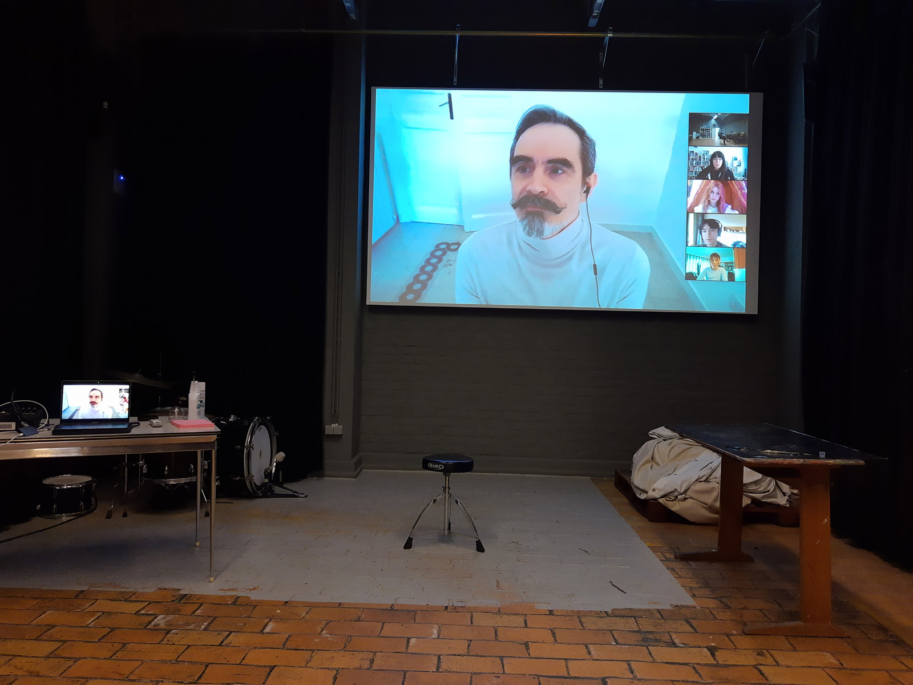
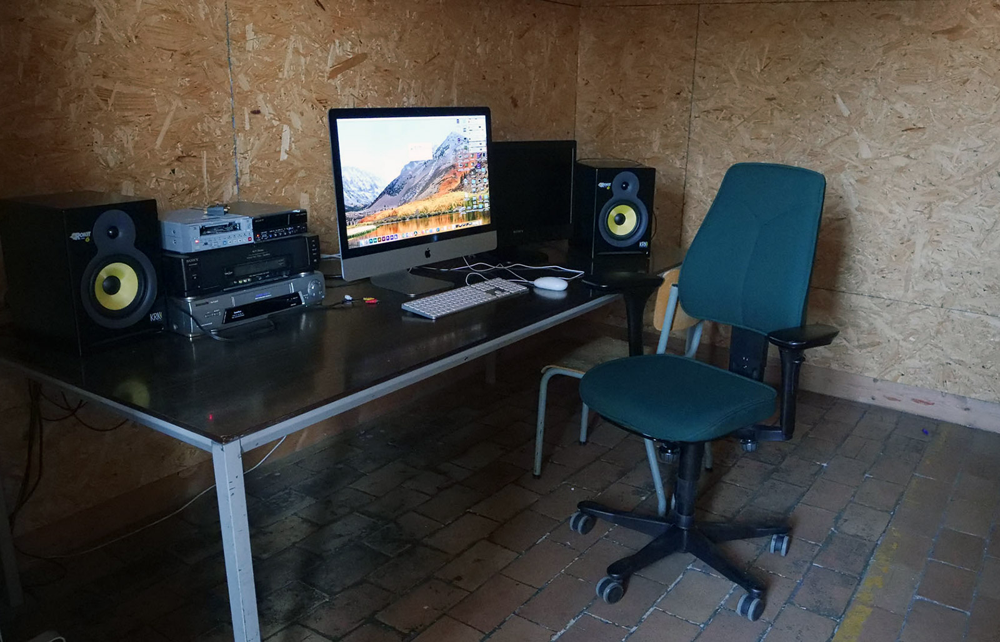
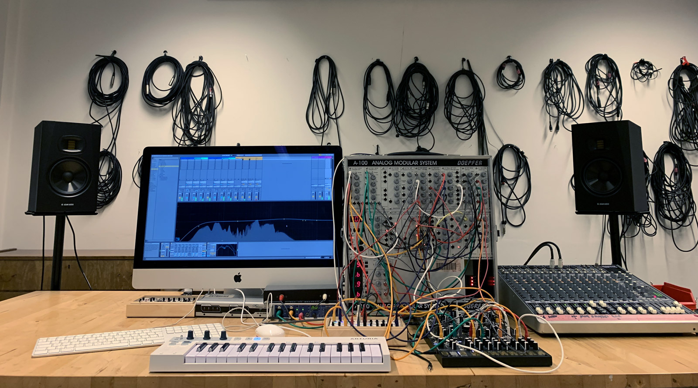
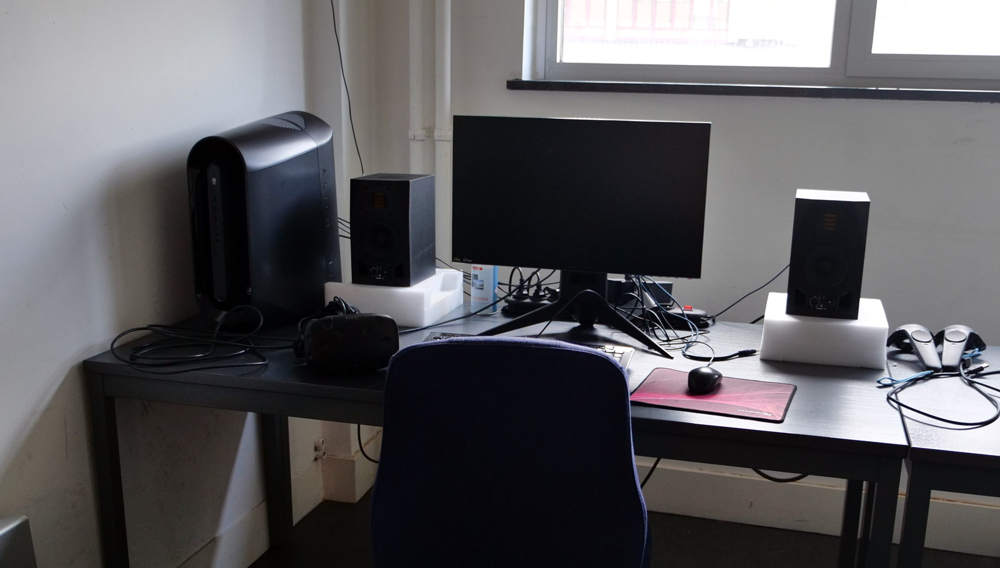
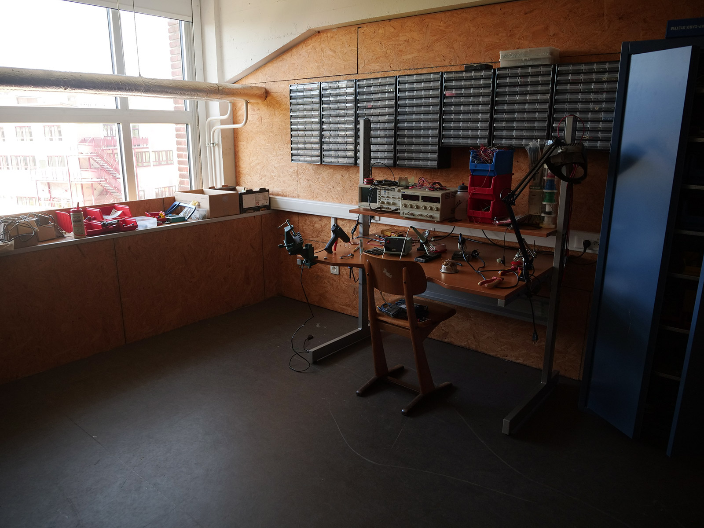

# SPECIFIEKE WERKRUIMTES
[toc]
## Blackbox

De Blackbox is een polyvalente ruimte die gebruikt wordt voor screenings, lezingen, groepsgesprekken en atelier specifieke theorielessen. Studenten kunnen in deze plek ook opstellingen en performances oefenen en brengen, opnames maken, etc.

**Afmetingen**: ±11 bij 6 meter en 5,5 meter hoog. Er is een technisch grid voorzien waardoor makkelijk licht en andere zaken opgehangen kunnen worden.    
De ruimte is akoestische geoptimaliseerd met absorberende panelen en gordijnen.    
**video**: [Panasonic PT-RZ470E](https://eww.pavc.panasonic.co.jp/projector/extranet/main/previous/rz470/index.html) projector (led/Laser DLP-projector)    
**geluid**: [Yamaha STAGEPAS 400BT](https://nl.yamaha.com/nl/products/proaudio/pa_systems/stagepas_400bt_600bt/index.html) PA systeem (2 x 200watt, 8-channel mixer, Bluetooth, ...)    
**licht**: dimbare TL lampen & puntspot op spreker via schakelaar (Q1)    
**ladder**: platformladder

## Videomontage

De Videomontage ruimte is uitgerust met een krachtige Apple computer, een 2e beeldscherm en studiomonitors. Qua software is er zowel een pakket van Adobe met recente versies van Premiere Pro en After Effects geïnstalleerd als Apple Final Cut Pro en DaVinci Resolve van Blackmagic.    
Er is ook een oude iMac beschikbaar voor de digitalisatie van MiniDV tapes en VHS.

**Computer**: Apple Mac Studio (M4 Max-chip met 16‑core CPU, 40‑core GPU, 16‑core Neural Engine
64GB centraal geheugen, 2TB SSD‑opslag) met Benq 27 inch monitor 
`user: schoolofarts – psw: 1111`  
**Tweede scherm**: Sony (type ??)  
**Geluid**: Adam Audio T7V studio monitors

## Audio lab

De audio werkplaats uitgerust met een Apple iMac computer, [quadrofonisch luidspreker opstelling](https://en.wikipedia.org/wiki/Quadraphonic_sound), een analoge synth van Doepfer en enkele andere losse modules. Qua software is er Ableton Live, Adobe Audition, Reaper & Max geïnstalleerd.

**Computer**: Apple iMac 27" (AZERTY toetsenbord) + RME Fireface geluidskaart  
`user: schoolofarts – psw: 1111`  
**Geluid**: Quadrofonische opstelling met 4 Adam T7V studio monitors, Adam T10 subwoofer, Mackie mixer  
**Instrumenten**:     
- [Doepfer A-100](https://doepfer.de/a100e.htm) modulair eurosysteem 
- [Make Noise O-CTRL](https://www.makenoisemusic.com/synthesizers-and-controllers/0-ctrl/) step-sequencer & [Strega](https://www.makenoisemusic.com/synthesizers-and-controllers/strega/) experimentele analoge *alchemy* synthesizer
- [Behringer Neutron](https://www.behringer.com/en/products/0718-AAB) semi-modulaire analoge synthesizer (rauwe klank)
- [Behringer Pro-800](https://www.behringer.com/en/products/0718-ABF) achtstemmige polyfone analoge synthesizer (vintage jaren '80-klank)
- [Field Kits van Koma Elektronik](https://koma-elektronik.com/?product=field-kit) electro-akoestisch instrument dat alledaagse objecten en omgevingsgeluiden omzet in muziek door middel van contactmicrofoons, motoren en sensoren
- [Walrus Qi Etherealizer](https://www.walrusaudio.com/products/qi-etherealizer?variant=46729400451307) a multi-effects pedaal    
**Amp**: [Roland KC-80](https://www.roland.com/nl/products/kc-80/) 3 kanaals keyboard versterker      
**Mic**: [Neumann TLM 102](https://www.neumann.com/en-us/products/microphones/tlm-102) studio opname set met een compacte grootmembraan condensatormicrofoon. Staat bekend om zijn kristalheldere geluid en hoge geluidsdrukbestendigheid, dus ideaal voor zowel stemopnames en luide instrumenten. Heeft +48 V phantom power nodig.     

**Software licenties**: Max & RNBO op iLok usb key, TouchDesigner & Ableton Live Suite 12.

## VR lab

Blender, Unity, Unreal, Adobe Premiere Pro en After Effects

**Computer**: Windows PC (AMD Ryzen 9 9950X 16C 32T, 64Gb Ram, GeForce RTX 5080 grafische kaart, ...) 
`user: schoolofarts – psw: 1111`  
**Geluid**: Adam studio monitors    

**Computer**: Windows PC Dell Alienware Aurora R10 (AMD Ryzen 9 5900X 12C, 32Gb Ram, NVIDIA® GeForce RTX™ 3090 24Gb grafische kaart, AZERTY toetsenbord)     
`user: schoolofarts – psw: 1111`  
**VR headsets**: HTC Vive & Meta Quest 2   

## Elektronica Lab   

Arduino's, Raspberry Pi's 3B en 400, Pico    
Verschillende sensoren, motoren, etc

