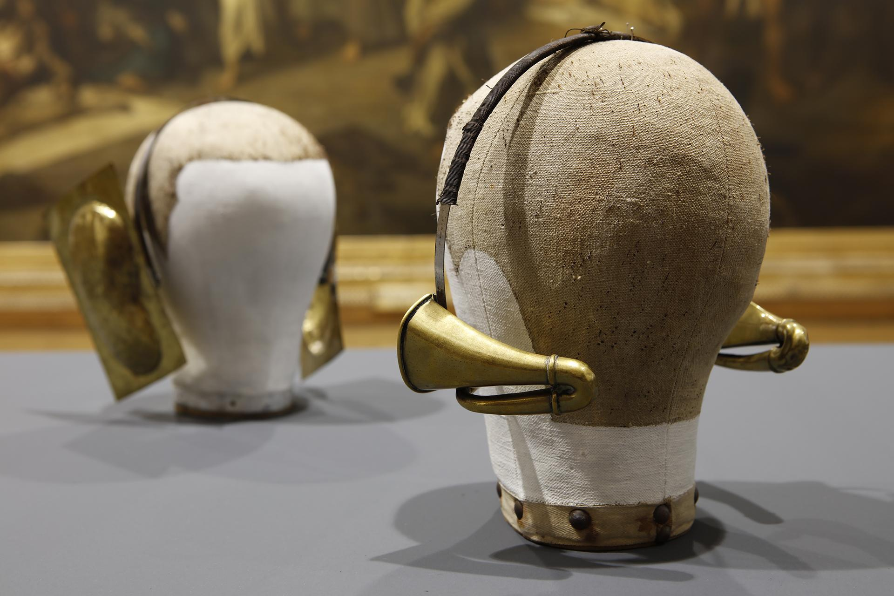

# SOUND && MUSIC

*Keywords: listening, fieldrecording, sound editing, soundscapes, sound art, …*    
*Tools: ears, recording devices, microphones, DAW software, speakers & headphones, …*    
[toc]

Baudouin Oosterlynck - instrument d’écoute 

    <h2>EARCLEANING & FIELD RECORDING</h2>
    
Hand-outs:
        <a href="sound-music/earcleaning-deeplistening.pdf" target="_blank">From Earcleaning to Deep Listening</a> &
        <a href="sound-music/field-recording-gear.pdf" target="_blank">Field Recording Gear</a>
    

    
<strong>Oefening tegen volgende week. Maak veldopnames!</strong> 
        Verzamel een 10-tal verschillende geluiden uit één ruimte (binnen) of locatie (buiten). Ga op zoek naar geluiden die variëren in dynamiek, textuur, amplitude (volume) en duur. Geef de geluiden een naam en breng ze mee volgende week voor de montage les. We starten met naar een paar opnames te luisteren.
    

    <h2>LISTENING & AUDIO EDITING</h2>
    
Hand-out: <a href="sound-music/geschiedenis-audio-field-recording.pdf" target="_blank">Fieldrecording: Brief History</a> 
        Film: <a href="https://kaskfilms.be/underneath-it-flickers/" target="_blank">underneath it flickers</a> van Lau Persyn.
    
Samen enkele opnames beluisteren 
        <a href="sound-music/audition-intro.pdf" target="_blank">Introductie Adobe Audition</a> - Edit & Master Field Recordings: overview of the UI, editing basics, EQ, effects & export.
    

    
<strong>Meebrengen:</strong> 
        - een goede (bij voorkeur gesloten) hoofdtelefoon (oortjes zijn ook OK maar minder optimaal) 
        - computer met Adobe Audition geinstalleerd
    

    <h2>SOUNDSCAPING</h2>
    

        Ableton in session & arragement view 
        Generative composition tools, Midi & synths, Live input
    

    

    
<strong>Meebrengen:</strong> 
        - opnieuw hoofdtelefoon en computer met Adobe bleton Live (11 of 12, Lite of Intro of Standard of Suite)
    

    <h2>Opdracht</h2>
    <h4>Maak een soundscape bij een gevonden beeld</h4>
    
 Kies één foto uit het aanbod en gebruik die als basis voor een klankband. Start met een natuurlijke soundscape die aansluit bij het beeld. Laat de sfeer geleidelijk veranderen, subtiel of juist volledig contrasterend. Combineer beeld en geluid tot één video van maximaal 3 minuten.

    
Voor de soundscape werk je in Ableton Live. Om beeld en geluid samen te brengen gebruik je Première Pro (of andere video montage software).

    
Voor de klankband werk je met minstens 50% eigen opnames.

    <h2>Tips voor field recordings:</h2>
    <ol>
        <li>Luister. Neem even de tijd om naar de ruimte te luisteren zonder op te nemen.</li>
        <li>Stel opniveaus zorgvuldig in. Richt op piekniveaus rond -12 dB en observeer minstens 30 seconden.</li>
        <li>Neem op in hoogwaardig formaat. Gebruik 24 bit WAV of AIF met een samplefrequentie van 44,1 kHz (of 48 kHz voor video).</li>
        <li>Vermijd gecomprimeerde formaten (zoals MP3), tenzij kwaliteit echt niet cruciaal is of je lange opnames nodig hebt.</li>
        <li>Zet automatische niveauregeling uit (‘ALC’ of ‘AGC’) om dynamiek te behouden.</li>
        <li>Monitor tijdens het opnemen. Houd je koptelefoon op om problemen zoals clipping of windgeluid op te merken.</li>
        <li>Laat niveaus met rust. Als het niveau 0 dB bereikt, verlaag het dan eenmalig.</li>
        <li>Neem op in stereo voor een beter gevoel van ruimte, tenzij je specifieke geluidsbronnen, als bijv. een stem, wilt vastleggen (dan is mono mogelijk geschikter).</li>
        <li>Neem minstens drie minuten op, liefst vijf. Dit voorkomt dat je belangrijke momenten mist.</li>
        <li>Maak verschillende opnames van dezelfde situatie, met de microfoon dichtbij en veraf.</li>
        <li>Investeer in een goede hoofdtelefoon.</li>
        <li>Verminder windgeluid met: 
            - Geschikte windbescherming (donzige versies, niet de gewone foam). 
            - Beschutting zoeken of je lichaam in de wind plaatsen. 
            - Laag zitten om windsnelheid te verminderen. 
            - Omnidirectionele microfoons gebruiken. 
        <li>Vermijd handling noise door tussen het opname toestel en je hand een shock mount te plaatsen.</li>
        <li>Zet je mobiele telefoon uit tijdens het opnemen, niet op stil.</li>
    </ol>

    <h2>Bronnen met field recordings & sound effects:</h2>
    <ul>
        <li> <a href="https://freesound.org/" target="_blank">freesound.org</a> is a huge collaborative database of audio snippets, samples, recordings, bleeps, ... released under Creative Commons licenses</li>
        <li> <a href="https://aporee.org/maps/" target="_blank">aporee.org</a> is a global soundmap dedicated to field recording, phonography and the art of listening. it connects sound recordings to its places of origin, in order to create a sonic cartography</li>
        <li> <a href="https://elphnt.io/store/field/" target="_blank">field by elphnt.io</a> is a curated collection of field recordings, drone, noise and texture samples</li>
        <li><a href="https://sound-effects.bbcrewind.co.uk/" target="_blank">BBC Sound Effects library</a> is a collection of over 16,000 sounds from the BBC’s rich archive, available for personal, educational, and research purposes</li>
        <li><a href="https://www.freesfx.co.uk/" target="_blank">freesfx.co.uk</a> is a free Sound Effects and Music </li>
        <li> <a href="https://www.zapsplat.com/" target="_blank">zapsplat.com</a> a library of free sound effects downloads</li>
        <li> <a href="https://samplefocus.com/tag/field-recordings" target="_blank">samplefocus.com</a> is a community uploaded and curated sample library</li>
        <ul>

