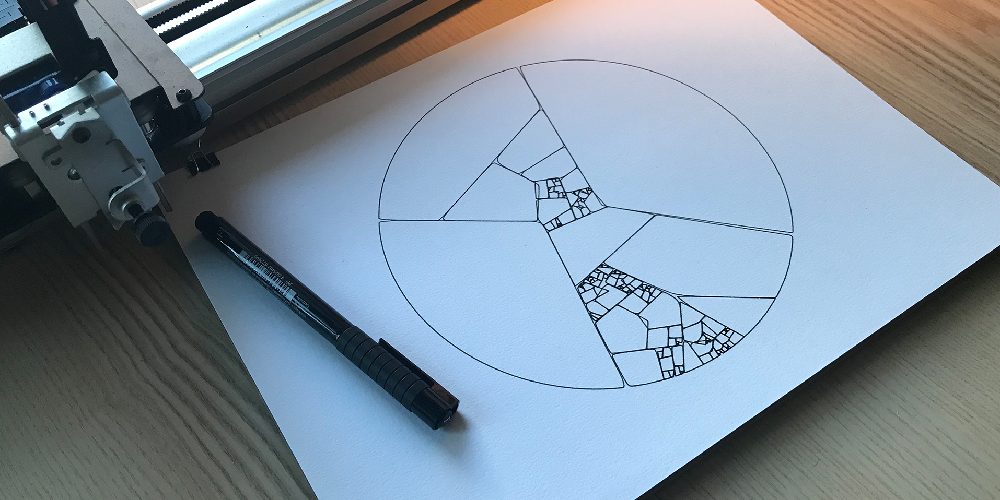

# GENERATIVE || SCRIPTED

*Keywords: screenbased, digital born images, AI, moving image, 3D, …* 
*tools: code editors, processing, P5JS, AI tools or platforms as ChatGPT, DALL·E, Midjourney, Stable Diffusion, runway ml, axidraw, UR10 robot arm, …*  

**Kunst tussen controle en chaos**    
In hedendaagse kunst verwijst **scripted** naar werken die ontstaan vanuit een vooraf bepaald concept of plan. Denk aan een kunstenaar die een concept uitschrijft en het werk exact volgens dat plan uitvoert. **Generative kunst** daarentegen laat ruimte voor systemen die zichzelf ontwikkelen als algoritmes, AI, natuurlijke processen, maar ook publieksparticipatie, toevalligheden om het werk mee vorm te geven. Hier is de kunstenaar eerder een initiator dan een regisseur. Het kunstwerk leeft, groeit en verrast.

[toc]

patchwork plot by Matt DesLauriers

  <h2>PEN PLOTTER</h2>
  
Hand-out: <a href="generative-scripted/generativescripted_theory.pdf" target="_blank">Generative || scripted context</a> - een korte inleiding
 
  
<a href="generative-scripted/plotter/" target="_blank">pen plotter fun</a> - een handleiding in het werken met tekenrobots

  
<strong>Meebrengen:</strong> 
   - computer

  <h2>P5.JS</h2>
  
Hand-out: <a href="generative-scripted/p5js.pdf" target="_blank"> p5js ▲■●</a> - eerste stappen in code & <a href="https://editor.p5js.org/hendrikleper/collections/HyPmDVNJf" target="_blank"> p5.js oefenfiles</a> (hier wordt ook naar verwezen in de pdf)

  
<strong>Meebrengen:</strong> 
  - computer

  <h2>AI</h2>
  
<a href="generative-scripted/AI_theory.pdf">AI reader</a> met verwijzingen naar platforms, kunstenaars, geschiedenis, kritiek, ... 

  
<strong>Meebrengen:</strong> 
  - computer

  <h2>Geschiedenis van Generative & Computer art</h2>
  <ul>
    <li><a href="https://timeline.lerandom.art/">Generative Art Timeline</a> Ontdek de 70.000-jarige geschiedenis van generatieve kunst door middel van honderden mijlpalen en tien hoofdstukken (door Peter Bauman)</li>
    <li><a href="https://computer-grrrls.gaite-lyrique.net/">Computer Grrrls</a> Women & machines timeline door Marie Lechner &amp; Inke Arns</li>
    <li><a href="https://www.rightclicksave.com/article/a-longer-history-of-generative-art">A Longer History of Generative Art</a> Nick Lambert, een van 's werelds meest vooraanstaande wetenschappers op het gebied van computerkunst, schetst de geschiedenis van generatieve esthetiek tot aan NFT's.</li>
  </ul>

