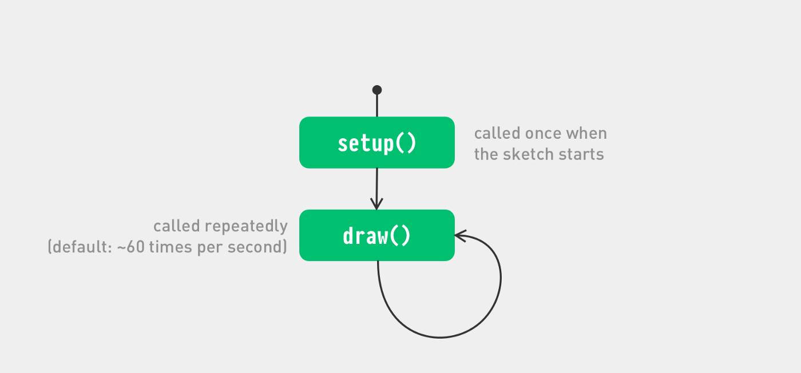
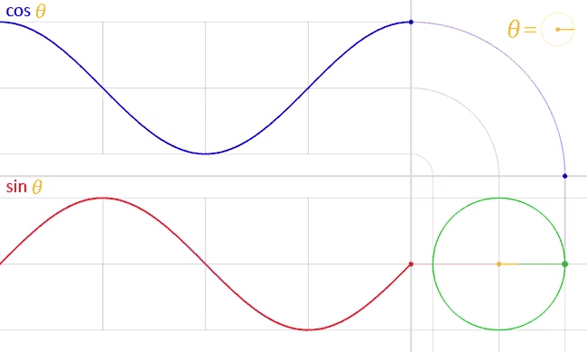

# P5.JS • Movement, Expressions, Variables, Random, Linear & Circular Motion
<a id="markdown-p5.js-%E2%80%A2-movement%2C-expressions%2C-variables%2C-random%2C-linear-%26-circular-motion" name="p5.js-%E2%80%A2-movement%2C-expressions%2C-variables%2C-random%2C-linear-%26-circular-motion"></a>


<!-- TOC depthfrom:2 depthto:2 insertanchor:true -->

- [Putting things in motion](#putting-things-in-motion)
- [Expressions or math](#expressions-or-math)
- [Variables](#variables)
- [Random](#random)
- [Linear Motion](#linear-motion)
- [Circular Motion](#circular-motion)

<!-- /TOC -->

☝︎ [home](../)
☞ next chapter: [Conditionals & Loops](../03/conditionals-loops.md)

## Putting things in motion
<a id="markdown-putting-things-in-motion" name="putting-things-in-motion"></a>
Up until now, our sketches have been pretty…static, but we’re about to change that! 
In this section, we’re going to explore how to add animation to our sketches. 

This moment is also the right time to talk about the two two distinct parts, so-called function blocks: `function setup()` and `function draw()` that shape our scripts. A function block is a way of chunking a group of commands together.

The `setup()` function is called once when the program starts. It’s used to define initial environment properties such as screen size and background color and to load media such as images and fonts as the program starts.

The `draw()` function continuously executes the lines of code contained inside its block until the program is stopped. 

There can only be one setup() and one draw() function for each program.

    
<sub>diagram of the lifecycle of a p5.js sketch</sub>

Let try this! Copy the following code.
```JavaScript
function setup() {
  createCanvas(400, 400);
  background(255, 175, 204);
}

function draw() {
  fill(50, 128);
  noStroke();
  ellipse(mouseX,mouseY,30,30)
  if (mouseIsPressed) {
    background(0);
  }
}
```
The program creates a canvas and starts drawing gray semi-transparent circles at the position of the mouse. When a mouse button is pressed the canvas is erased and you can start allover.

More information about the mouseX, mouseY and the if-block will follow in the second part of this tutorial. But it is no rocket-science to understand their function in the program. 

Notice also that the background function has moved to the setup function. Can you guess what would happen if it is called from within the draw() function?

Additionally you can set the speed with which draw() is called by using the [`frameRate()`](https://p5js.org/reference/p5/frameRate) function. If you give it a number (12, 24, 25, and 30 are typical), it will attempt to maintain that rate, calling draw() regularly. The default frame rate is based on the frame rate of the display (here also called "refresh rate"), which is set to 60 frames per second on most computers.

There are two other function blocks that I'll mention now but come back to later: 
`mousePressed()`& `preload()`.


## Expressions (or math)
<a id="markdown-expressions-or-math" name="expressions-or-math"></a>
An expression is a way to make a new value by combining other values with mathematical operators. This is incredibly useful.

#### the p5.js calculator
```JavaScript
console.log(1 + 1);
console.log(0 - 1);
console.log(1 * 0.01);
console.log(1 / 2);
```
`console.log` (or `print`) is a function that prints a message to your browser's web console as seen in previous chapter.

#### a more exciting visual example

```JavaScript
function setup() {
  createCanvas(400, 300);
  stroke(0);
  strokeWeight(3);
  background(255, 175, 204);
  noFill();
  rectMode(CENTER);
  rect(width/2, height*0.5, 200, 200);
  ellipse(width/2, height*0.5, 200, 200);
  triangle(width/2, 50, width-113, 200, 113, 200);
}
```
Note:

- Everything happens in the `setup()` function as we don't need to write this over and over. Just once is fine.
- The 'width' and 'height' variables contain the width and height of the display window as set in the createCanvas() function. If we change the canvas size we don't have to change all the shape drawing functions.
- `rectMode(CENTER)` is far more handy here than the default `rectMode(DEFAULT`. 
- /2 is actually the same *0.5

####  Common Mathematical Operators  are:
| Character | Operator |
| :-: | --- |
| +	| Addition |
| -	| Subtraction |
| *	| Multiplication |
| /	| Division |
| = |	Assignment |


####  Yet there are some rules to remember:
- The order of operations matters, [the PEMDAS rule](https://en.wikipedia.org/wiki/Order_of_operations). 3+2&ast;3 will yield 9. If you want it to result 15 you must write it as (3+2)*3. 
- You can not use **x** as a symbol for multiplication. x is a letter and will be viewed by p5.js as a variable.
- An equals sign works a bit differently than it does in math class. It is used to assign a value to a variable. More on this soon.


## Variables
<a id="markdown-variables" name="variables"></a>

Now that you have an understanding of values and expressions, we can tackle one of the most powerful concepts in computer programming: **variables**.

A variable stores a value **in memory** so that it can be used later in a program. The variable can be used many times within a single program, and the value is easily changed while the program is running.    

A variable declaration has the following format:
- the keyword let (var is possible too), followed by
- the name of the variable (you get to pick this!), followed by
- an equals sign (=), followed by
- a value you want to “assign” to the variable. 

**The name** is what you decide to call the variable. Choose a name that is informative about what the variable stores, but be consistent, not too criptical nor  too verbose. For instance, the variable name 'radius' will be clearer than 'r' when you look at the code later.

When declaring a variable in processing (that is Java and not Javascript as p5.js) you also need to specify its **data type**, which indicates what kind of information is being stored. The most common data types are: integers (whole numbers), floating-point (decimal) numbers, booleans (true or false), characters, words or strings, and so on. In p5.js you **do not need to do this**. This is actually handy but can also be confusing as you still need to know what kinds of variables there are and how they work. 

To make things even confusing there are two words we can use to set a variable, **"let"** and **"var"**. The difference between them is in their 'scope'. But mostly both will work. Let is newer, and will probably become the standard, so let's use let. If you want to learn about the difference check [this video](https://www.youtube.com/watch?v=q8SHaDQdul0).

Declaring the variable before the setup area means the variable is **'global'** and accessible throughout the entire sketch. If you create a variable inside of setup(), you can’t use it inside of draw() and vice versa. A variable within a function block is only available within that block, thus is **'local'**. It’s good practice to do this if a variable is only needed within a single function. 

#### 9 vertical lines
```JavaScript
let yTop = 20;
let yBottom = 180;

function setup() {
  createCanvas(400, 200);
}

function draw() {
  background(255, 175, 204);
  line(100, yTop, 100, yBottom);
  line(125, yTop, 125, yBottom);
  line(150, yTop, 150, yBottom);
  line(175, yTop, 175, yBottom);
  line(200, yTop, 200, yBottom);
  line(225, yTop, 225, yBottom);
  line(250, yTop, 250, yBottom);
  line(275, yTop, 275, yBottom);
  line(300, yTop, 300, yBottom);
}
```
The real power of variables is that you can use them in any context that you would normally need to write a value. This means that you can use variables in expressions. The example above can be adapted as followed.

#### 9 vertical lines with more variables
```JavaScript
let xPos = 100;
let xStep = 25;
let yTop = 20;
let yBottom = 180;

function setup() {
  createCanvas(400, 200);
}

function draw() {
  background(255, 175, 204);
  line(xPos + (xStep * 0), yTop, xPos + (xStep * 0), yBottom);
  line(xPos + (xStep * 1), yTop, xPos + (xStep * 1), yBottom);
  line(xPos + (xStep * 2), yTop, xPos + (xStep * 2), yBottom);
  line(xPos + (xStep * 3), yTop, xPos + (xStep * 3), yBottom);
  line(xPos + (xStep * 4), yTop, xPos + (xStep * 4), yBottom);
  line(xPos + (xStep * 5), yTop, xPos + (xStep * 5), yBottom);
  line(xPos + (xStep * 6), yTop, xPos + (xStep * 6), yBottom);
  line(xPos + (xStep * 7), yTop, xPos + (xStep * 7), yBottom);
  line(xPos + (xStep * 8), yTop, xPos + (xStep * 8), yBottom);
}
```
There is actually a way to more compactly express this set of instructions with **a loop**. More on that later. First we will add some randomness to our drawing and set our sketch in motion.

## Random
<a id="markdown-random" name="random"></a>
Unlike the smooth, linear motion common to computer graphics, motion in the physical world is usually idiosyncratic. We can simulate the unpredictable qualities of the world by generating random numbers. The [`random()`](https://p5js.org/reference/#/p5/random) function calculates these values and we can set a range to tune the amount of disarray in a program.    

The following short example prints random values to the console, with the range limited by the x position (on the horizontal axis) of the mouse. The `random()` function always returns a floating-point value.

```JavaScript
function draw() {
  let r = random(0, mouseX);
  console.log(r);
}
```

#### Random Dots
```JavaScript
let x, y;  // create two variables x, y for position

function setup() {
  createCanvas(400, 400);
  background(0);
  noStroke();
}

function draw() {
  fill(255, 120, 0, 250);
  x = random(0, width);
  y = random(0, height);
  ellipse(x, y, 15, 15);
  filter(BLUR, 1);
}
```
note:

- `let x, y;` is a shorthand notation for     
`let x;     
let y;` 
- The filter BLUR executes a Gaussian blur, the parameter 1 specifies the intensity of the filter. You might have seen the framerate drop to 5 frames/sec or so. This is a CPU intensive operation. Try `background(0, 5);` at the top of the draw loop instead. 

#### back to our 9 lines in the wind
```JavaScript
let xPos = 100;
let xStep = 25;
let yTop = 20;
let yBottom = 180;
let wind = 5;

function setup() {
  createCanvas(400, 200);
}

function draw() {
  background(255, 175, 204);
  line(xPos + (xStep * 0)+random(-wind,wind), yTop, xPos + (xStep * 0), yBottom);
  line(xPos + (xStep * 1)+random(-wind,wind), yTop, xPos + (xStep * 1), yBottom);
  line(xPos + (xStep * 2)+random(-wind,wind), yTop, xPos + (xStep * 2), yBottom);
  line(xPos + (xStep * 3)+random(-wind,wind), yTop, xPos + (xStep * 3), yBottom);
  line(xPos + (xStep * 4)+random(-wind,wind), yTop, xPos + (xStep * 4), yBottom);
  line(xPos + (xStep * 5)+random(-wind,wind), yTop, xPos + (xStep * 5), yBottom);
  line(xPos + (xStep * 6)+random(-wind,wind), yTop, xPos + (xStep * 6), yBottom);
  line(xPos + (xStep * 7)+random(-wind,wind), yTop, xPos + (xStep * 7), yBottom);
  line(xPos + (xStep * 8)+random(-wind,wind), yTop, xPos + (xStep * 8), yBottom);
}
```
Adding the line `wind = mouseX/20;` in our draw loop will make the random range restricted from 0 to 20 (400/20) depending on the x position of the mouse.

Note: There is actually a nicer, less machine-like, random function, [`noise()`](https://p5js.org/reference/#/p5/noise) form Perlin noise. It produces a more naturally ordered, harmonic succession of numbers. It was invented by Ken Perlin in the 1980s and been used since in graphical applications to produce procedural textures, natural motion, shapes, terrains etc. See also https://genekogan.com/code/p5js-perlin-noise/


## Linear Motion
<a id="markdown-linear-motion" name="linear-motion"></a>
We have seen that code inside the `draw()` function is called on every program cycle repeatedly and we can set the speed with the `frameRate()` function. 

Well, another power of using variables is we can change them on every cycle. 

#### our line on the move
```javaScript
let xPos = 100;
let xStep = 5;
let yTop = 20;
let yBottom = 180;

function setup() {
  createCanvas(400, 200);
  frameRate(10);
}

function draw() {
  background(255, 175, 204);
  line(xPos, yTop, xPos, yBottom);
  xPos += xStep;
}
```

When you run this you’ll see the line move from left to right. It's position on the x axis is kept in a variable as well as the step (or step size) by which it moves. The draw loop draws the line, and increases the x position by 5. 

Try to change xStep variable smaller if you want to slow the movement down. You can also make it a floating point number, eg. 0.05 

It would be good if we could prevent the line from moving into infinity. Wouldn't it? With conditionals in the next chapter we can.

Note:

- `xPos += xStep;` is actually a shorthand notation of `xPos = xPos + xStep;`
- Even so is writing `a++` equivalent to `a = a + 1` and writing `a--`  equivalent to `a = a - 1`.

## Circular Motion
<a id="markdown-circular-motion" name="circular-motion"></a>
Circular motion is a movement in which an object travels along the circumference of a circle. However, this simple movement has much more beauty in it than it might seem. We will only lift a tip of the veil of a very fascinating domain including [Simple Harmonic Motion](https://en.wikipedia.org/wiki/Simple_harmonic_motion). Think about the swing of a pendulum, a weight that swings up and down on a spring.

Working with circular motion requires [a little bit of trigonometry knowledge](https://processing.org/tutorials/trig/) but we will limit this to the sine / [`sin()`](https://p5js.org/reference/#/p5/sin) and cosine / [`cos()`](https://p5js.org/reference/#/p5/cos) functions and their relationship. 

Sine and Cosine? Basically, if you were to move around the perimeter of a circle, your horizontal position would trace out a cosine function while your vertical position would trace out a sine. 



#### How do angles work in p5.js 
Angles are set in radians rather than degrees. Radians are angle measurements based on the value of pi (3.14159).

A full circle is 360 DEGREES, which is equal to TWO_PI (2π) in RADIANS.
furthermore 45° = QUARTER_PI, 90° = HALF_PI and 180° = PI
See [this chart on the conversion between degrees and radians](https://en.wikipedia.org/wiki/Radian#/media/File:Degree-Radian_Conversion.svg)

If you prefer to use degree measurements, you ca convert to radians using the [`radians()`](https://p5js.org/reference/#/p5/radians) function or use the [`angleMode(DEGREES)`](https://p5js.org/reference/#/p5/angleMode) function.

#### Sine and Cosine

Using sin(angle) * radius, we can calculate the x coordinate of a point on the circumference of a circle.
Using cos(angle) * radius, we can calculate the y coordinate of the same point.

As a result, sine and cosine are two numbers that oscillate between 1 and -1 according to angle change.

```javaScript
let radius;
let angle = 0;
let speed = 0.05;
let xOffset, yOffset;

function setup() {
  createCanvas(400, 300);
  radius = width / 4;
  xOffset = (width/2);
  yOffset = (height/2);
}

function draw() {
  background(255, 175, 204);
  // Empty Circle as path
  noFill();
  stroke(100);
  circle(0+xOffset, 0+yOffset, radius * 2);
  // Rotating Circle
  noStroke();
  fill(255,0,0);
  let x = cos(angle) * radius;
  let y = sin(angle) * radius;
  circle(x+xOffset, y+yOffset, 20);
  // Increase angle every frame
  angle += speed;
}
```
Note: 

- To make our circle travel around the centre of the canvas, we need to work with those xOffset and yOffset variables. The [`translate()`](https://p5js.org/reference/#/p5/translate) function, that we will see later, simplifies this process considerably.
- add the code below just before the `angle += speed;` line to see the sine and cosine in action in a simple harmonic motion.

```javaScript
circle(xOffset-50, yOffset, cos(angle)*100)
circle(xOffset+50, yOffset, sin(angle)*100)
```

Challenge: modify the code to create a spiralling motion.


