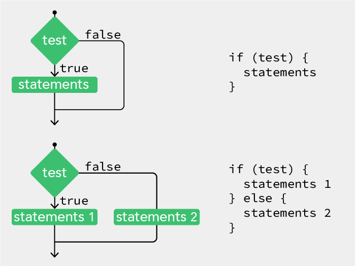
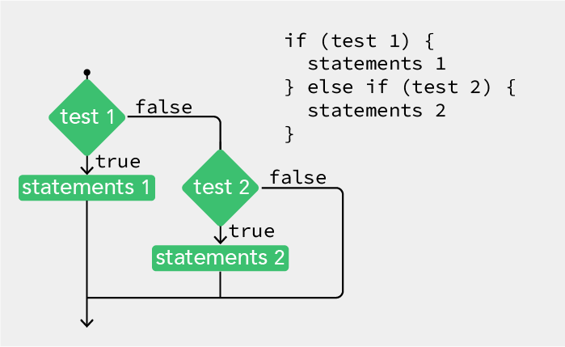
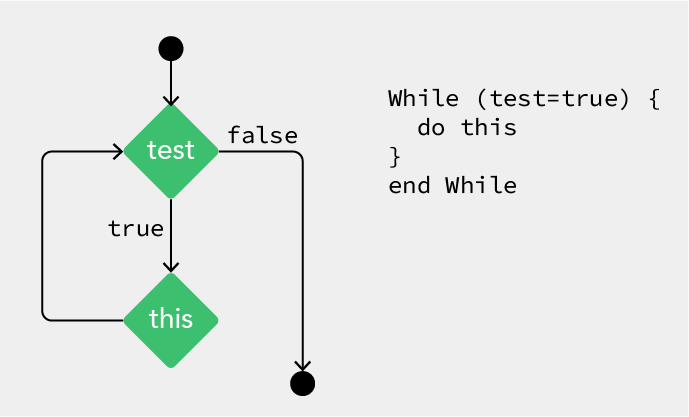
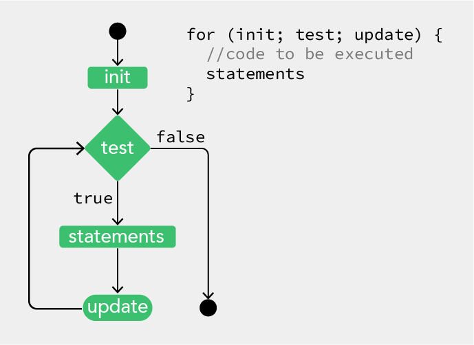

# P5.JS • Conditionals & Loops
<a id="markdown-p5.js-%E2%80%A2-conditionals-%26-loops" name="p5.js-%E2%80%A2-conditionals-%26-loops"></a>

<!-- TOC depthfrom:2 depthto:2 insertanchor:true -->

- [Conditionals](#conditionals)
- [While Loop](#while-loop)
- [For Loop](#for-loop)

<!-- /TOC -->

☝︎ [home](../)
☞ next chapter: [Interaction](../04/interaction.md)

##  Conditionals
<a id="markdown-conditionals" name="conditionals"></a>

Conditions are like questions. They allow a program to decide to take one action if the answer to a question is **"true"** or to do another action if the answer to the question is **"false"**.

Thus, it checks that a condition has been met before executing the code inside the block marked by the braces that follow it. 

In the case below, the conditional asks whether the value of diam is less than or equal to 400. If it is, the code in the block executes. If not, the code in the block is skipped:

```javaScript
// check a condition
if (diam <= 400) {
  // execute code between the braces
  // if condition is met
}
```
You can also use an else clause to provide a block of code to be executed if the condition isn’t met:

```javaScript
if (diam <= 400) {
  // execute this code if diam <= 400
} else {
  // execute this code if diam > 400
}
```
    
<sub>Flow diagram of conditional test</sub>

If you imagine the flow of execution as a trickle of water running down the script, by setting a conditional you’re effectively creating different channels for the stream to follow.

With an **if ... else** clause, the stream can go one of two ways, either through the block or around. 

The most common relational operators are:    
| Character | Operator |
| :-: | --- |
|>| Greater than |
|<|Less than |
|>=| Greater than or equal to |
|<=| Less than or equal to |
|==| Equal to |
|!=| Not equal to |

In addition you can also use **logic operators** to group conditions: 
| Character | Operator |
| :-: | --- |
|&vert;&vert;| logical OR  |
|&&| logical AND   |
|!| logical NOT|

#### our line on the move in a bounded loop
```javaScript
let xPos = 100;
let xStep = 5;
let yTop = 20;
let yBottom = 180;

function setup() {
  createCanvas(400, 200);
  frameRate(10);
}

function draw() {
  background(255, 175, 204);
  line(xPos, yTop, xPos, yBottom);
  if (xPos > width - 10) {
    xPos = 10;
  } else {
    xPos += xStep;
  }
}
```

Note:
- As is usually the case, you can do things in more than one way. The following was equally good.
```javaScript  
function draw() {
  background(255, 175, 204);
  line(xPos, yTop, xPos, yBottom);
  xPos += xStep;
  if (xPos > width - 10) {
    xPos = 10;
  } 
}
```
Thus the else part is not always necessary and can be omitted.


But we don’t live in an either-or world and so sometimes just having an if and an else isn’t enough.    
Then **else if** comes to the rescue.




#### Lets try a more advanced conditional with 2 tests

```JavaScript
let dice;
let border = 10;

function setup() {
  createCanvas(300, 300);
  background(255, 175, 204);
  stroke(0);
  noFill();
  rectMode(CENTER);
  dice = random(1);
  if (dice < 0.333) {
    ellipse(width / 2, height * 0.5, 200, 200);
  } else if ((dice > 0.333) && (dice < 0.666)) {
    rect(width / 2, height / 2, 200, 200);
  } else {
    triangle(width / 2, 50, width - 50, 250, 50, 250);
  }
}
```
Note:

- the **else-if** statement combines 2 relational expressions with **&&**    
So, if the result of the function random given to the variable dice is greater than 0.333 **and** less than 0.666 then draw a rectangle

- Recap. Any **if** statement can have any number of associated **else if** clauses. Even if you have an **else if** clause, you don’t necessarily need to have an **else** clause.


#### a Bouncing Ball    
And to finish this chapter on conditionals a somewhat classic example

Draw an ellipse that moves from left to right. When it reaches the right hand side of the sketch, make it move from right to left. When it reaches the left hand side again, make it move from left to right again.

```javaScript
let xspeed = 4;
let xpos;
let diam = 30;

function setup() {
  createCanvas(400, 400);
  xpos = diam;
}

function draw() {
  background(255, 175, 204);
  fill(50, 128);
  ellipse(xpos, 200, diam, diam);
  if ((xpos > width - diam / 2) || (xpos < diam / 2)) {
    xspeed = xspeed * -1;
  }
  xpos += xspeed;
}
```


## While Loop
<a id="markdown-while-loop" name="while-loop"></a>

As you write more programs, you’ll notice that patterns occur when lines of code are repeated, but with slight variations. A code structure called **a loop** (or iteration loop) makes it possible to run a line of code more than once to condense this type of repetition into fewer lines. This makes your programs more modular and easier to change.

```javaScript
let number = 99;
function draw() {
  while (number > 0) {
    console.log(number);
    number--;
  }
  console.log("zero");
}
```
This outputs the value of the variable *'number'* to the console window 99 times. The while command checks a condition and, if the condition is met, executes the code inside the braces; it then loops back up to the top of the block. The execution continues to the final line only after the condition is no longer met (in this case, when 'number' is 0).

Note that if you don’t include the 'number--' line inside the loop, which subtracts 1 from the number every time it loops, the condition will never be met and the loop will go on forever.

    
<sub>Flow diagram of a while loop</sub>


#### Lets draw a line repeatedly as we did before.
```javaScript
let xPos = 100;
let xStep = 25;
let yTop = 20;
let yBottom = 180;

function setup() {
  createCanvas(400, 200);
  frameRate(10);
  background(255, 175, 204);
}

function draw() {
  while (xPos < width - 80) {
    line(xPos, yTop, xPos, yBottom);
    xPos += xStep;
  }
}
```

And now try out adding the wind factor by displacing the top x coordinate!!

```javaScript
let xPos = 100;
let xStep = 25;
let yTop = 20;
let yBottom = 180;
let wind = 5;

function setup() {
  createCanvas(400, 200);
  background(255, 175, 204);
}

function draw() {
  background(255, 175, 204);
  while (xPos < width - 80) {
    line(xPos + random(-wind, wind), yTop, xPos, yBottom);
    xPos += xStep;
  }
  xPos = 80;
}
```
Note: 
- That background() needs to move from the setup function to draw to see only the last movement.  
- you need to reset the variable xPos to is base value at the end.


## For Loop
<a id="markdown-for-loop" name="for-loop"></a>

The for loop is used when you want to iterate through a set number of steps, rather than just wait for a condition to be satisfied. The syntax and flow diagram is as follows:

    
<sub>Flow diagram of a for loop</sub>

The code between the curly brackets { } is called **a block**. This is the code that will be repeated on each iteration of the loop. Inside the parentheses are **three statements**, separated by semicolons, that work together to control how many times the code inside is run. From left to right, these statements are referred to as **the initialization** (init), **the test**, and **the update**. The ‘init’ typically declares a new variable to use within the for loop and assigns a value. The variable name ‘i’ is frequently used. The ‘test’ evaluates the value of this variable, and the ‘update’ changes it’s value.

The test statement is always **a relational expression** that compares two values with a **relational operator**. As mentioned already the common relational operators are:   
`>` Greater than, `<` Less than, `>=` Greater than or equal to, `<=` Less than or equal to, `==` Equal to, `!=` Not equal to    
The relational expression always evaluates to **true** or **false**. When it’s true, the code inside the block is run, when it’s false, the code inside the block is not run and the for loop ends.

```JavaScript
let origx = 100;
let origy = 200;
let destx = 500;
let desty = 200;

function setup() {
  createCanvas(600, 400);
  noLoop();
}

function draw() {
  background(255, 175, 204);
  fill(255);
  strokeWeight(1);
  for (let i = 25; i < 400; i += 25) {
    stroke(50);
    line(width / 2, i, origx, origy);
    stroke(240);
    line(width / 2, i, destx, desty);
  }
}
```

The initial state of the for loop sets a variable i to 25. The code in the loop executes until i <  400 (the height) (the end condition). Every time the loop is executed, the value of i increases by 25, according to the step you’ve defined (i += 25). This means the code inside the parentheses of the for loop will execute 15 times ((400-25/25), with i set to 25, 50, 75 ... 375. Knowing that the i variable follows this pattern, you can use it in multiple ways. 


### Nested for loops
When one for loop is embedded inside another, the number of repetitions is multiplied. The example below does this to draw a grid of points.

```javaScript
let count = 0;

function setup() {
  createCanvas(600, 400);
  stroke(50);
}

function draw() {
  background(255, 175, 204);
  fill(255);
  strokeWeight(1);
  for (let i = 25; i < 600; i += 25) {
    for (let j = 25; j < 400; j += 25) {      
      point(i, j);
      text(count, i, j);
      count ++;
    }
  }
}
```
Notice that we draw in columns. So first the most internal for loop iterates and draws a vertical line of points on the far left, then we move one step to the right with the outer for loop, draw the next column of points and so on. 

A next similar example with dynamic lines reacting on the mouse position. 

```JavaScript
let origx = 200;
let origy = 200;
let destx = 400;
let desty = 200;

function setup() {
  createCanvas(600, 400);
  //noLoop();
}

function draw() {
  background(255, 175, 204);
  fill(255);
  strokeWeight(1);
  origx = mouseX;
  origy = mouseY;
  destx = width - mouseX;
  desty = height - mouseY;
  for (let i = 25; i < 600; i += 25) {
    for (let j = 25; j < 400; j += 25) {
      stroke(50);
      line(i, j, origx, origy);
      stroke(240);
      line(i, j, destx, desty);
    }
  }
}
```
### GOTO 10
"goto 10" refers to "10 PRINT CHR$(205.5+RND(1)); : GOTO 10"      
a random maze generation program in one line of Commodore 64 Basic.
Check [this book](the phenomenon of creative computing and the way computer programs exist in culture.) on the origin of the computer code and the phenomenon of creative computing and the way computer programs exist in culture. 

#### GOTO 10 or Random Diagonal Lines in a grid
```JavaScript
let dice = 0;
let tile = 20;

function setup() {
  createCanvas(600, 600);
  background(255);
  stroke(0);
  noLoop();
}

function draw() {
  for (let x = tile / 2; x <= width; x += tile) {
    for (let y = tile / 2; y <= height; y += tile) {
      dice = random(1);
      if (dice <= 0.5) {
        line(x - tile / 2, y - tile / 2, x + tile / 2, y + tile / 2);
      } else {
        line(x - tile / 2, y + tile / 2, x + tile / 2, y - tile / 2);
      }
    }
  }
}
```

#### GOTO 10 the Horizontal / Vertical approach
https://editor.p5js.org/hendrikleper/sketches/gPAhEwMab

#### Random Shapes in a 10 by 10 grid
```JavaScript
let dice = 0;
let tile = 30;
let gutter = 3;

function setup() {
  createCanvas(300, 300);
  background(255);
  stroke(0);
  fill(0);
  rectMode(CENTER);
  noLoop();
}

function draw() {
  for (let x = tile / 2; x <= width; x += tile) {
    for (let y = tile / 2; y <= height; y += tile) {
      dice = random(1);
      if (dice <= 0.5) {
        ellipse(x, y, tile - gutter, tile - gutter);
      } else {
        rect(x, y, tile - gutter, tile - gutter);
      }
    }
  }
}
```

#### Draw a Full Grid of Random Shapes 
Triangles can be orientated in 4 directions
https://editor.p5js.org/hendrikleper/sketches/zymfmIoeI

#### Draw a Full Grid of Random Shapes with Color
https://editor.p5js.org/hendrikleper/sketches/sU7hKZaN7e


