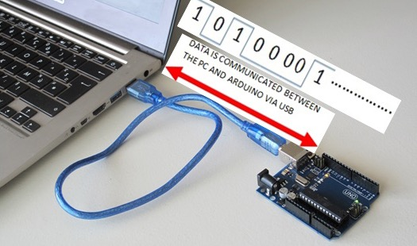

# 1. 📞 Serial Communication Intro

☝︎ [home](../)    
☞ next chapter: [Max to Arduino - A Digital Output controlled from Max](../02/m2a.md)

Serial communication is a simple means of sending data quickly and reliably from one device to another. The data is sent, one bit at a time, one right after the other, over a single line. The data packages are electrical pulses, 5 volts represents a bit value of 1, and 0 volts a 0. In Arduino this equals setting a pin HIGH or LOW. It's a little like Morse code, where you can use dits and dahs to send messages by telegram.

A minimum of three lines or wires are used for bidirectional communication: transmit (TX), receive (RX), and ground (GND).    

See [this tutorial](https://learn.sparkfun.com/tutorials/serial-communication/) is you want to read more on the basics of Serial Communication.    

## Serial Communication with Arduino
All Arduino boards have at least one serial port (also known as a UART or USART). It communicates on digital pins 0 (RX) and 1 (TX). The Arduino Uno boards we use have a chip to convert the hardware serial port on the Arduino chip to USB. Not all Arduino boards have this.    

    

We've actually used the Serial communications capability already quite a bit as that is how we send sketches to the Arduino! When you Compile/Verify what you're really doing is turning the sketch into binary data (ones and zeros). When you Upload it to the Arduino, the bits are shoved out one at a time through the USB cable to the Arduino where they are stored in the main chip.

[This](https://forum.arduino.cc/t/serial-input-basics-updated/382007) is a good introductory tutorial on using serial communication (input) with Arduino.

## Interfacing Max with Arduino and vice versa
This is accomplished using the [serial](https://www.arduino.cc/reference/en/language/functions/communication/serial/) functionality of the Arduino and the [serial object](https://docs.cycling74.com/max8/refpages/serial?q=serial) in Max.

In the following pages there is almost no code included. You will always need to open the files in their respective applications: Arduino & Max.

👉🏻 [Download the code examples for this tutorial as a zip file.](../files/Archive.zip) 👈🏻