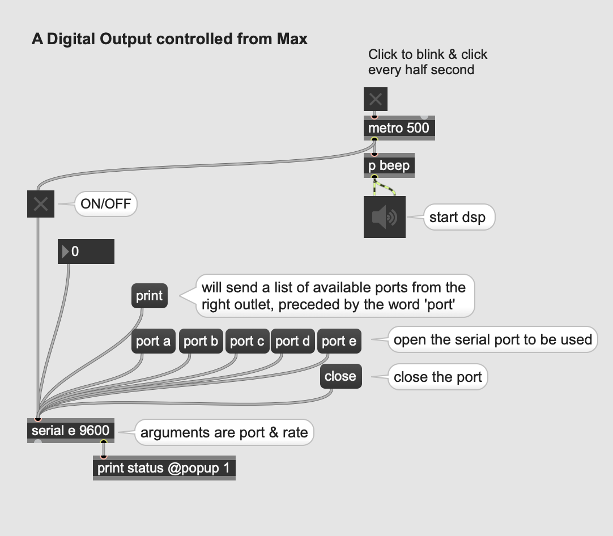
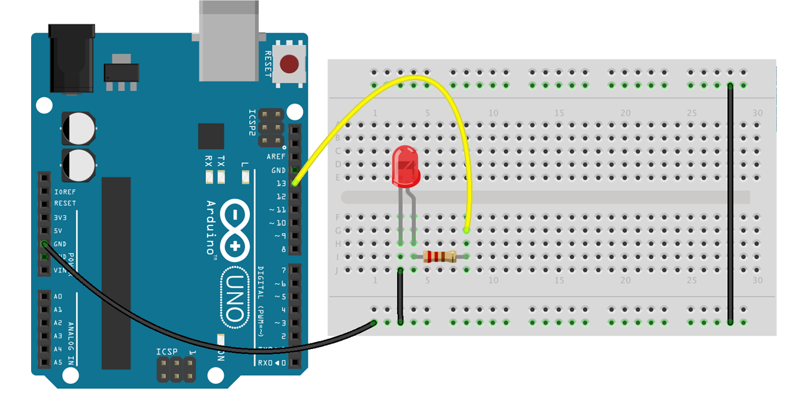
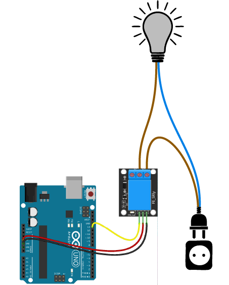

# 2. Interfacing Max with Arduino and vice versa

☝︎ [home](../)    
☞ next chapter: [Arduino to Max - A Digital Input (button) to be transferred to Max](../03/a2m-button.md)

## a. Max to Arduino: A Digital Output controlled from Max
In this first example we want to control a LED with Max. Of course, the LED can be substituted by another actuator, although the circuit will probably have to be modified accordingly.    

The code is similar to the example "PhysicalPixel" (in section 04.Communication) with some minor differences.     
In both programmes (Arduino & Max) there are several notes or comments explaining what each function and code block does.

Max uses the serial object to send and receive data serially. The Baud rate specified must match that of the Arduino connection.

1. Obviously you need to connect the Arduino (board) to your computer.
2. Secondly, upload the Arduino-code to the board.
3. Then, Open the MAX patch, look for the right port using 'print' message and open that port. You can also change the port argument in the 'serial' object.
4. Click the 'toggle' to switch the LED on & off. Let it blink.



Notice: As we use the builtin LED on the Arduino we do not need to connect any other components. This will be different in all examples after this. If you do want to use a conventional LED you can see how to make this at the bottom of the page.     

⚡️⚡️⚡️ TAKE CARE!    
The Max Serial object cannot be open at the same time as the serial monitor in the Arduino IDE, nor can you flash a new sketch to your Arduino while the Max Serial object is connected.

⚡️⚡️⚡️  TECH ELABORATION!
When Max, or any other program, sends serial data to the Arduino it arrives into the Arduino input buffer at a speed set by the baud rate. At 9600 baud about 960 characters arrive per second which means there is a gap of just over 1 millisecond between characters. An Arduino can do a lot in 1 millisecond thus this serial data arrives relatively slowly we need to take this in account in more complex programs.*

### 🔎 Notes on the Arduino code
In the setup function we need to open the serial port & set data rate with `Serial.begin(9600);`. We only need to do this one, hence we place it in the setup and not the main loop. 9600 is one of the standard baudrates. It comes down to ca. 960 characters being transmitted per second. This is rather on the slow side but usually more than sufficiently fast.

The most import part in the Arduino code is this block.
```c+++
if (Serial.available() > 0) {
  byte value = Serial.read();
}
```
The functionblock `if (Serial.available() > 0) {}` checks if there is at least one data byte in the **Serial Buffer**.     
If this is the case `Serial.read()` brings out the data from the Serial Buffer and puts it in a variable with the name 'value'.    

The variable type **byte** (= 8 bit) can store an unsigned number from 0 to 255. The common variable type Int stores a 2-byte (or 16-bit) value which yields a range of -32768 to 32767.





You can replace the LED with other low-power components that can be switched on and off via a digital output (0 - 5V), such as a relay. A relay is an electrical or electromechanical component used to switch a circuit with the help of another circuit. It works like a switch that is operated by an electric current instead of manually.    

In the diagram below, a 5V relay module is used to switch a lamp on and off at 220V AC. 




