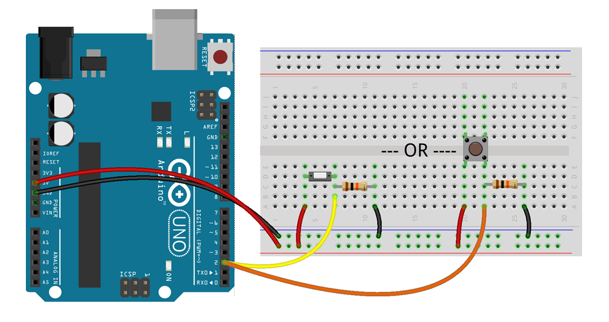
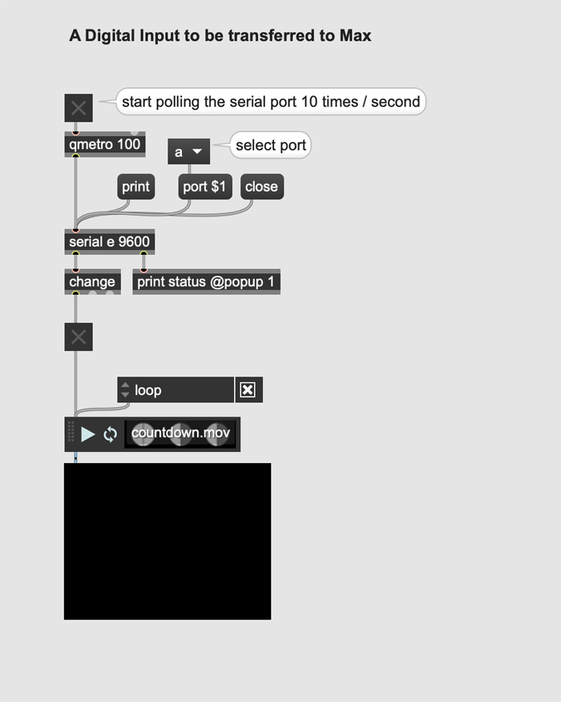

☝︎ [home](../)    
☞ next chapter: [Arduino to Max - An Analog Input (potentiometer) to be transferred to Max](../04/a2m-pot.md)

## b. Arduino to Max: A Digital Input (button) to be transferred to Max
In this second example we are going to control the playback of a video with a tactile switch or pushbutton switch connected to the Arduino.  When the button is pressed, the switches turn ON and starts the video and when the button is released, the switches turn OFF and stops the video.

To receive serial data in Max, the serial object must be polled at a certain time interval. The 'qmetro' object sends a bang message to the serial object, which outputs the received data at the interval specified in metro (in ms).

1. Make the circuit as below. There are 2 options based on the pushbutton you use.

2. Upload the 'digital_input.ino' code to your Arduino.
3. Now, make sure your Arduino is attached, the serial monitor is closed and open the Max patch.

4. Hold the button on your breadboard to make the video play, let go to stop it.

`Serial.write();` is used here to send (or write) binary data to the serial port. This data is sent as a byte or series of bytes. A byte is consists of 8 bits and can have a value between 0 and 255.

⚡️ BONUS!     
Right now, holding your finger on the button for as long as you want the video to play is not practical. We need a way to let the button stick to its current state. Like pushing the button once, starts the video. And pushing it again stops it. 'digital_input_sticky.ino' is a variation on the previous Arduino code to does this all the way.
