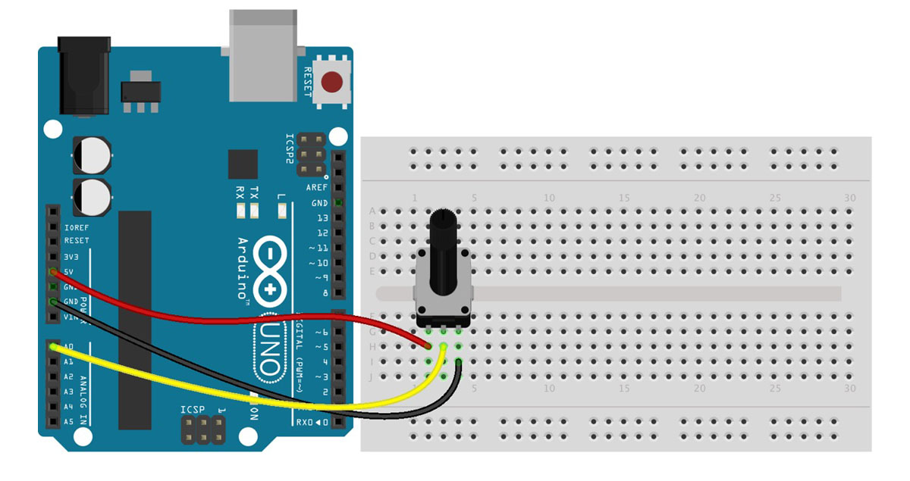
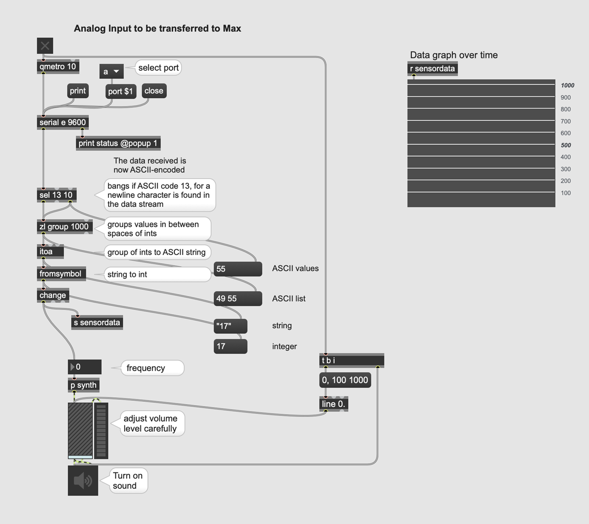

☝︎ [home](../)    
☞ next chapter: [Arduino to Max - Digital Inputs (many buttons) to Max](../05/a2m-buttons.md)

## c. Arduino to Max: An Analog Input (potentiometer) to be transferred to Max
A potentiometer connected to the Arduino is used to control the frequency of a virtual oscillator in Max. Things will get a bit more complicated now as the data is not passed though as binary data but as as *human-readable* [ASCII](https://www.ascii-code.com/) text.

1. A three-pin potentiometer is connected to the Arduino in the usual way with the middle leg connected to an analog input pin and the other pins to +5V and GND.

2. Upload the 'analog_input.ino' code to your Arduino.
3. Open the Max patch, open the serial port and start the 'qmetro' and dsp (sound).

4. Twist that knob like an expert!

### 🔎 Notes on the Arduino code

Different from previous example we use `Serial.println()` to send our data as the Analog Input resolution of Arduino is 10-bit, with a range between 0 and 1023. As we saw `Serial.write()` is limited to 8-bit and and therefore not fit for the task.    

`Serial.print()` prints data to the serial port as human-readable ASCII text. Numbers are printed using an ASCII character for each digit. This ensures that we can transmit more complex data as the value of the potentiometer.     

`Serial.println()` is similar as print() but terminates its data-packet with a carriage return character (ASCII 13, or '\r') and a newline character (ASCII 10, or '\n'). These characters will be used in Max to determine the end of each value. Both are known as control characters, they don’t have any visual meaning. See [here](https://elextutorial.com/learn-arduino/arduino-serial-port-send-line-feed-carriage-return-new-line/) for more.     

### 🔎 Notes on the Max code
words borrowed with gratitude from <a href="https://chariscat.wordpress.com/2020/12/06/serial-communications-between-arduino-and-max/">Charis Cat</a>

#### Sel Object
An important ASCII string is 13 10, which represents a carriage return & newline character.     
Using a ‘sel’ object with the arguments 13 10 will separate the sensor data from these 2 characters. When the ‘sel’ object reads a 13, or a carriage return, it outputs a bang from its left output and outputs the rest of the data from it’s right. Combining these into a group creates a list of the ASCII characters between carriage returns, a little closer to the required output.
#### Zl Group Object
Connecting the left and right outputs of the sel object into the hot input of a ‘zl group’ object creates this group. But it can’t do anything about the fact that the numbers are in ASCII.    
The ‘zl group’ object also needs a number argument specifying how long the group will be, and using the improbably high number of 1000 means that the list will always be read in full (Mckellar, 2016).
#### Itoa Object
There is an object called ‘itoa’ in Max. It stands for integer to ASCII – exactly what we need here!    
According to the documentation, the ‘itoa’ object ‘converts a stream or list of up to 256 integers into a symbol’. It recognises integers into its left input as in UTF-8 ASCII Unicode format, translates them into the correct characters, and outputs them as a symbol.    
The values which it outputs are between quotes, signifying that they are in symbol format, so there is still one more object to use.
#### Fromsymbol Object
The object which converts from symbol has a pretty handy name, it’s just ‘fromsymbol’. ‘fromsymbol’ reads the input and converts it into integers, by default using the space as the separator. This is why I have used a space between each number in the Arduino code.

