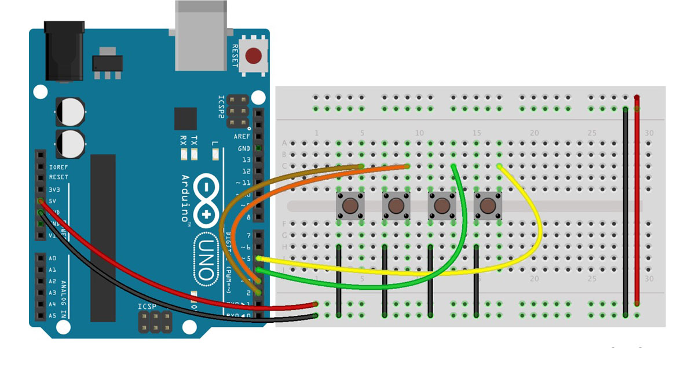
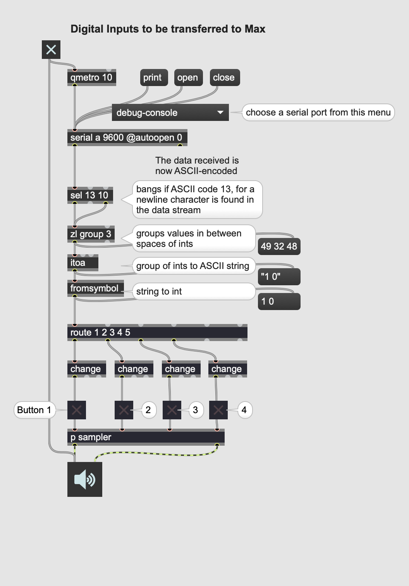

☝︎ [home](../)    
☞ next chapter: [Arduino to Max - Analog Inputs (many potentiometers) to Max](../06/a2m-pots.md)

## d. Arduino to Max: Digital Inputs (many buttons) to Max
This example is somewhat a combination of '2. Digital Input' and '3. Analog Input'.  Multiple, 4 in this case, pushbuttons are connected to the digital input pins and their state, pushed or not, is transferred over serial to Max in an ASCII string.    



### 🔎 The circuit is somewhat special
4 pushbuttons are attached to pin 2,3,4,5 from GND. We don't need any resistors as we will use the `pinMode(INPUT_PULLUP)` method. See [this tutorial](https://www.arduino.cc/en/Tutorial/DigitalInputPullup). An internal 20K-ohm resistor is pulled to 5V. This configuration causes the input to read HIGH when the switch is open, and LOW when it is closed!

### 🔎 Notes on the Arduino code
The code uses for loops to iterate through certain functions according to the number of pins (or connected pushbuttons) used. In this way the code is modular and efficient.    

Writing a button state over serial is done in 3 steps. First we write the number of pin. We start from one (1) because we, humans, find that more logical. This is followed by a empty space and then the button state, 1 or 0, followed by a carriage return character (ASCII 13, or '\r') character. See `Serial.print()` vs `Serial.println()`.
```C++
Serial.print(i+1);
Serial.print(" ");
Serial.println(0);
```

### 🔎 Notes on the Max code
In Max we just have to route button states. This is easily done with the 'route' object followed by the button number, thus the output of this function `Serial.print(i+1);`.

From here, there is a small section in the patch that populates a menu of possible serial connections. You just have to pick the right one.


