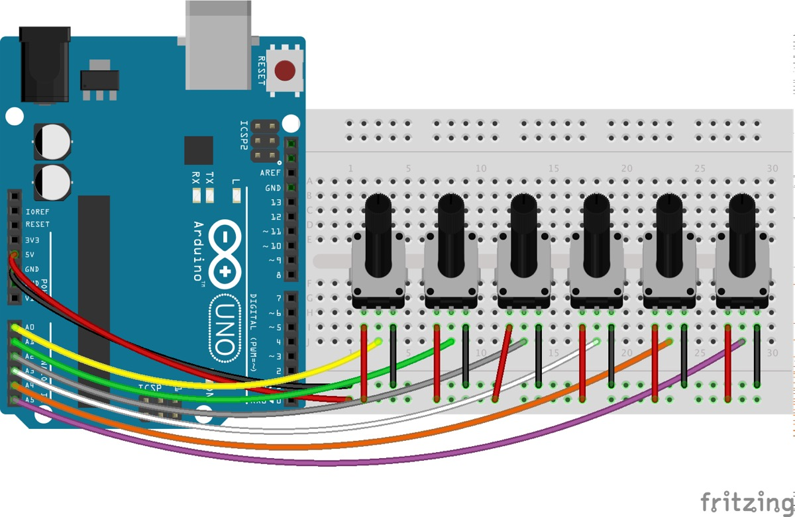
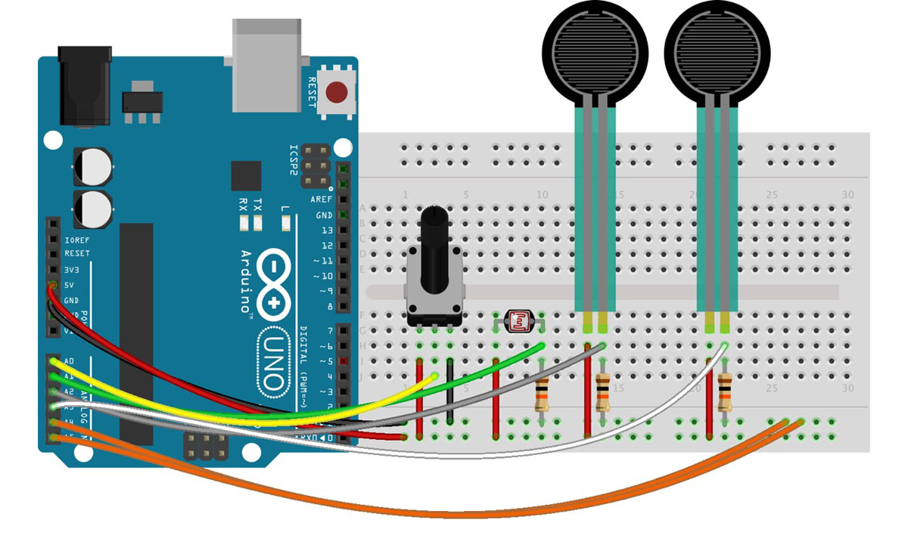

☝︎ [home](../)    
☞ next chapter: [Arduino to Max - Analog & Digital Inputs to Max or sensors & buttons](../07/a2m-pots&buttons.md)

## e. Arduino to Max: Analog Inputs (many potentiometers or other sensors) to Max
I suspect you are slowly starting to get the hang of the system. So in this example, we are connecting multiple sensors to our Arduino board. We send out the data as an ASCII string. The sensor values are separated by spaces and the sequence is terminated with a carriage return & a newline character.

### two examples of many possible circuits.
    
6 potentiometers - easy peasy!

    
4 sensors: a potentiometer, a LDR or photocell and 2 force sensors. These last 3 need a 10 kΩ resistor connected to ground.

A photocell is a variable resistor. It produces a resistance proportional to the amount of light it senses.  A force sensor is force-sensitive resistor thus also a variable resistor.

It turns out voltage is really easy for microcontrollers (those with analog-to-digital converters - ADC’s - at least) to measure. Resistance? Not so much. But, by adding another resistor to the resistive sensors, we can create a voltage divider. Once the output of the voltage divider is known, we can go back and calculate the resistance of the sensor.

For example, the photocell's resistance varies between 1kΩ in the light and about 10kΩ in the dark. If we combine that with a static resistance somewhere in the middle - say 5.6kΩ, we can get a wide range out of the voltage divider they create.

In this second example we only use 4 sensors. We could easily adapt the code only to read & send 4 but we can also leave the code alone. You will notice that the unconnected pins will be 'floating' somewhere between 5V and 0V. They will output random values (between 0 and 1024). Connecting them to ground, as in the circuit, will solve this.

