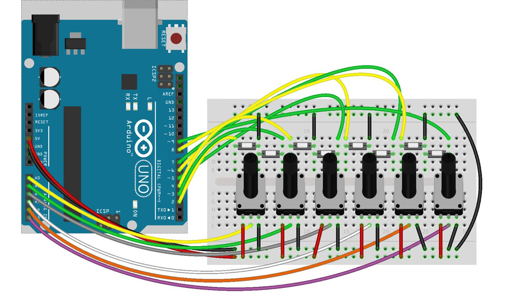
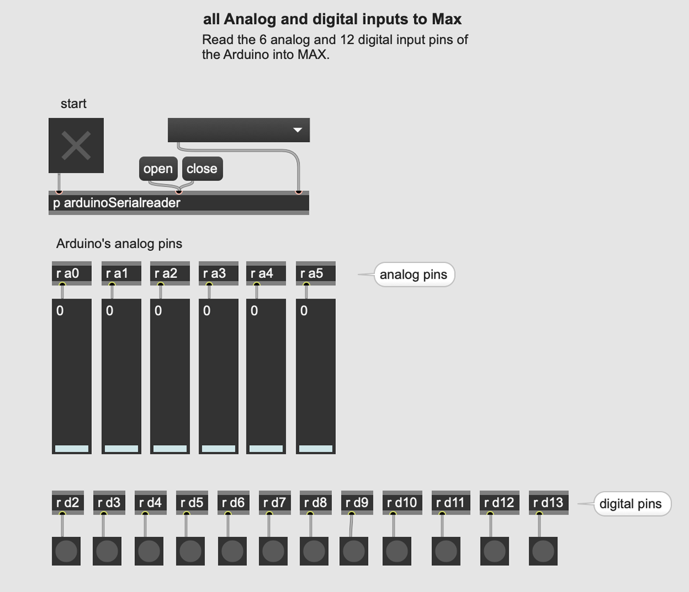

☝︎ [home](../)    
☞ next chapter: [Max to Arduino - Analog output(s) controlled from Max](../08/m2a-pwm.md)

## f. Arduino to Max: Analog & Digital Inputs to Max or sensors & buttons
This is an example on how to use the full potential of an arduino UNO as sensor interface. It reads the 6 analog and 12 digital input pins of the Arduino and sends the values to Max.

It is based on [Arduino2Max](https://github.com/hendrikleper/arduino2max) a sketch and patch by Daniel Jolliffe & Thomas Ouellet Fredericks.

The patch and sketch more or less explain themselves. There is one new principle that comes up here and that is a Call and Response or Handshaking method. By sending an 'r' character, Max asks the Arduino to transmit new data.
We also raised the baud rate to 115200 for faster data transfer.

In the folder you'll also find Andrew Benson's SensorBox software. That is an alternative to the above but with more complex code using [bitshifting](https://www.interviewcake.com/concept/java/bit-shift).

