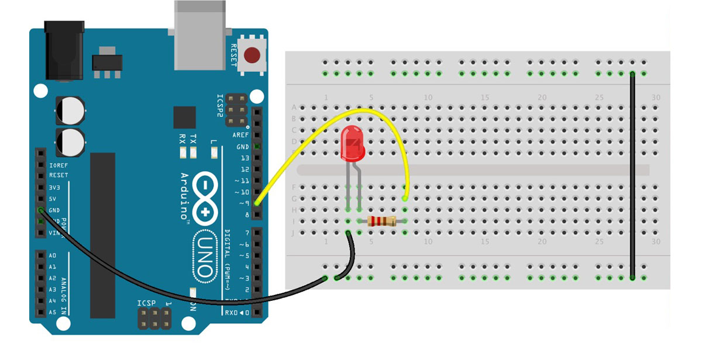
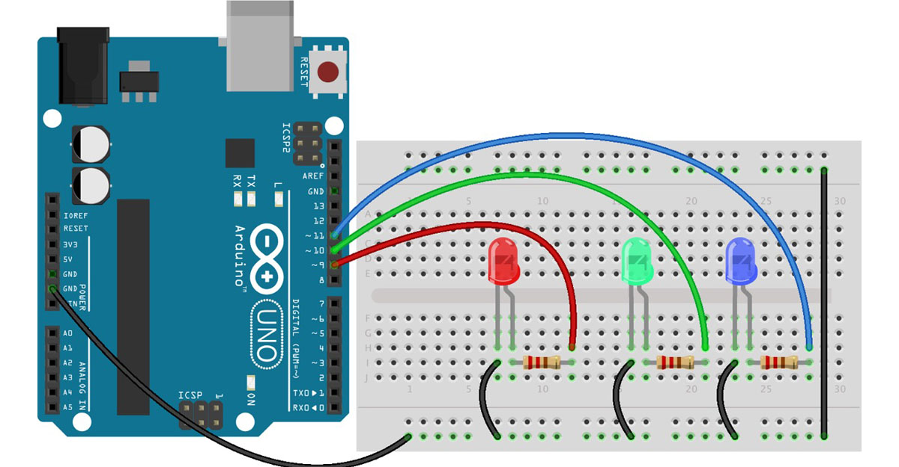
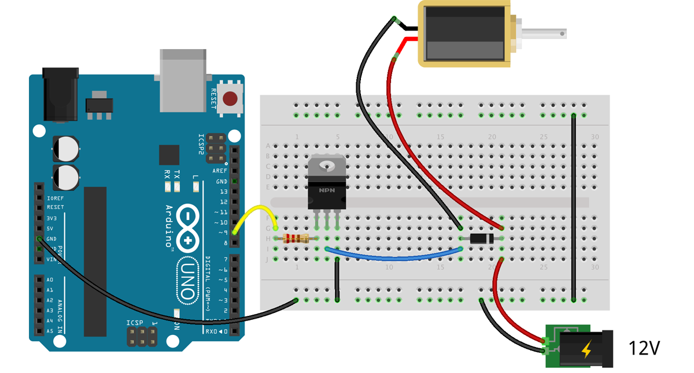
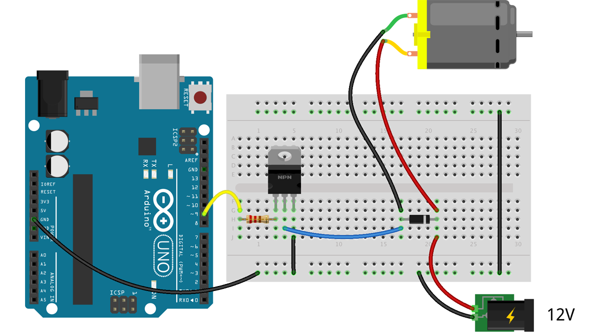

☝︎ [home](../)    
☞ next chapter: [Max to Arduino - Analog output(s) controlled from Max](../09/m2a-servo.md)

## g1. Max to Arduino: Analog output controlled from Max
We reverse the communication again. Max is the sender, Arduino the receiver. There are 2 examples included. In the first we send the data in bytes (values between 0 and 255). In the 2nd we send an ASCII encoded string of values from 0 to 255. Each sequence is concludes with a newline character. Both examples are included in the max patch but there are 2 different Arduino sketches.

a basic circuit with an external LED and resistor

In Arduino we the `analogWrite()` function to generate an *analog value* to a pin. This is [not a true analog output](https://docs.arduino.cc/learn/microcontrollers/analog-output).    
You'll find explanation and clarification in the code examples as comments.    

The file 'getMaxBufferValue.js' is needed for a calculation in Max.

## g2. Max to Arduino: More Analog outputs controlled from Max
This example is similar to the example above where an ASCII encoded string of values is sent from Max. We now send all 3 values concluded with a newline character.

3 external LEDs are now connected to the Arduino

NOTE:    
On using an RGB LED and [why sharing one resistor on the common anode or cathode is not a good idea](https://www.circuitbread.com/tutorials/why-cant-i-share-a-resistor-on-the-common-anode-or-cathode-of-my-rgb-led).

## g3. Max to Arduino: solenoid(s)
🚧 🚧 🚧 🚧 🚧 🚧 🚧 🚧    

see https://adam-meyer.com/arduino/TIP120

## g4. Max to Arduino: dc motor(s)
🚧 🚧 🚧 🚧 🚧 🚧 🚧 🚧    

see https://adam-meyer.com/arduino/TIP120