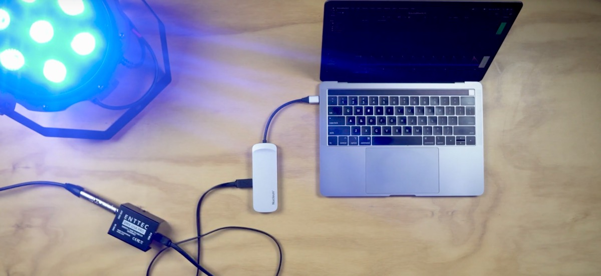

# Max & DMX
parts of this text are taken from https://cycling74.com/tutorials/working-with-hardware-dmx-part-1    

☝︎ [home](../)    

DMX, or more accurately, DMX 512, is a network protocol most commonly used for the control of stage lighting and effects. The name “DMX” is short for “Digital Multiplex”. The “512” in DMX 512 represents the maximum number of devices (512) that can be controlled with a single data packet. This network of 512 devices is called a DMX *universe*.

In a typical DMX 512 network, devices are daisy chained together. The control device is at the beginning of the chain, with a cable running to one device, and a cable run from that device to the next device, and so on. DMX always travels in one direction – it is unidirectional, and the end of the chain needs to be terminated.

In this picture, we have a laptop running our Max patch connected to a DMX controller, which in turn sends packets down the DMX network cabling to connected lighting devices.

Devices in a DMX universe are specified by channel, with up to 512 channels in a single packet. A packet contains a header followed by the control data expressed as 8-bit values (bytes). Since this is 8-bit data, we use the values 0-255 (in decimal) when programming DMX data in Max.

There is no index in a DMX packet, so if a device thinks it is on channel one, it will look at the first data byte in a DMX packet and choose that value to set its state. If a device thinks it is on channel 53 in the current universe, then it will choose the 53rd byte in the packet for its value.

Each DMX controllable device has built-in channel selectors, allowing you to specify its channel numbers within the universe. When programming multi-channel DMX devices, you usually need to dig into the documentation for each device in order to find out how each channel is used.

The first thing we need is a DMX interface. We have an Enttec USB Pro in the equipment pool.

In addition to a controller, you’ll need devices to control and some cabling to hook it all up. DMX cables are a mix of 3 pin and 5 pin XLR. There is an incredible range of DMX controllable dimmers, lights, fog machines, lasers, servos, and amplifiers out there. In the studio and equipment pools we have 4-channel LED spots, a 4 channel dimmer, a fog machine, stroboscope, ...  

## Enttec USB Pro

In Max we make use of Thomas Ouellet Fredericks [Enttec DMX USB Pro patcher](https://github.com/thomasfredericks/DMX_USB_PRO_MAX) as a base patch to start of.

🚧 🚧 🚧 🚧 🚧 🚧 🚧 🚧

## Arduino as a DMX interface

see also https://tigoe.github.io/DMX-Examples/

## Other DMX software
[Qlab](https://qlab.app/) or sound, video and lighting control for macOS.

