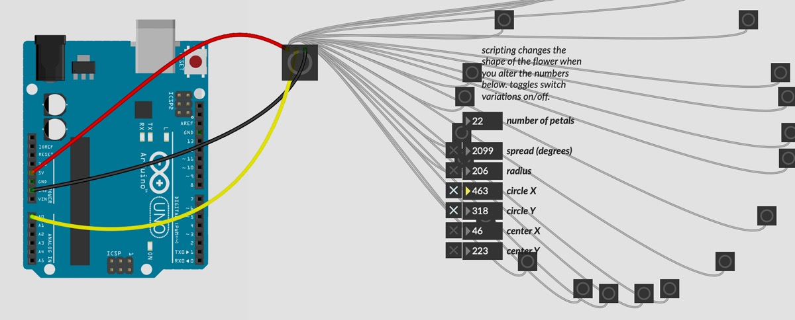

# Physical Computing with MAX and Arduino & DMX

This is the second part of the physical computing with [Arduino tutorial](../arduino/default.md) but it could also be a follow-up to a Max workshop. It is all about interfacing [Max](https://cycling74.com/) with the physical world.    

Today we will see the nuts and bolts on how **serial data** is sent between the two environments, on how to use sensor data to activate, move, or distort sound and video but also how we can control light and movement with motors and electromagnets from Max.     
We will also see some basics of using **DMX**, a communication protocol used in lighting and event engineering, with Max.    

The example programs consist of Arduino sketches and Max patches. A logical structure has been provided with numbering, which is copied below. In some of the folders you will also find a pd patch. These are merely unfinished and not tested thoroughly.

On the Arduino website one finds [a number of options](https://playground.arduino.cc/Main/InterfacingWithSoftware/) for interfacing an Arduino with computer programs and mobile devices and applications, including [Max](https://playground.arduino.cc/Interfacing/MaxMSP/), [PureData or PD](https://playground.arduino.cc/Interfacing/PD/), [Processing](https://playground.arduino.cc/Interfacing/Processing/), [Python](https://playground.arduino.cc/Interfacing/Python/), ...     
On the Cycling74/Max website there is also a manual about [Serial Communication between Max & Arduino](https://docs.cycling74.com/max8/tutorials/communicationschapter02).    

And on the internet you will even find several pre-made packages, with the [firmata](https://www.arduino.cc/en/Reference/Firmata) Arduino-code as the most well known and comprehensive, and projects to iterface it other programs, as [Max](https://www.maxuino.org/), [Ableton Live](https://github.com/Ableton/m4l-connection-kit) [PD](https://puredata.info/downloads/pduino), etc. making the coding job simple. The drawback is that these packages are often quite complex and less efficient. The basics of serial communication are actually quite straightforward. Let's start with these.

## Contents

1. [Serial Communication Intro](01/intro.md)
2. Interfacing Max with Arduino and vice versa
	1. [Max to Arduino - A Digital Output controlled from Max](02/m2a.md) 
	2. [Arduino to Max - A Digital Input (button) to be transferred to Max](03/a2m-button.md)
	3. [Arduino to Max - An Analog Input (potentiometer) to be transferred to Max](04/a2m-pot.md)
	4. [Arduino to Max - Digital Inputs (buttons) to Max](05/a2m-buttons.md)
	5. [Arduino to Max - Analog Inputs (potentiometers) to Max](06/a2m-pots.md)
	6. [Arduino to Max - Analog & Digital Inputs (sensors & buttons) to Max](07/a2m-pots&buttons.md)
	7. [Max to Arduino - Analog output(s) LEDs, Solenoids & DC Motors ](08/m2a-pwm.md) 🚧 
	8. [Max to Arduino - Analog output(s) Servo Motors](09/m2a-servo.md) 🚧 
	9. [Max to Arduino - Analog output(s) Stepper Motors](10/m2a-stepper.md) 🚧 
3. [Max & DMX](12/dmx.md) 🚧 

