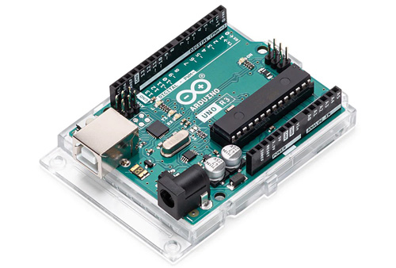
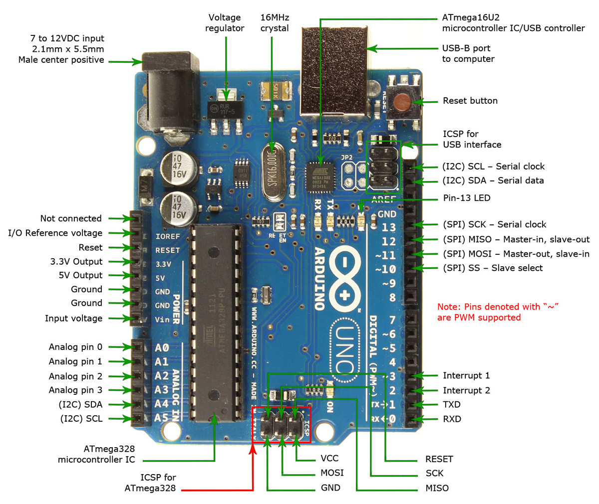
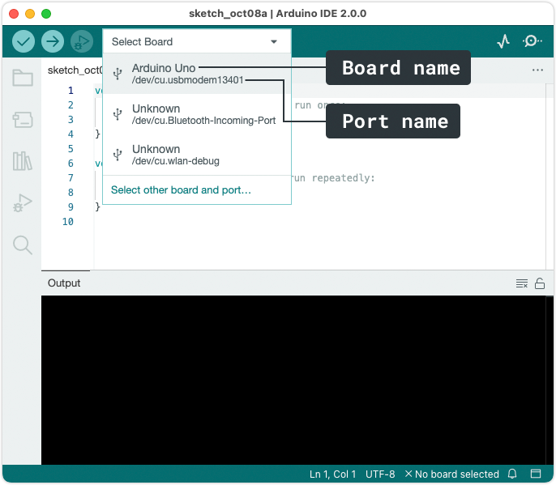
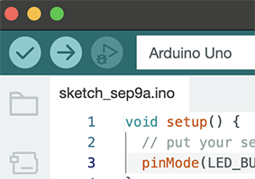

# 1. Getting Ready

☝︎ [home](../)
☞ next chapter: [Getting Started](../02/gettingstarted.md)

### The Arduino Platform

Arduino is composed of two major parts:    
1. **the Arduino board**: the piece of hardware you work on when you build your objects   
2. **the Arduino software**: an editor (IDE) that runs on your computer or in a web browser. In the editor you write a sketch (a computer program with a set of instructions) that you upload to the Arduino board. This program tells the board what to do.

The [Arduino website](https://www.arduino.cc/) is a nice place to start exploring projects built on Arduino, learn, ask for help.    
👉🏻 learn the basics of Arduino through [the Built-in Examples](https://docs.arduino.cc/built-in-examples/) collection tutorials    
👉🏻 a vast repository of [tutorials](https://docs.arduino.cc/tutorials/)    
👉🏻 [the projecthub](https://projecthub.arduino.cc/) documents projects created by the arduino community    
👉🏻 the [Forum](https://forum.arduino.cc/)

### The Arduino Board
The Arduino board is a small microcontroller or, in other words, a small computer chip on a circuitboard. This computer is at least a thousand times less powerful than your laptop, but it is also a lot cheaper and very useful to build applied devices.

There are many different Arduino boards on the market. All official boards are listed [here](https://www.arduino.cc/en/hardware). In the studio we mainly work with the [Arduino UNO Rev3](https://store.arduino.cc/products/arduino-uno-rev3). The Arduino UNO is somewhat the reference version of Arduino.

Looking at the Arduino board: you’ll see a black chip with 28 *legs*. That chip is the ATmega328P, the heart of your board.
The arduino UNO / ATmega328 features:
- **14 Digital IO pins** (pins 0–13). These can be inputs or outputs, which is specified by the sketch you create.
- **6 Analog In pins** (pins A0–5). These dedicated analog input pins take analog values (0-5V) (i.e. voltage readings from a sensor) and convert them into a number between 0 and 1023 (or 1024 values = 10 bit).
- **6 PWM pins** (pins 3, 5, 6, 9, 10, and 11). These are actually 6 of the digital pins that can be reprogrammed for *analog output*. They are indicated with a ~(tilde).
- The board can be **powered** from your computer’s USB port (5V), most USB chargers, or an AC adapter (7-12V recommended, 2.1mm barrel tip, center positive).
- And another Atmega16U2 programmed as a **USB-to-serial converter**.
- ...

    
*The complete parts of an Arduino UNO*

The arduino reference can be found [here](https://docs.arduino.cc/tutorials/uno-rev3/intro-to-board).
The complete schematic of Arduino UNO can be found [here](https://www.arduino.cc/en/uploads/Main/arduino-uno-schematic.pdf).

### The Software (IDE)
The programs you write for your Arduino are known as sketches. They are written in C/C++ using a code editor. There are 3 options made available by the Arduino team to program your boards:
- An **IDE** or integrated development environment. It is software you install and run on your computer.
- A **web editor** to code online. You need to make a login to save your sketches in the cloud.
- And **CLI** or Command Line Interface, if you don't want to use a user interface. 

First we will download & install the Arduino IDE 2.x and then we go through the process of uploading a Sketch from the IDE to the board.

####  Arduino IDE Installation Guide
Download the latest stable version for your operating system from the [Arduino Software Page](https://www.arduino.cc/en/software) or, alternatively, start by [selecting your board on the website](https://docs.arduino.cc/) and then follow the **quickstart** guide.        

####  Upload a Sketch with the Arduino IDE 2.x
The process for setting up your Arduino and connecting the software to your board slightly differs depending on the computer you are using and the Arduino board itself.    

Before uploading, we need to **select the board** that we will use.     
Next to the Verify and Upload buttons, you’ll find a drop-down menu that usually shows connected Arduino boards. If your board isn’t detected automatically, click “Select other board and port…” and follow the instructions, or go to *Tools > Board and Tools > Port* in the menu to choose them manually. You’ll know it’s connected when the board name appears in **bold**.

    
*screenshot of the board & port select procedure*

To **upload some code** we first take a look at the toolbar at the top of the editor.    
At the very left, there are 2 buttons: a **checkmark**, used *to verify* and **an arrow pointing right**, used *to upload*.      
The verify tool simply goes through your sketch, checks for errors and compiles it. The upload tool does the same, but when it finishes compiling, it also uploads it to the board.

    
*screenshot of the verify and upload buttons*

⚡️⚡️⚡️ To conclude this chapter you can follow [this guide](https://docs.arduino.cc/software/ide-v2/tutorials/getting-started-ide-v2) if you want to get basics of the Arduino IDE 2.x with a detailed overview of the UI, links to special features as autocompletion and debugging.

☝︎ [home](../)
☞ next chapter: [Getting Started](../02/gettingstarted.md)