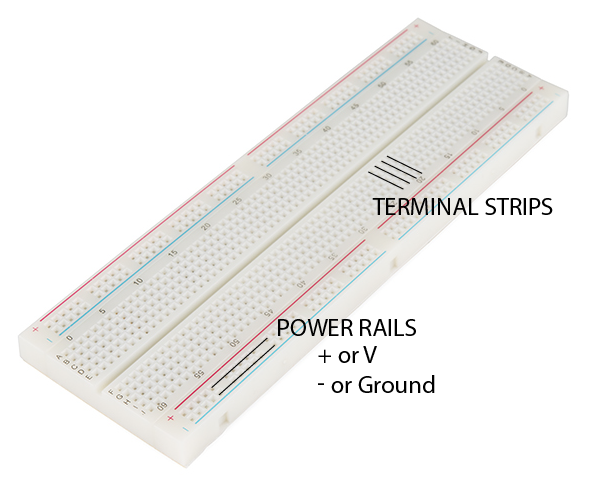
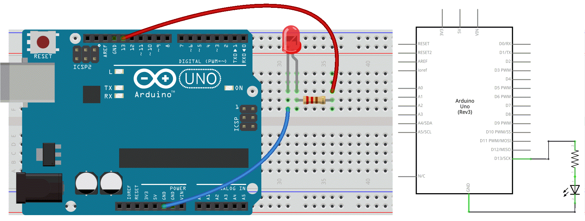

# 3. Getting Physical ☞ 𝕒 𝕓𝕚𝕘 𝕃𝔼𝔻

☝︎ [home](../)
☞ next chapter: [Digital Input with a Pushbutton](../04/pushit.md)

### Wiring Diagrams & Schematics
Next we want to wire an external LED to the board. I could explain you here in steps how to make the connections *- the anode (longest) leg of an LED is connected to pin 13 on the Arduino UNO, the negative or cathode (shortest) leg of the LED is then connected Ground -* but wouldn't it be much easier to draw you a sketch or diagram with the wires and components connected to the Arduino?!

Being able to read these **diagrams** is a very important part of building circuits. Schematics are universal pictograms that allow people all over the world to understand and build electronics. Every electronic component has a very unique schematic symbol. These symbols are then assembled into circuits using a variety of programs. You could also draw them out by hand. If you want to dive deeper in the world of electronics and circuit building, learning to read schematics is a very important step in doing so.

Below is the schematics for the above circuit and, at the right, a much easier to read and wire diagram (made with [Fritzing](http://fritzing.org/home/)). We will mainly use this kind of wiring diagams in this tutorial.

Have a look at this more elaborate tutorial [How to Read a Schematic](https://learn.sparkfun.com/tutorials/how-to-read-a-schematic).

### Components
Let's get on with some real physical computing and electronic components we can connect and control.
Without soldering or metal-wire-knotting we are not able to make this connections. A solderless breadboard comes in handy here.

#### breadboard
A [breadboard](https://en.wikipedia.org/wiki/Breadboard), also known as a solderless breadboard, is a small plastic board full of holes, each of which contains a spring-loaded contact (in metal). You can push a component’s leg into one of the holes, and it will establish an electrical connection with all of the other holes in the same vertical column of holes. Many breadboards also include sections for power distribution, making it easier to build your circuits.

    

Then you plug in the LED and connect pin 13 & ground to the Arduino. Again, the anode (longest) leg of an LED is connected to pin 13 and the negative or cathode (shortest) leg of the LED is then connected Ground.    

    

⚡️⚡️⚡️ If you want some extra context and help check this wonderful [How to Use a Breadboard](https://learn.sparkfun.com/tutorials/how-to-use-a-breadboard/) Sparkfun-page.

#### wires
The wire used to connect components. They come in a wide range of sizes and types. There are 2 main varieties; solid core or stranded. Solid core is stiffer, stranded wire is more flexible. We will use jumper wires, also known as jumper leads on our breadboard.
#### switches
Switches pass or interrupt the flow of electricity. You can attach wires to 2 contacts and they are put in contact by activating the switch. Switches can be momentary and toggles switches. A toggle switch stays in it last position. A momentary switch (or pushbutton) spring back to their default position. We will use the latter.
#### light-emitting diodes (LED)
LED's are the most common for of output from a microcontroller as they need very little power to be turned on. A LED is a diode that emits light. We need to understand how a diode operates.    
A diode is like a one-way street: it only allows electricity to flow in one direction. In other words diodes are polarized. The 2 sides of a diode are called a cathode (-) and an anode (+).
#### resistors
Resistors give electricity something to do: the convert electricity to heat. In this way, they prevent the infamous short circuit. Resistors have 2 leads and no polarity.     
Resistors are rated in Ohms (Ω), indicating how much resistance they offer. Below you can learn to read the colour codes.
#### potentiometers    
Potentiometers, trimpots or pots for short, are variable resistors. Pots have three legs. The power of a potentiometer is in the middle leg. It's  resistance varies depends on the potentiometers' rotating (or sliding) contact (the wiper) position. It is best to use it as a voltage divider with our Arduino. This means we have all 3 contacts connected: 1 to GND, 2 to ADC, 3 to +5V (or 3V3).       

Other common variable resistors are photocells (LDR), termistors, force-sensitive (FSR) and bend-sensors. These are all two-legged (or “two-lead”). In order to make them work optimally on our Pico we need to add a 2nd resistor (later more).    

⚡️⚡️⚡️ See also [this Great Website](https://makeabilitylab.github.io/physcomp/electronics/) if you want to learn more about the fundamentals of electricity, or delve deeper into physical computing.

☝︎ [home](../)
☞ next chapter: [Digital Input with a Pushbutton](../04/pushit.md)