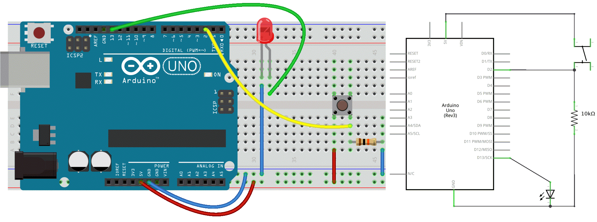

# 4. Getting Physical prt2 ☞ 𝔻𝕚𝕘𝕚𝕥𝕒𝕝 𝕀𝕟𝕡𝕦𝕥𝕤 ℙ𝕦𝕤𝕙𝕓𝕦𝕥𝕥𝕠𝕟

☝︎ [home](../)
☞ next chapter: [Advanced Sensors](../05/advancedsensors.md)


### Push the button
In our first example, the LED was our actuator, and our Arduino was controlling it. If we imagine an outside parameter to take control over this LED, our finger, we need **a sensor**. And the simplest form of sensor available is **a pushbutton**.

Let's make our wiring diagram first.  

#### Circuit
- LED attached from pin 13 to ground
- pushbutton attached to pin 2 from +5V
- 10K resistor attached to pin 2 from ground

      

#### Code
```c++
// constants don't change:
const int buttonPin = 2;
const int ledPin =  13;

// variables will change:
int buttonState = 0;         // variable for reading the pushbutton status

void setup() {
  // initialize the LED pin as an output
  // & the pushbutton pin as an input
  pinMode(ledPin, OUTPUT);
  pinMode(buttonPin, INPUT);
}

void loop() {
  // read the state of the pushbutton value:
  buttonState = digitalRead(buttonPin);

  // check if the pushbutton is pressed.
  // If it is, the buttonState is HIGH:
  if (buttonState == HIGH) {
    // turn LED on:
    digitalWrite(ledPin, HIGH);
  } else {
    // turn LED off:
    digitalWrite(ledPin, LOW);
  }
}
```
If everything is correct, the LED will light up when you press the button. Yes?! Good!

🔎 **A closer look at the code**    
Now here is the `digitalRead()` function and the `if` `else` instructions. The latter is a very important one in programming. It allows the computer to make decisions.       
`digitalRead()` reads the value from a specified digital pin, either ON (typically, HIGH or 5V) or off (typically, LOW or 0V).

⚡️⚡️⚡️ Notice the difference between the `==` sign and the `=`. The former is used when two entities are compared, and returns TRUE or FALSE. The latter assigns a value to a variable.

🔎 **And a few words on the circuit**    
We need the connection to ground via a resistor. There are no issues when the button is pressed. However when the switch is open, the digital input pin doesn't know what to read. It floats and that is not good. This is easily solved with what’s called **a pull-down resistor** before the ground (GND) connection.

⚡️⚡️⚡️ If you like to keep your electronic circuitry as simple as possible, you can make use of the `INPUT_PULLUP` option in the pinMode function. In doing so, **a pull-up resistor**, a resistor integrated in the Arduino board, will be set between the digital pin and VCC (5V). This resistor will make sure the state stays HIGH. When you press the button, the state becomes LOW. This is the normal logic inverted. However also the circuit is different: one leg of the push button is connected to the ground (GND), another one to a digital pin. The external resistor is no longer needed. See this [example](https://docs.arduino.cc/built-in-examples/digital/InputPullupSerial).

### Sticky on/off button
Holding your finger on the button for as long as you need light is not practical.
Let's program **a second behavior** to make the on button “stick”. We therefore must implement some form of “memory”, in the form of a software mechanism that will remember when we have pressed the button and will keep the light on even after we have released it.

```c++
/* Turn on LED when the button is pressed
  and keep it on after it is released */

const int buttonPin = 2;
const int ledPin =  13;

int val = 0;          // val will be used to store the state of the input pin
int old_val = 0;      // this variable stores the previous value of "val"
int buttonState = 0;  // variable that will store the pushbutton status

void setup() {
  // initialize the LED pin as an output
  // & the pushbutton pin as an input
  pinMode(ledPin, OUTPUT);
  pinMode(buttonPin, INPUT);
}

void loop() {
  // read the state of the pushbutton value:
  val = digitalRead(buttonPin);

  // check if there was a transition
  if ((val == HIGH) && (old_val == LOW)) {
    buttonState = 1 - buttonState;
    delay(10);    // small delay for debouncing
  }

  old_val = val;  // val is now old, let's store it

  // check if the pushbutton is pressed. If it is, the buttonState is HIGH:
  if (buttonState == 1) {
    digitalWrite(ledPin, HIGH); // turn LED on
  } else {
    digitalWrite(ledPin, LOW);  // turn LED off
  }
}
```

🙀 Hold on! What is **debouncing**?! [Explained and illustrated with a better, non-freezing method](https://docs.arduino.cc/built-in-examples/digital/Debounce).


### Other On/Off Sensors
Now that you’ve learned how to use a pushbutton, you should know that there are other basic sensors that work according to the same *on/off* principle, as:
* **Switches** are just like pushbuttons, but don't automatically change state when released
* **Thermostats** are switches that open when the temperature reaches a set value
* **Magnetic switches** (or “reed relays”) have two contacts that come together when they are near a magnet
* **Carpet switches** are small mats that you can place under a carpet or a doormat to detect the presence of a human being (or heavy cat).
* **PIR** or Passive InfraRed sensor. This small device triggers when a human being (or other living being) moves within its proximity.
* **Tilt switches** are electronic components that contain two contacts and a little metal ball.
* ...
You can try some!       


☝︎ [home](../)
☞ next chapter: [Advanced Sensors](../05/advancedsensors.md)

