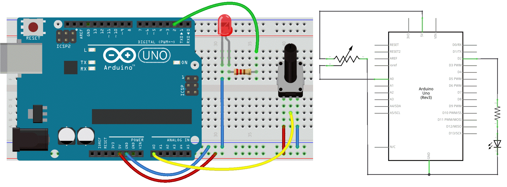
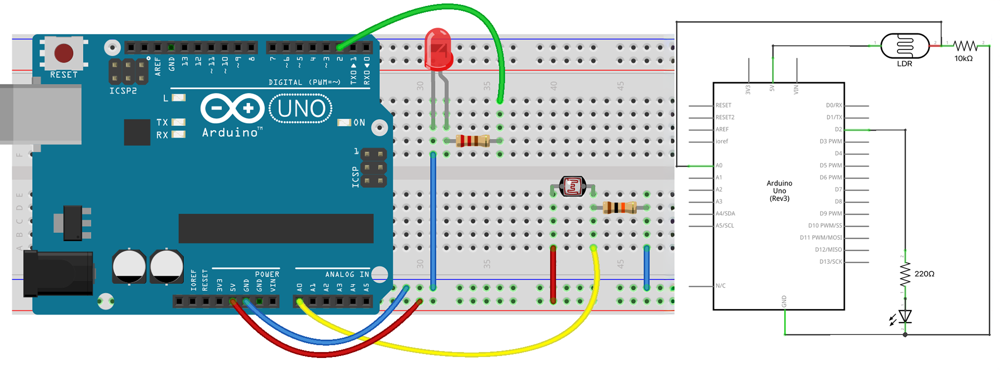

# Advanced Sensors ☞ 𝔸𝕟𝕒𝕝𝕠𝕘 𝕀𝕟𝕡𝕦𝕥𝕤

☝︎ [home](../)
☞ next chapter: [PWM](../06/pwm.md)

### ADC or Analog to Digital Converter  
In order to read a more advanced sensor than a On/Off button we need **a different type of pin**. In the lower-right part of the Arduino board, you’ll see six pins marked **“Analog In”**.   
These are special pins that can tell us not only whether there is a voltage applied to them, but if so, also its value. The Arduino has a 10-bit **A**nalog to **D**igital **C**onverter. By using the `analogRead()` function, we can read the voltage applied to one of the pins. This function returns a number between 0 and 1023, which represents voltages from 0 to 5 volts. For example, if there is a voltage of 2.5 V applied to pin number 0, `analogRead(0)` returns 512.

The next sketch & electronics diagram demonstrates analog input by reading an analog sensor as a potentiometer on analog pin 0 and turning on and off a LED connected to digital pin 2. The amount of time the LED will be on and off depends on the value obtained by `analogRead()`.

#### Circuit
- potentiometer: center pin of the potentiometer to the analog input 0, one side pin (either one) to ground, the other side pin to +5V
- LED: a 220Ω resistor bridges digital output 2 to the  anode (long leg) of the LED, the cathode (short leg) attached to ground.   
Actually the resistor can also go in between the cathode and ground as in a series circuit the order of components does not matter as the current has to pass through all the parts!

    

#### Code
```c++
int sensorPin = A0;   // select the input pin for the potentiometer
int ledPin = 2;      // select the pin for the LED
int sensorValue = 0;  // variable to store the value coming from the sensor

void setup() {
  // declare the ledPin as an OUTPUT
  pinMode(ledPin, OUTPUT);
  // there is no need to set our analog in pin
}

void loop() {
  // read the value from the sensor:
  sensorValue = analogRead(sensorPin);
  // turn the ledPin on
  digitalWrite(ledPin, HIGH);
  // stop the program for <sensorValue> milliseconds:
  delay(sensorValue);
  // turn the ledPin off:
  digitalWrite(ledPin, LOW);
  // stop the program for <sensorValue> milliseconds:
  delay(sensorValue);
}
```
⚡️ ⚡️ ⚡️     
As you might have noticed in the example above the blinking interval is not always changed immediately after turning the knob. Especially when there are long breaks. The reason for this is that `delay()` pauses the program completely for the time specified. We better use `millis()` when precise timing is important. See [the blink-without-delay example](https://docs.arduino.cc/built-in-examples/digital/BlinkWithoutDelay) and also [this explanation](https://makeabilitylab.github.io/physcomp/arduino/led-blink.html#blink-without-using-delays).    
⚡️ ⚡️ ⚡️

### Talk2Me
Wouldn't it be handy to check our incoming values? We actually can by establishing **Serial Communication** from our Arduino to our computer.   
We call this *"serial"* communication because the connection appears to both the Arduino and the computer as a serial port, even though it may actually use a USB cable. Bytes are sent one after another (serially) from the Arduino to the computer.  
In the code below we will map the 0-1023 values to a custom range 10-500, send the two variables over the serial port and the Arduino Serial Monitor to view them. Click the Serial Monitor button in the toolbar and select the same baud rate used in `Serial.begin()`.  

The circuit remains the same.  

#### Code
```c++
int sensorPin = A0;    // select the input pin for the potentiometer
int ledPin = 2;        // select the pin for the LED
int sensorValue = 0;   // variable to store the value coming from the sensor
int outputValue = 0;   // variable to store a scaled value of the sensorValue

void setup() {
  // declare the ledPin as an OUTPUT
  pinMode(ledPin, OUTPUT);
  // initialize serial communications at 9600 bps
  Serial.begin(9600);
}

void loop() {
  // read the value from the sensor:
  sensorValue = analogRead(sensorPin);

  // map or scale it to a custom range:
  outputValue = map(sensorValue, 0, 1023, 10, 500);

  // print the results to the Serial Monitor:
  Serial.print("sensor = ");
  Serial.print(sensorValue);
  Serial.print("\t output = ");
  Serial.println(outputValue);

  // turn the ledPin on
  digitalWrite(ledPin, HIGH);
  // stop the program for <sensorValue> milliseconds:
  delay(sensorValue);
  // turn the ledPin off:
  digitalWrite(ledPin, LOW);
  // stop the program for <sensorValue> milliseconds:
  delay(sensorValue);
}
```
🔎 **A Closer Look at the Code**    
In the setup() function we open the serial communication and set the data rate in bits per second (baud), here 9600bps, with the command `Serial.begin(9600);` Notice the **capital 'S'**.    

`Serial.print()` prints the data to the serial port as human-readable ASCII text. This command can take many forms. Numbers are printed using an ASCII character for each digit. Floats are printed as ASCII digits, defaulting to two decimal places. Bytes are sent as a single character. Characters and strings are sent as is.   
For example:
`Serial.print(78)` gives "78"
`Serial.print(1.23456)` gives "1.23"
`Serial.print('N')` gives "N"
`Serial.print("Hello world.")` gives "Hello world."  

`Serial.println()` takes the same forms as Serial.print() but the message is followed by a carriage return character (ASCII 13, or '\r') and a newline character (ASCII 10, or '\n').

See also [the Serial Reference Page](https://www.arduino.cc/reference/en/language/functions/communication/serial/)    


#### Using an LDR Instead of a Potentiometer
A Light Dependent Resistor (LDR) or photoresistor is a sensor whose resistance changes with light intensity. In bright light its resistance becomes low, and in darkness its resistance becomes high. Because the Arduino cannot measure resistance directly, we must convert this resistance change into a changing voltage.     

**We need to build a Voltage Divider with a Resistor**   
To read the LDR with `analogRead()`, we combine it with a fixed resistor to form [a voltage divider](https://learn.sparkfun.com/tutorials/voltage-dividers/all). The divider outputs a voltage somewhere between 0 V and 5 V depending on the LDR’s resistance. Without that resistor, the voltage would not vary in a usable way.    

When light increases → LDR resistance drops → output voltage rises or falls (depending on wiring).    
When light decreases → LDR resistance rises → output voltage shifts the opposite way.    

A common resistor value for the divider is 10 kΩ, but values between 5 kΩ and 100 kΩ can work.    

This creates a classic voltage divider:     
5V → LDR → A0 → resistor → GND

  

See [this Analog Input tutorial](https://docs.arduino.cc/built-in-examples/analog/AnalogInput).    

### more toys
We have a bunch of usefull and less usefull sensor modules in the studio as:
- A **Temperature Sensor** used to detect ambient air temperature (range from 0° to 100° C).
- A **Photocell** or LDR is a variable resistor, which produces a resistance proportional to the amount of light it senses.
- A **joystick** is in fact a double potentiometer placed on the X & Y axis. Connecting it to two analog inputs. It also features a switch that can be connected to a digital pin.
- A **Soil Humidity Sensor**. Two probes are inserted into the soil and current flow through the soil from one probe to the other. The sensor will get a resistance value by reading the current changes between the two probes and convert such resistance value into moisture content. The higher moisture (less resistance), the higher conductivity the soil has.
- An **Alcohol Sensor** :grinning: to make a breath analyzer.
- A **Gas Sensor** or the MQ2. This sensor is suitable for detecting LPG, isobutane, propane, methane, alcohol, Hydrogen and smoke. It has high sensitivity and quick response.
- ...


⚡️⚡️⚡️    
You might also come across even more advanced sensor modules. These modules are connected to the Arduino board through UART, SPI, or I2C (3 common communication peripherals found on Arduino). Let's not make it more complex than needed here. If you want to learn more [this post](https://maker.pro/arduino/tutorial/common-communication-peripherals-on-the-arduino-uart-i2c-and-spi) is a good start.    
⚡️⚡️⚡️


☝︎ [home](../)
☞ next chapter: [PWM](../06/pwm.md)