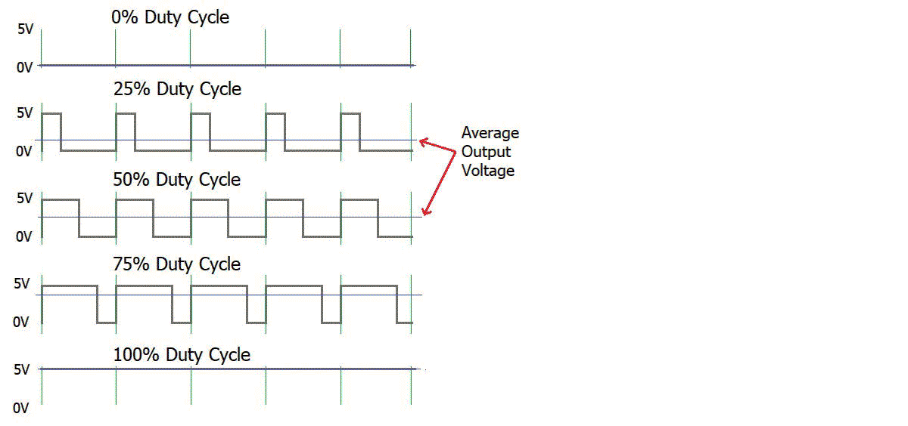
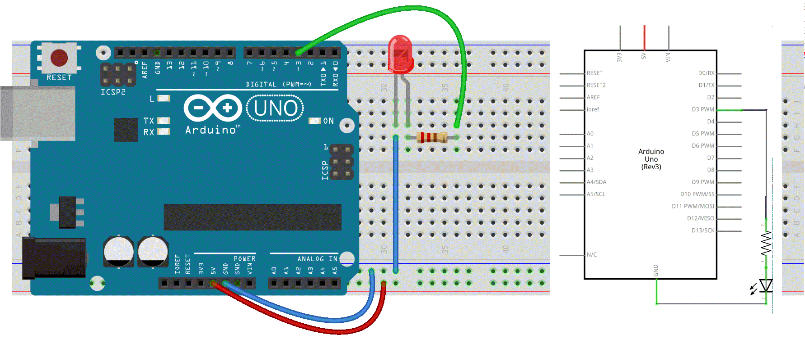
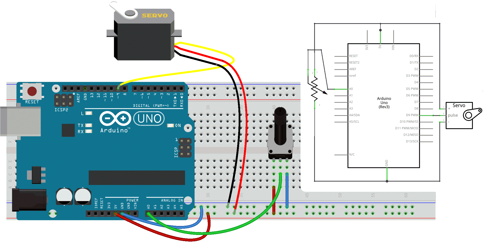

# PWM ☞ 𝔸𝕟𝕒𝕝𝕠𝕘 𝕆𝕦𝕥𝕡𝕦𝕥𝕤

☝︎ [home](../)

##  PWM, a fading LED
PWM, short for **Pulse Width Modulation**, is a technique used to encode an analog signal level into a digital one. A computer cannot output analog voltage, only digital voltage values such as 0V or 5V. We use it to control the dimming of RGB LEDs, the direction of a servo motor, sound synthesis, and more. We can accomplish a range of results in both applications because PWM allows us to vary how much time the signal is high as in an analog-like fashion. While the signal can only be high (5V) or low (0V) at any time, we can change the proportion of time the signal is high compared to when it is low over a consistent time interval. This is called modulating the duty cycle.




- The amplitude of the pulse width (minimum / maximum)
- The pulse period (the reciprocal of pulse frequency per second)
- The voltage level (such as 0V–5V)

There are 6 PWM interfaces on an Arduino Uno: Digital pins 3, 5, 6, 9, 10, and 11, all indicated with a ~ (tilde).    

We will explore this PWM magic by changing the brightness of a LED over time.  

#### Circuit
    

#### Code
```c++
int ledPin = 3;      // LED connected to digital pin 3
int fadeAmount = 5;  // how many points to fade the LED by


void setup() {
  // nothing happens in setup
}

void loop() {
  // fade in from min to max in increments of fadeAmount points
  for (int fadeValue = 0 ; fadeValue <= 255; fadeValue += fadeAmount) {
    // sets the value (range from 0 to 255):
    analogWrite(ledPin, fadeValue);
    // wait for 30 milliseconds to see the dimming effect
    delay(30);
  }

  // fade out from max to min in increments of fadeAmount points
  for (int fadeValue = 255 ; fadeValue >= 0; fadeValue -= fadeAmount) {
    // sets the value (range from 0 to 255):
    analogWrite(ledPin, fadeValue);
    // wait for 30 milliseconds to see the dimming effect
    delay(30);
  }
}
```

###  Input 2 Output
**Now let's connect our Input with the output.**
In a previous experiment, we have done a *button-controlled LED*, using digital signal to control digital pin. Now we will use a potentiometer to control the brightness of the LED.

The Arduino will read the analog value of the potentiometer and assign this value to PWM port. But since PWM works only in the range from 0 - 255 we need to map the input from our sensor down, thus a value between 0 - 1024 to one between 0 - 255.  

### Circuit
    

### Code
```c++
/* Set the brightness of ledPin to a brightness specified by the
  value of the analog input */

const int ledPin = 3;      // LED connected to digital pin 9
const int analogPin = A0;  // potentiometer connected to analog pin 0

int val = 0;               // variable to store the read value
int ledVal;                // variable to store the output value


void setup() {
  // Nothing here, as analog pins are automatically set as inputs &
  // it is not needed to set the pin as an output before calling analogWrite()
}
void loop() {
  // read the value from the sensor
  val = analogRead(analogPin);
  // turn the ledpin on at the brightness set by the sensor
  //Mapping the Values between 0 to 255 because we can give output
  //from 0 -255 using the analogWrite funtion
  ledVal = map(val, 0, 1023, 0, 255);
  analogWrite(ledPin, ledVal);
  delay(10);
}
```

After uploading the program, when we rotate the potentiometer knob, we can see the brightness of the LED change.


###  Servo Motor Control
Now, let's substitute our LED for a **Servo Motor**.   

Servos are motors with a shaft that can turn to a specified position. They usually have a range from 0 to 180 degrees. With an Arduino, we can tell a servo to go to a specified position. In this part we will see how to connect a servo motor and then how to turn it to different positions defined by the value of our potentiometer.

A servo motor consists of some parts to function: a motor, a gearbox and a feedback circuit. It just needs a power line, a connection to ground, and one to a control pin.

*There is a second, different, kind of servo that features a continuous rotation of the shaft, that can be set to various speeds. This is a very useful motor for small geared vehicles.*

#### Circuit
Our servo motor has a female connector with three pins.
- The darkest, brown here, is usually the ground. Connect it to the Arduino GND.
- Connect the power cable that in all standards should be red to 5V on the Arduino.
- Connect the remaining line on the servo connector to a digital 9 (or 10) on the Arduino.    

    

*Note that servos can draw considerable power, so if you need to drive more than one or two, you'll probably need to power them from a separate supply (i.e. not the +5V pin on your Arduino).*


#### Code
In this example we will use **a specific library** that will make coding a lot easier.   
Just like with most programming platforms the Arduino Software can be extended through the use of Libraries. They provide extra functionalities and make programming the Arduino much easier since they contain the code needed to control certain modules, sensors, etc… A number of libraries come installed with the IDE, but you can also download or create your own.


To use a library in a sketch, select it from Sketch > Import Library or just type in the `#include <name_of_library>` command.

```c++
#include <Servo.h>

Servo myservo;    // create servo object to control a servo

int potpin = A0;  // analog pin used to connect the potentiometer
int val;          // variable to read the value from the analog pin

void setup() {
  myservo.attach(9);  // attaches the servo on pin 9 to the servo object
}

void loop() {
  // read the value of the potentiometer
  val = analogRead(potpin);
  // scale it to use it with the servo (value between 0 and 180)
  val = map(val, 0, 1023, 0, 180);
  // sets the servo position according to the scaled value
  myservo.write(val);
  // waits for the servo to get there
  delay(15);
}
```
Make sure you always check the do's and don'ts on how to use a library on its reference page! [This is the servo reference page](https://www.arduino.cc/reference/en/libraries/servo/)

The key functions used here are:
- `Servo *objectname*;`
- `*objectname*.attach*(interface)*` select the pin for servo. This can only use pin 9 or 10.
- `*objectname*.write*(angle)*` controls the angle of the servo (0 to 180 degree).

That's it for now.    
👋🏼


☝︎ [home](../)