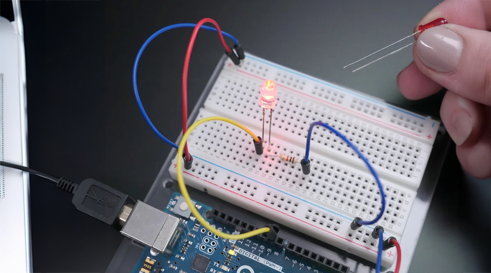

# Physical Computing with the Arduino

👋🏼 Hi, welcome 👋🏼    

You will learn the basics of [physical computing](https://www.tigoe.com/blog/what-is-physical-computing/) with the Arduino.    
This includes learning basic principles of electronics, reading and reproducing circuits sand programming the Arduino.

[Arduino](https://www.arduino.cc/) is an open source physical computing platform based on a simple input/output (I/O) board and a computer program.     
Arduino can be used to develop standalone interactive objects or can be connected to software on your computer, such as [Processing](https://processing.org/), [Max](https://cycling74.com/products/max/), the internet with a.o. [P5.JS](https://p5js.org/), ...  

## Contents
1. [Getting Ready](01/gettingready.md) - the arduino board & software
2. [Getting Started](02/gettingstarted.md) - hello world with a blinking LED
3. [Getting Physical](03/gettingphysical.md) - wiring diagrams, schematics, common components
4. [Push it](04/pushit.md) - with a pushbutton
5. [Advanced Sensors](05/advancedsensors.md) - analog sensors 
6. [PWM](06/pwm.md) - fading LEDs & the servo motor    

Download the [sketches](code.zip)(zipped) and [Handouts in Dutch](arduino_handouts_nl.pdf) or [Handouts in English](arduino_handouts.pdf)

## Additional Learning resources:  
- The [learn](https://docs.arduino.cc/learn/) & [tutorials](https://docs.arduino.cc/tutorials/) sections on the arduino website are really helpful to get you started.
- See also [this Great Website](https://makeabilitylab.github.io/physcomp/electronics/) if you want to learn more about the fundamentals of electricity, or delve deeper into physical computing.

