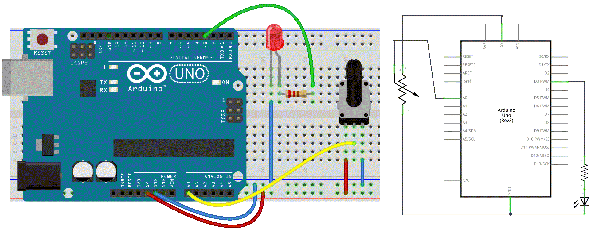

### 6b. Analog Input 2 Output
**Nu gaan we onze Input koppelen aan de Output.**
In een eerder experiment hebben we een button-controlled LED gemaakt, waarbij een digitale knop een digitale pin aanstuurt. Nu gaan we een potentiometer gebruiken om de helderheid van een LED te regelen.    

De Arduino leest de analoge waarde van de potentiometer en gebruikt deze om een PWM-signaal naar de LED te sturen.    Omdat PWM alleen werkt in het bereik van 0–255, moeten we de invoer van onze sensor omzetten van 0–1023 naar 0–255. Dit doen we met de functie `map()`.    

#### Circuit


#### Code

```c++
/* Set the brightness of ledPin to a brightness specified by the
  value of the analog input */

const int ledPin = 3;      // LED connected to digital pin 9
const int analogPin = A0;  // potentiometer connected to analog pin 0

int val = 0;               // variable to store the read value
int ledVal;                // variable to store the output value


void setup() {
  // Noting here as: Analog pins are automatically set as inputs &
  // it is not needed to set the pin as an output before calling analogWrite()
}
void loop() {
  // read the value from the sensor
  val = analogRead(analogPin);
  // turn the ledpin on at the brightness set by the sensor
  //Mapping the Values between 0 to 255 because we can give output
  //from 0 -255 using the analogwrite funtion
  ledVal = map(val, 0, 1023, 0, 255);
  analogWrite(ledPin, ledVal);
  delay(10);
}
```
