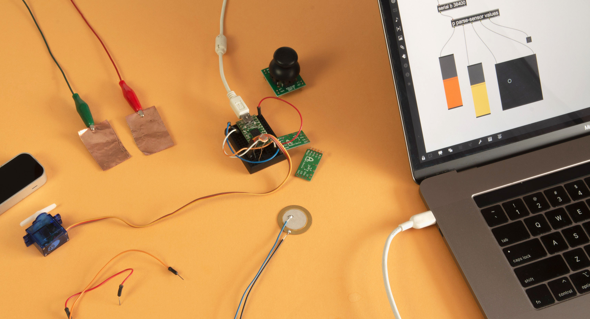

# INTERACTIVE == PHYSICAL

*Keywords: patching, connections, digital, phyiscal, video, sound, interaction, sensor, actuaror, motor, …*      
*tools: Max, arduino, sensors, motors, …*    

**Kunst die reageert en beweegt**    
Wat gebeurt er als digitale logica een lichaam krijgt? In deze media toolkit onderzoeken we de wisselwerking tussen *het fysieke* en *het digitale*. Met **Max**  - een visuele programmeeromgeving waarin je met bouwstenen en draadjes klanken, beelden en data verbindt - en **Arduino**  - een platform waarmee je fysieke sensoren, motoren en lampen kunt aansturen - bouwen we systemen die luisteren, reageren en handelen. Geen abstracte code, maar direct hoorbare en voelbare resultaten. Samen werken we toe naar experimenten die kunnen uitgroeien tot **installaties** of **performances**.
[toc]

Max, Arduino & sensors

  <h2>Max</h2>
  
<a href="interactive-physical/max/" target="_blank">Max tutorial</a>

  
<strong>Meebrengen:</strong> 
  - computer met <a href="https://cycling74.com/downloads" target="_blank_">Max</a> (versie 9) geïnstalleerd + een hoofdtelefoon of oortjes

  <h2>Physical Computing</h2>
  <ul>
    <li><a href="interactive-physical/arduino" target="_blank">Arduino tutorial</a></li>
    <li><a href="interactive-physical/arduino-max" target="_blank">connecting Max with Arduino</a></li>
  </ul>
  
<strong>Meebrengen:</strong> 
  - computer met <a href="https://www.arduino.cc/en/software" target="_blank">Arduino</a> geïnstalleerd

<h2>Makers</h2>
  <ul>
    <li><a href="https://www.lynnhershman.com/" target="_blank">Lynn Hershman Leeson</a> is een Amerikaanse kunstenaar - filmmaker en pionier in de nieuwe media. Ze werkt met thema's als identiteit, surveillance en de impact van technologie op de samenleving.</li>
    <li><a href="https://www.lozano-hemmer.com/" target="_blank">Rafael Lozano-Hemmer</a> is een Mexicaans-Canadese kunstenaar die bekendstaat om zijn grootschalige interactieve installaties. Hierin vloeien technologie, architectuur en publieksparticipatie samen om thema's als verbinding en identiteit te onderzoeken.</li>
    <li><a href="https://www.dwbowen.com/" target="_blank">David Bowen</a> is een Amerikaanse kunstenaar die naam maakte met interactieve installaties op het snijvlak van technologie, robotica en natuurlijke elementen. Hij onderzoekt hiermee de wisselwerking tussen mens en milieu.</li>
    <li><a href="https://www.zimoun.net/" target="_blank">Zimoun</a> is een Zwitserse kunstenaar die meeslepende, kinetische geluidsinstallaties creëert. Met eenvoudige materialen en mechanische systemen onderzoekt hij patronen, geluid en ruimte.</li>
    <li><a href="https://alimomeni.net/" target="_blank">Ali Momeni</a> is een Iraans-Amerikaanse kunstenaar, muzikant en docent. Hij staat bekend om zijn interdisciplinaire werk in de publieke ruimte, interactieve installaties en performances, waarbij hij technologie inzet om samenwerking en gemeenschapszin te stimuleren.</li>
    <li><a href="https://ejtech.studio/" target="_blank">EJ Tech</a> is een in Boedapest gevestigd duo, bestaande uit Judit Eszter Kárpáti en Esteban de la Torre. Ze staan bekend om hun experimentele aanpak waarbij ze geluid, licht en tactiele materialen combineren in immersieve installaties en performances.</li>
    <li><a href="https://hansbeckers.be/works/" target="_blank">Hans Beckers</a> is een Belgische geluidskunstenaar en componist (en oud-student van KASK). Hij creëert meeslepende installaties en performances waarin hij natuurlijke materialen en zelfgebouwde instrumenten verwerkt.</li>
    <li><a href="https://jocaimo.blogspot.com/" target="_blank">Jo Caimo</a> is een Belgische kunstenaar (eveneens een oud-student) die participatieve installaties en performances maakt. In zijn werk mengt hij humor, technologie en sociale interactie, waarbij hij het publiek vaak op onconventionele en speelse wijze betrekt.</li>
    <li>...</li>
  <ul>

