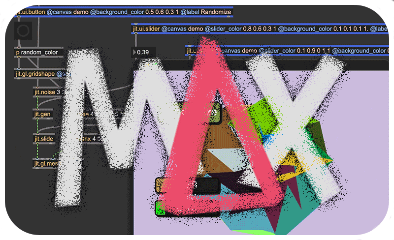

    

[Max](https://cycling74.com/products/Max) is [een visuele programmeertaal](https://en.wikipedia.org/wiki/Visual_programming_language). Het programmeren gebeurt aan de hand van visuele uitdrukkingen en ruimtelijke ordeningen van tekst en grafische elementen. Het programmeren in Max heet **patchen**, visuele elementen of **“object boxes”** worden verbonden met draadjes of **“patchcords“**. Deze diagrammen laten zien hoe de data door het programma 'stroomt'. Met Max kan je onmiddellijk de resultaten zien en horen bij elke verandering die je maakt. Het is een heel intuïtieve manier van programmeren waarin doen en denken samenvallen.

Max is ontstaan midden jaren 80 en groeide over de jaren uit tot een erg uitgebreid en krachtig platform. Het wordt voornamelijk gebruikt door kunstenaars, componisten, wetenschappers, docenten, studenten en softwareontwerpers. Het voorziet in tools om te werken met MIDI, data, geluid en muziek **“msp~”**, bitmapbeelden, video en 3D **“jitter”**, interactiviteit en connectiviteit met andere toepassingen en hardware ...

## Wat kan je nu allemaal doen met Max?

Mensen gebruiken Max voor allerlei doeleinden. Enkele populaire projecten zijn audio-reactieve visuals, nieuwe muziekinstrumenten en live-elektronica. Hier is een greep uit wat interessante voorbeelden:
* Leafcutter John is een muzikant die met Max werkt. De performance [Nightless Night](https://www.youtube.com/watch?v=U9v-4VrSglE) gebruikt een aantal lichtsensoren, samen met knipperende handlampjes, om een nieuw muziekinstrument te creëren.
* Daito Manabe is een kunstenaar die werkt aan installaties, composities en performance, waarbij hij zoveel mogelijk nieuwe technologieën inzet. [Particles](https://www.youtube.com/watch?v=gvUpkknryaY) is een werk dat Max gebruikt om de posities van meerdere rollende fysieke componenten te koppelen aan diverse geluidsgebeurtenissen. Ook het oudere [electric stimulus to face](https://daito.ws/en/archive/electricstimulustoface_test/) is een grappig en niet alledaags voorbeeld van performance met technologie.
* AGF/Antye Greie-Ripatti is een Duitse digitaal kunstenaar, dichter en producer die bekendstaat om haar innovatieve gebruik van Max om stem, tekst en elektronica te transformeren tot experimentele audiovisuele werken, waardoor ze een invloedrijke maker is binnen de Max-gemeenschap. Zie bijv. [dit interview](https://cycling74.com/articles/an-interview-with-antye-greie-ripatti-agf) met haar. Het nummer [My Patch](https://www.youtube.com/watch?v=BYJ2dDDf-ts) is een erg mooi en tijdloos aan de software zelf.
* [Deze compositie](https://www.youtube.com/watch?v=BXlaSBo0KXs), geschreven voor de heropening van de St. Pauli Elbtunnel in Hamburg, gebruikt Max om de uitvoering van 144 muzikanten over de volledige lengte van de tunnel te coördineren.
* Rino Petrozziello heeft diverse generatieve audiovisuele Max-patchers ontworpen waarbij de interface van Max zelf verandert in een autonoom kunstwerk, zoals in zijn werk [Max/Msp Droid face](https://vimeo.com/116421027); hij omschrijft het zelf toepasselijk als “joking with the aesthetics of the software”.
* ...

## TUTORIAL
☞ Dit is een reeks nieuwe [tutorial files](max_tutorial_2025.zip) & een [showcase](max_showcase.zip); een verzameling patchen geplukt van het internet die wat de mogelijkheden demonstreren. [Dit](max_files_old.zip) is een reeks oudere tutorial files voor wie ernaar zou zoeken.

## ALTERNATIEVEN
Naast Max zijn er nog heel wat andere visuele programmeeromgevingen (waarvan sommige gratis en open source). [Op deze pagina](https://github.com/ivanreese/visual-programming-codex/blob/master/implementations.md) vind je ze bijna allemaal opgelijst. Onderstaande lijken me zeker het bekijken waard of vormen een mogelijk alternatief voor Max.
* [Pure Data](https://puredata.info/) [Cross-platform] *Open source visual programming language for multimedia*.
* [VVVV](https://vvvv.org/) [Win] *Hybrid visual/textual live-programming environment for easy prototyping and development*
* [TouchDesigner](https://derivative.ca/) [Mac, Win] *Visual development platform to create realtime projects*
* [NodeBox](https://www.nodebox.net/) [Mac, Win] *Cross-platform, node-based GUI for efficient data visualizations and generative design*
* ...
