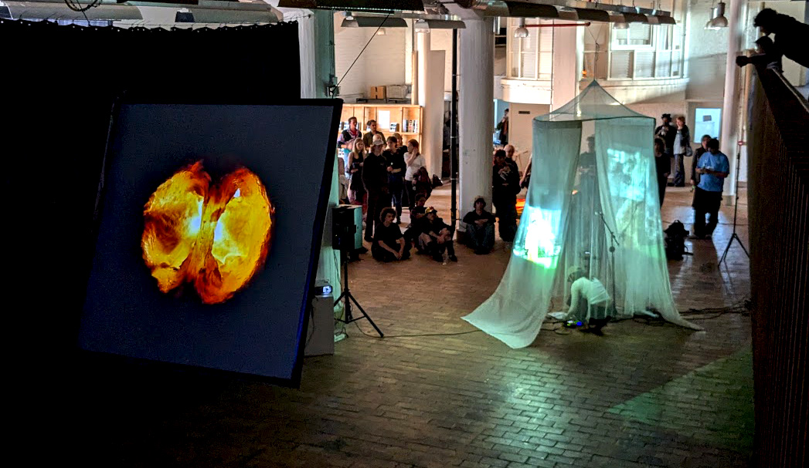

# AV-EXPO TECHNIEK
*Keywords: audiovisueel, projectie, geluidsinstallatie, presentatietechnologie, immersieve ervaringen,  …*
*tools: flatscreen schermen, projectoren, hdmi kabels, datapath fx4, mediaplayers, koptelefoons, koptelefoon versterker, boxen en versterker, meer kabels, …*

Tijdens deze workshop behandelen we een aantal klassieke presentatievormen van geluid en beeld in een tentoonstellingscontext. We maken samen een aantal technische opstellingen die het merendeel onder jullie de komende tijd met zekerheid nodig zullen hebben maar we bekijken ook een aantal complexere installaties waaronder multichannel video-installaties. We zullen werken met veelgebruikte apparatuur zoals projectoren, monitors, luidsprekers en mediaplayers, switches en splitters, allerhande kabels en tegelijkertijd praten we over technische aspecten als videoformaten, resolutie, beeldverhouding, compressie, framerates, etc.  

### Hand-out
[AV-Expo Techniek](AVtech.pdf) (pdf)

