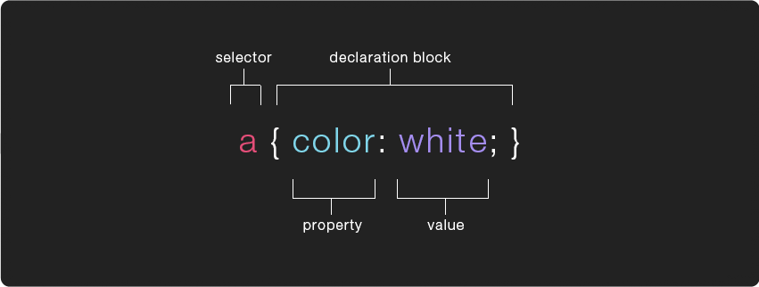

# CSS or Cascading Style Sheets

## CSS Rules

**CSS works by associating rules with HTML elements.**



A CSS "rule" contains 2 parts, **a selector** which specifies which element(s) the rules will be applied to and a **{ declaration block }**, surrounded by curly brackets, which specifies how the element should be styled.

The declaration is split in 2 parts, **the property** which indicates the aspect of the element you want to change (ex: color, font, width, border) followed by a `:` (colon) and then **the value** (the setting you want to use for that specific property) followed by a `;` (semi-colon).

## the CSS - HTML link

There are 3 ways to apply CSS style rules to HTML, with:

1. External stylesheets
2. Internal stylesheets
3. Inline CSS

### External stylesheets

This is the most common and most useful way of working. The CSS rules are in an external, separate document. The external document is linked to the HTML document with a `<link> `element in the `<head>`.

```html
<!DOCTYPE html>
<html lang="en">
  <head>
    <meta charset="utf-8" />
    <title>This is the title</title>
    <link rel="stylesheet" href="styles.css" />
  </head>
  <body>
    <h1>Hello world</h1>
    <p>Lorem ipsum dolor sit amet consectetur, adipisicing elit. Pariatur odio voluptas eius, dolorum, non numquam et aliquam repudiandae similique quaerat exercitationem nam unde saepe necessitatibus quidem optio hic iusto. Minus?</p>
  </body>
</html>
```

An external style sheet must be saved with a .css extension. This could be the content of styles.css

```css
body {
    background-color: pink;
}
h1 {
    color: yellow;
}
```

Check out [this external stylesheet example](css-ex.html) in the browser.

### Internal stylesheets

The rules are inside a `<style>` element in the `<head>`.
This is less useful because it can only be used for 1 document. Should be avoided if possible unless in the design process of when making a one-page-website.

```html
<!DOCTYPE html>
<html>
  <head>
    <style>
      body {
        background-color: pink;
      }
      h1 {
        color: yellow;
      }
    </style>
  </head>
  <body>
    <h1>Hello world</h1>
    <p>Lorem ipsum dolor sit amet consectetur, adipisicing elit. Pariatur odio voluptas eius, dolorum, non numquam et aliquam repudiandae similique quaerat exercitationem nam unde saepe necessitatibus quidem optio hic iusto. Minus?</p>
  </body>
</html>
```

### Inline styles

CSS rules are added to an HTML document with a style attribute. The rules then only apply to that specific element.

```html
<p style="color: red;">I am red.</p>
<p>I am not red.</p>
```

Avoid if possible. It poses challenges in terms of maintenance and flexibility due to scattered CSS rules. This method contradicts the concept of the **3 layers in a webpage**, where the separation between structure (HTML) and design (CSS) is crucial. Ideally, modifying the design of a page should be achievable without altering the HTML, but the use of inline styles complicates this process, often requiring at least some minor adjustments in practice.

The concept of the cascade is applicable to these three methods of applying CSS to HTML, where the most specific rule takes precedence. Specifically, an inline rule will supersede rules in the internal & external stylesheet. And consequently rules in the internal stylesheet supersede the ones in the our external stylesheet. An entire note on the cascade follows later.

## CSS Selectors

```css
h1 {
  color: yellow;
}
```

The example above uses an h1 **type selector**, which means it will apply the rules to all `<h1>` elements on the page.  
You can apply the same rule to multiple elements by including them in a comma separated list within the selector. For example:

`h1, h2, h3 { color: yellow; }`

This will change the color of all the `<h1>`, `<h2>`, and `<h3>` tags on the page to yellow.

There are many other kinds of selectors which give you different ways of targeting specific elements to apply your CSS rules to. Another common selector is the **class selector** which targets any element whose class attribute’s value matches that of the class name.

```css
<style>
  .title {
    color: #ff0000;
    font-size: 24px;
    font-family: sans-serif;
  }
</style>
```

```html
<div class="title">content</div>
```

## Further CSS Selector types

This is an overview of most of the ways you can write CSS Selectors, for more in depth info visit the Mozilla Developer Network's page on [CSS selectors](https://developer.mozilla.org/en-US/docs/Learn/CSS/Building_blocks/Selectors):

- **Universal Selector** `* { }`  
  this rule will apply to all elements on a page

- **Type Selector** `p { }`  
  this rule will apply to all elements of the specified type (in this case `<p>`)

- **Class Selector** `.stuff { }`  
  this rule will apply to all elements with a class attribute that matches it (for example `<div class="stuff">`), you can mix type/class selectors like this `p.stuff { }`, that will only target `<p>` tags with a `class="stuff"`

- **ID Selector** `#info { }`
  this rule will apply to all elements with an id attribute that matches it (for example `<div id="info">`)    

```css
<style>
  #title {
    color: #ff0000;
  }
</style>
```

```html
<div id="title">content</div>
```

---    

*From here on it gets a little more complex. We could come back for this later as the since these selector types are used in more advanced applications.*
---


Below are a few selector examples designed specifically for selecting relatives (elements that are related to each other in some way)

- **Child Selector** ` p > a { }`  
  this rule will apply to all `<a>` elements directly inside of `<p>` elements (ie. any `<a>` which is a "child" of a `<p>`)

- **Descendant Selector** `p a { }`  
  this selector is just like the previous one, except that it will apply to all the `<a>` elements inside of `<p>` regardless of how deeply nested it is (ie. it can be a child of a child of a child of `<p>`)

- **Adjacent Sibling Selector** `h1+h2 { }`  
  this rule will apply to all `<h2>`elements that directly follows an `<h1>` element

- **General Sibling Selector** `h1~h2 { }`  
  this rule will apply to all `<h2>` elements that follows an `<h1>` element (doesn't have to directly follow, so long as they are "siblings")

**An element can have more than one CSS class**,  
for example:

```html
<div class="item red">hello</div>
```

This div has two classes applied to it, each might do something specific. Rather than creating a custom class for each type of element in your page, you could create classes that are meant to be used more modularly and then add all that apply to any given element.

- AND Selector: `.big.red { }`  
  this rule will apply to any element that contains both the “big” and “red” class, for example:

```html
<div class="big red">hello</div>
```

NOTE: If you leave a space between `.big .red {}` then it will become a Descendant Selector and apply to all elements with a class of ‘red’ which are also children of elements with a class of ‘big’, ex:

```html
<div class="big">
  <span class="red">hey!</span>
</div>
```

## pseudo-classes/elements

Selector’s can also be followed by **pseudo-classes**, which specify a particular “state” the element can be in. The example below shows a very common use of the `:hover` pseudo-class.

```css
a {
  color: #ff00ff;
  text-decoration: none;
}
a:hover {
  color: #cc3399;
}
```

Similarly, selector’s can also be followed by **pseudo-elements** (`::` instead of `:`), rather then specify a special state, pseudo-elements target a specific part of the targeted element, for example:

`p::first-letter { font-size: 32px; }`

This will make the first letter of every `<p>` element 32px. A full list of [pseudo-classes](https://developer.mozilla.org/en-US/docs/Web/CSS/Pseudo-classes) is available on the mozilla developer network as well as a full list of [pseudo-elements](https://developer.mozilla.org/en-US/docs/Web/CSS/Pseudo-elements). You can also find a list of every [CSS selector and property](https://css-tricks.com/almanac/) in CSS-Tricks.com's almanac.

## [Properties List](https://developer.mozilla.org/en-US/docs/Web/CSS/Reference)
Use this [CSS reference](https://developer.mozilla.org/en-US/docs/Web/CSS/Reference) to browse an alphabetical index of all of the standard CSS properties, pseudo-classes, pseudo-elements, data types, ... 


<p class="prev-next text-center">
  <a class="btn" href="../css/"><i class="fa fa-angle-left"></i> Previous</a>  
  <a class="btn" href="../css/02_colors/">Next <i class="fa fa-angle-right"></i></a>
</p>