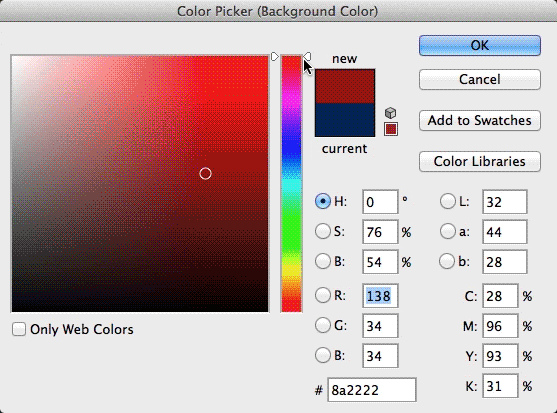

# CSS Colors

There are a few CSS properties that take a color as a value: `background-color`, `color` & `text-shadow` (changes the font color), `border-color` & others (see [this Applying Color page](https://developer.mozilla.org/en-US/docs/Web/CSS/CSS_colors/Applying_color) from the Mozilla Developpers CSS reference).    

There are a number of different ways to describe colors in computers & CSS accepts most of them.

## Types of Values

    

#### Color Names

There are [147 color names](http://www.w3schools.com/cssref/css_colornames.asp) like "green", "tomato", & "whitesmoke" which can be used as values. Using color names isn't very common.

#### Hex Codes

This is likely the most common used method. It comes in the form #rrggbb where rr (red), gg (green) and bb (blue) are hexadecimal values between 00 and ff (same as decimal 0-255). E.g.: `#FF0000` is red, `#00FF00` is green && `#0000FF` is blue.

#### RGB Values

Similar to hex in that it describes a color based on how much red, green & blue there is, except that it takes decimal values from 0 - 255 for each & is written like this: `color: rgb(255,0,0);` is red, `color: rgb(0,255,0);` is green & `color: rgb(0,0,255);` is blue.

#### HSL Values

hsl stands for hue (degrees from 0 - 360 specifying a spot on the [color wheel](https://en.wikipedia.org/wiki/Color_wheel), 0 being red (the top of the wheel), saturation (the amount of gray in a color (from 0 -100%) & lightness (the amount of white or black (0 - 100%, 50% being normal).    
`color: hsl(0,100%,50%);` is red, `color: hsl(120,100%,50%);` is green & `color: hsl(240,100%,50%);` is blue.

## opacity / alpha

CSS3 introduced opacity (transparency) which is described via a float value between 0.0 & 1.0    
There are a few ways to specify it: either with the `opacity: 0.5;` property or by adding an 'a' (alpha) to either rgb or hsl like this: `color: rgba( 255, 0, 0, 0.5 );` or color: `hsla( 0, 100%, 50%, 0.5 );` resulting in semi-transparent red.

  <a class="btn" href="../css/01_css-syntax/"><i class="fa fa-angle-left"></i> Previous</a>  
  <a class="btn" href="../css/03_units/">Next <i class="fa fa-angle-right"></i></a>

