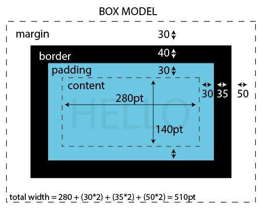

# the Box Model

Every element in an HTML page is a box. It consists of: content, padding, borders and margins.

There are essentially two kinds of boxes depending on whether the element is an **inline element** or a **block element**.    

**Block elements** have default widths of 100% (so they stretch from the far left to the far right of their parent element)    
Inline elements are only ever as wide as their content.Additionally, block elements always force a line-break (so they appear one on top of the other like a column). 
   
Whereas **inline elements** line up next to each other (like a row).

Every element is one of those by default, e.g.    
` <a> ` are inline elements    
`
 <h1> 
` are block elements    

The default behavior of an element can be overridden via CSS with the `display` property, for ex: `img { display: block }`. 

### [ex 1: the box model properties](the-box-model-ex1.html)

A set of properties often associated with the box model are: 
* `margin` the space around the box
* `padding` the space inside the box, between the edges of the box & it's content 
* `border` the outline around the box between the margin & padding 

In this first example there are 2 `
` elements inside the body. 

The 1st paragraph takes up as much horizontal space as possible, while the 2nd paragraph has a second style description (with `class="p500"`) that sets the width at 500 pixels. Try resizing your window.

Margin & padding both have a single value like: `margin: 100px;` which means all 4 sides of the box will have the same amount of margin & padding.     

There are other ways to write this for example when you pass two values to margin (or padding) like this: `margin: 100px 50px`, the first value gets applied to the top & bottom of the box, and the second value gets applied to the left & right side.    
You could also do this `margin: 10px 20px 40px 20px;` where you pass four values (one for each side), starting from the top, then going clockwise (second value is for the right side, third value for the bottom & fourth value for the left side).    
You could also specify specificly which side you want to apply margin to like this `margin-top: 10px;` and/or `margin-bottom: 10px` and/or `margin-left: 10px;` and/or `margin-right: 10px;` (the same is true for padding & border).

**NOTE**: You might have noticed that even when the margin is set to 0 there is still a little bit of space between the div & the top left corner of the browser. This is because the `
` is inside the `<body>` element & the body element has a bit of margin set on it by default.    
You can remove this by adding `body { margin: 0; }` to your stylesheet.

### [ex 2: block vs inline](the-box-model-ex2.html)

In this second example we've got 3 divs & 3 spans with only a little CSS to change their background color and give them some space. The divs are "block" elements by default so those will be stacked vertically as well as expand the full width of their parent element (in this case the `<body>` element). The spans are "inline" elements by default so those will be lined up horizontally && only be as wide as the content inside of them.

Use your browser's *Inspector tool* to edit the CSS of these elements. See what happens when you change a div from block to inline by adding `display: inline` to its CSS, or vice-versa. You could also make the element disappear by changing it to `display: none`.

### [ex 3: box-sizing](the-box-model-ex3.html)

In this last example we have two divs with an image of a ruler measuring in pixels inbetween. Both divs have the same width value applied `width: 200px`.     
But if you look at the ruler you'll notice the first div extends out to 250px while the second div is 200px. This is because in addition to the width value, the divs also have a border of 5px & a padding of 20px.    

The default box-sizing of a div is `box-sizing: content-box;` which means the full width of the visible div (which means not including margin which is invisible) will be the width value (200px) + the border (5px on the left & another 5px on the right) + the padding (20px on the left & 20px on the right) for a total of 250px.    

Sometimes this might be what you want, but other times (especially when working on responsive web design) you want the width of the visible element to be exactly what you specified in the width value. In order to get this behavior you need to change the default box-sizing to `box-sizing: border-box`.    

This is what's applied to the second div (via the 'b-box' class) which is why it only extends out to 200px. to learn more about box-sizing checkout this post on [css-tricks](https://css-tricks.com/box-sizing/).

  <a class="btn" href="../css/03_units/"><i class="fa fa-angle-left"></i> Previous</a>  
  <a class="btn" href="../css/05_typography/">Next <i class="fa fa-angle-right"></i></a>

