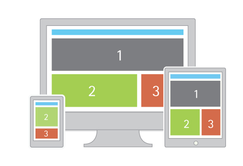
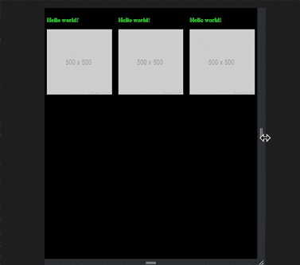

# Responsive Web Design




## Media Queries

Grids look great on desktops, but not so much on smaller devices (like phones). These days there’s no telling what device someone might use to visit your page, so it’s recommended to design your site in such a way that it is adapts or “responds” differently to different screen sizes, this is generally referred to as “responsive web design” (RWD). Below we’ll continue where we left off adapting your grid to be a bit more “responsive”.

One key to achieving this is using CSS3 media queries. which are like conditional statements for CSS. You may notice that in the animation above the gray boxes reposition when displayed on a smaller screen (e.g. a tablet or phone). The way you do this is to create a media query which says “if the width is smaller than a certain size do the following” or “if the page’s width isn’t the specified max-width, do the following”.

The code below will do something similar.

```CSS
.hide {
    background-color: #ffd900;
    color: #fff;
}
h1 {
    font-size: 150px;
    margin: 0;

@media (max-width: 640px) {
    .hide {
        display:none;
    }
}
```

The yellow box will only be `display: none;` (ie. disappear) if the window size is less than 640px, but it will reappear if it grows larger than that.  
You can setup multiple media queries for various screen sizes.

### [ex1: Responsive Web Design](layout-rwd.html)

## the Viewport Meta Tag

At this point things should be responding as expected on your desktop, but the moment you upload your project to the web & actually visit it on your phone you might be surprised to see it NOT responding as expected. By default most phones will just “zoom out” so that the page renders the same way on the phone as it does on desktop (& you’ll be left with a tiny looking version of your website) to get around this we need to use the viewport meta tag, which will force the mobile browser to behave as we’d expect.

```html
<meta name="viewport" content="width=device-width, initial-scale=1" />
```

The two layout examples from [the notes on flexbox & CSS grid layouts](../10_gridlayout-newstuff/) look great until the width of the window gets below 600px or so.  
Check out these media query demos for how we might change our [ex2: RWD flexbox](layout-rwd-flex.html) & [ex3: RWD CSS grid](layout-rwd-grid.html) so that it looks better on "mobile" & smaller screens. As usually, use your web inspector to experiment with these.

<p class="prev-next text-center">
  <a class="btn" href="../css/10_gridlayout-newstuff/"><i class="fa fa-angle-left"></i> Previous</a>  
  <a class="btn" href="../css/12_transforms/">Next <i class="fa fa-angle-right"></i></a>
</p>