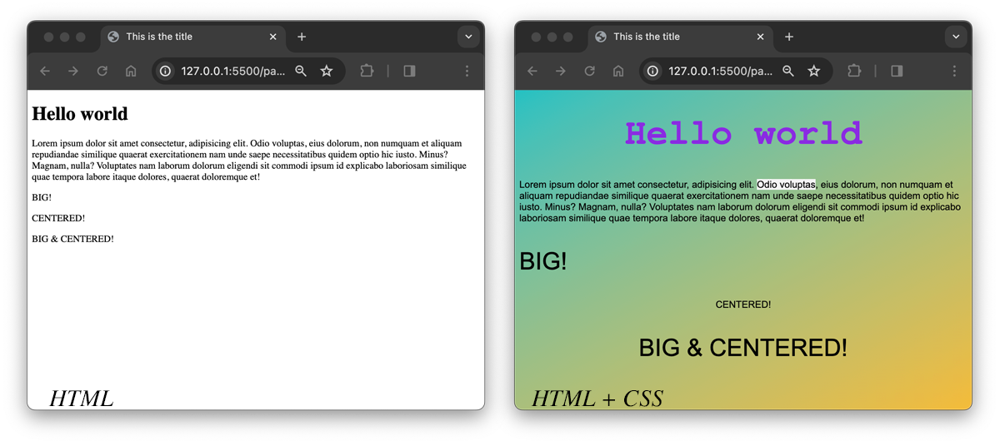

# CSS or Cascading Style Sheets

The point of CSS is to separate *presentation* (CSS) from *content* (HTML). This separation is a popular tech-design philosophy / methodology. It means that you can display the same content (HTML) in different ways (with different styles) for different contexts: laptops, smart phones, in print, on a braille tactile device, etc. Depending on how you implement your CSS, it also enables you to make site-wide changes in a single document which can make updating (even redesigning the entire aesthetic) a site drastically easier.

### Contents
1. [CSS Syntax](01_css-syntax/css-syntax.md)
    - [ex: external stylesheet - html](01_css-syntax/css-ex.html)
    - [ex: external stylesheet - css](01_css-syntax/styles.css)
2. [Colors](02_colors/colors.md)
3. [Units](03_units/units.md)
    - [ex 1: percentages](03_units/css-units-ex1.html)
    - [ex 2: viewport units](03_units/css-units-ex2.html)
4. [the Box Model](04_boxmodel/the-box-model.md)
    - [ex 1: the box model properties](04_boxmodel/the-box-model-ex1.html)
    - [ex 2: block vs inline](04_boxmodel/the-box-model-ex2.html)
    - [ex 3: box-sizing](04_boxmodel/the-box-model-ex3.html)
5. [Typography](05_typography/typography.md)
6. [the Cascade](06_the-cascade/the-cascade.md)
    - [ex 1: what takes precedence?](06_the-cascade/the-cascade-ex1.html)
    - [ex 2: more than one class](06_the-cascade/the-cascade-ex2.html)
    - [ex 3: Inheritance](06_the-cascade/the-cascade-ex3.html)
7. [Centering](07_centering/centering-things.md)
    - [CSS Centering Example](07_centering/centering-things.html)
8. [Layout - Positions](08_layout-position/position.md)
    - [CSS Position Examples](08_layout-position/positions.html)
9. [Layout - Old](09_gridlayout-oldstuff/layout-old.md)
    - [ex 1: CSS Liquid](09_gridlayout-oldstuff/layout_liquid.html)
10. [Layout - Modern](10_gridlayout-newstuff/layout-modern.md)
    - [ex 1: Flexbox](10_gridlayout-newstuff/layout_flexbox.html)
    - [ex 2: CSS Grid](10_gridlayout-newstuff/layout_grid.html)
11. [Responsive Web Design](11_responsive-media-queries/media-queries.md)
    - [ex1: Responsive Web Design](11_responsive-media-queries/layout-rwd-flex.html)
    - [ex2: RWD Flexbox](11_responsive-media-queries/layout-rwd-grid.html)
    - [ex2: RWD CSS Grid](11_responsive-media-queries/layout-rwd.html)
12. [Transform](12_transforms/transform.md)
    - [ex 1: translate](12_transforms/transform-ex1.html)
    - [ex 2: scale](12_transforms/transform-ex2.html)
    - [ex 3: rotate](12_transforms/transform-ex3.html)
    - [ex 4: skew](12_transforms/transform-ex4.html)
13. [Transitions](13_transitions/hover-transitions.md)
    - [ex 1: hovering over links](13_transitions/hover-transitions-ex1.html)
    - [ex 2: CSS Transitions](13_transitions/hover-transitions-ex2.html)
14. [Animations](14_animation/animations.md)
    - [ex 1: bounce animation](14_animation/animation-ex1.html)
    - [ex 2: blinking CSS emoji](14_animation/animation-ex2.html)
15. [Browsers: support, prefixes & quirks](15_browsers/vendor-prefixes.md)
