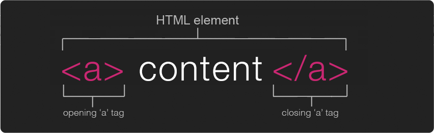
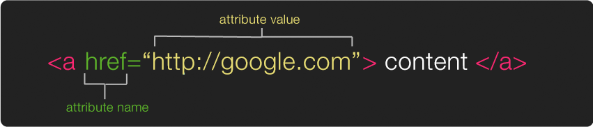
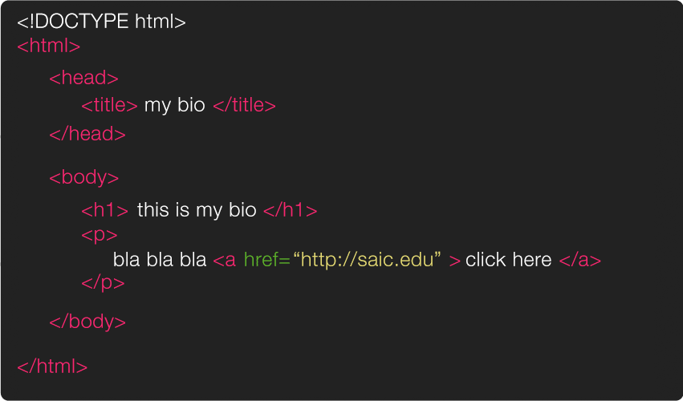

# HTML or Hypertext Markup Language

## HTML elements

HTML is a kind of [markup language](https://en.wikipedia.org/wiki/Markup_language).     
We use **HTML elements** in order to give our HTML page structure & organize our content.

### Tags

An element usually consists of **a pair of tags**, the **opening** and **closing** thag.

An **opening tag** has a `<` (less than sign) followed by characters that specify which tag it is, and then a `>` (greater than tag).

The **closing tag** is the same except it features a `/` (slash) before the characters.

Between the opening `<tag>` & the closing `</tag>` is where we place our content.



A list of all the HTML elements can be found [here](https://developer.mozilla.org/en-US/docs/Web/HTML/Element).

### Attributes

Inside the opening tag (between the `<tag` & the `>`) you can include **attributes**.

Attributes are used to add extra information about that particular element.

The first part of an attribute is **the attribute name**. It indicates what kind of extra information you're going to add to that element. These names are specific, always lower case & followed by a `=`.

The second part of an attribute is **the attribute value**. This is the info or setting for this attribute. Different elements can have different values, but they should always follow the `=` & be surrounded in `" "`.



A list of all the attributes (and their corresponding elements) can be found [here](https://www.w3.org/TR/REC-html40/index/attributes.html).

## Back end of an HTML Page

You can look at the HTML (& CSS) of any page and see how it's made.

In most browsers, you can right-click on an element, and then select 'Inspect element'. A panel will open and show you the source of that element.  
You can see the entire HTML source of a webpage by right-clicking on the page in your browser, and then select 'View page source' or shortcut ctrl/cmd + u

## HTML Structure

When we're ready to create a new HTML page there are a few basic tags and structure that we should always start with. This can be considered a basic HTML template page.



First, the `<!DOCTYPE html>`. This is a declaration that tells the browser that the code that follows conforms to the standards of a particular version of HTML. These used to be long & complicated (see previous [versions here](https://www.w3schools.com/tags/tag_doctype.asp) if you're curious) but with the latest version of HTML (HTML5) it is short & sweet.

Following we've got our first official **element**; `<html>` the opening tag indicates that everything in between it & the closing `</html>` is going to be HTML code.

Inside of the HTML element there are **two major elements**; the `<head>` ... `</head>` which contains information about the page & the `<body>` ... `</body>` which contains everything that will show up inside the browser window.

The only thing we absolutely need **inside of our head** element is a `<title> ... </title>`. You won't see this inside your browser window (because its not in the body) but it will show up in lots of other places, for example on your browser tab & also in google search results.

**Inside the body** you include all of the elements that will create the structure of your content, for example you can create headers with `<h1>` ... `</h1>` & smaller headers with `<h2>` ... `</h2>` & you can create paragraph containers with ` <p>` ... `</p>`.

### Nesting

By now it is already clear that HTML elements can contain other elements. This principle is called 'nesting'. So there is a clear hierarchical relationship between the elements. This will be important later when we talk about CSS.

There are rules about which sub-elements an element can contain. For example, a `<p>` can contain `<strong>` and `<em>` elements, but not a `<table>` element.

Elements must also be properly nested. This, for example is wrong:

```html
<strong><em>bold and in italics</strong></em>
```

The element that is opened last has to be closed first.

*But browser are very forgiving. If you make a mistake, they will try to guess what you meant. In many cases, your page might work even if it contains errors. However, you should always avoid these situations, because it will lead to frustration and confusion when you start applying CSS and JS.*

### Whitespace in HTML Documents

By whitespace we mean spaces, tabs & line break (new line). **Browser ignore almost all whitespace**. For example:

```
<p>Hello world!</p>
```

Renders exactly the same as

```
<p>


Hello                       world!
                </p>
```

Use whitespace to make the hierarchy clear between the elements. It makes the code more readable, and there is less chance of mistakes.

For example:

```html
<table><tr><td>Item 1</td><td>€5</td><td>3</td></tr><tr><td>Item 2</td><td>€7</td><td>11</td></tr></table>
```

This is correct HTML but it's not very readable. It can be rewritten as:

```html
<table>
  <tr>
    <td>Item 1</td>
    <td>€5</td>
    <td>3</td>
  </tr>
  <tr>
    <td>Item 2</td>
    <td>€7</td>
    <td>11</td>
  </tr>
</table>
```

The result in the browser will be exactly the same, but the code is much more readable.

This piece of HTML has 3 levels. Each level is indented with a specific number of tabs. It's easy to see where an element belongs inside the structure by looking at the number of tabs in front of each element.

- level 0: `<table>`, 0 tabs
- level 1: `<tr>` inside `<table>`, 1 tab
- level 2: `<td>` inside `<tr>`, 2 tabs

Using indentation (tabs or spaces) is not required, but it helps a lot.


<p class="prev-next text-center">
  <a class="btn" href="../html/"><i class="fa fa-angle-left"></i> Previous</a>  
  <a class="btn" href="../html/02_structure/">Next <i class="fa fa-angle-right"></i></a>
</p>