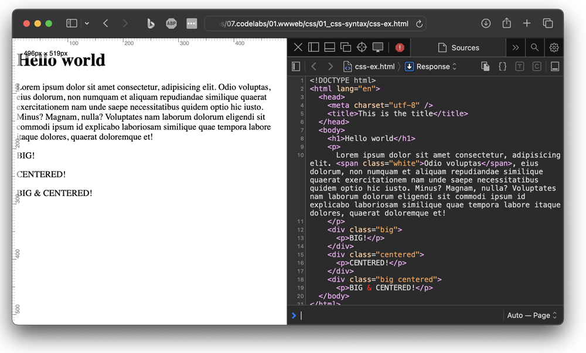

# HTML or HyperText Markup Language

HTML is the standard markup language used to create web pages. It defines the structure of content on a webpage using a system of tags, which denote headings, paragraphs, links, images, and more. Thus, HTML is used to create the basic framework of a webpage, allowing browsers to interpret and display the content correctly.

### Contents
1. [HTML Syntax](01_syntax/html_syntax.md)
2. [page & website structure](02_structure/html_structure.md)
    - [html boiler plate](02_structure/boilerplate.html)
    - [website with a structure in analogy to that of a house](02_structure/house/index.html)
3. [common & usefull elements](03_common_elements/common_elements.md)
