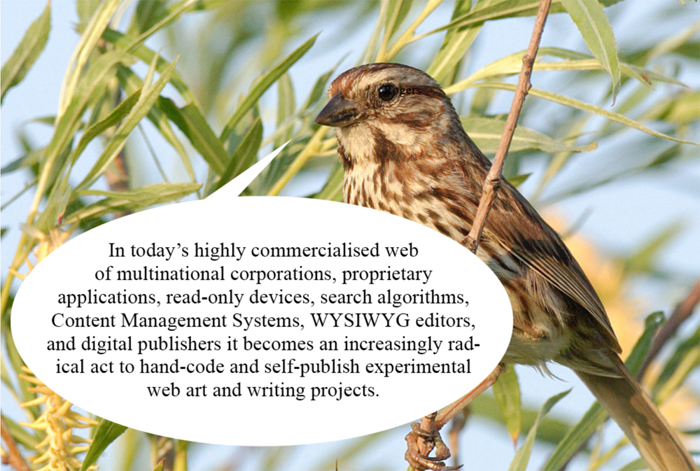

# WWWEB - HTML, CSS & JS

*Keywords: internet, web development, web design, netart, …*    
*Tools: html, css, javascript, code editor, browser, webserver, …*    


<sup>quote by J.R. carpenter, the image is part of the series [Sparrows talking about the future of the web](https://www.are.na/the-creative-independent-1522276020/sparrows-talking-about-the-future-of-the-web) created by Laurel Schwulst</sup>

 🙏🏼 This tutorial is composed almost entirely of teaching material from [Nick Briz](https://nickbriz.com) 🙏🏼 

### Contents
#### [Intro](#intro) & [Tools](#tools) • a cake with 3 layers & what do we need to bake one
#### [HTML](html/html.md) • structure and content
#### [CSS](css/css.md) • look and feel
#### JS • behavior --[under construction]-- 
<hr>

## <a name='intro'></a> A Webpage is like a Cake with 3 Layers
```html
                0   0
                |   |
            ____|___|____
         0  |~ ~ ~ ~ ~ ~|   0
         |  |    J S    |   |           interaction & behavior
      ___|__|___________|___|__
      |/\/\/\/\/\/\/\/\/\/\/\/|
  0   |         C S S         |   0     design or look & feel
  |   |/\/\/\/\/\/\/\/\/\/\/\/|   |
 _|___|_______________________|___|__
|/\/\/\/\/\/\/\/\/\/\/\/\/\/\/\/\/\/|
|                                   |
|              H T M L              |   structure & content
| ~ ~ ~ ~ ~ ~ ~ ~ ~ ~ ~ ~ ~ ~ ~ ~ ~ |
|___________________________________|   
```
☞ Each technology has its function & responsibility

### HTML or HyperText Markup Language. 
HTML is not a programming language because it doesn’t understand logic. A markup language is a way of marking up a document to explain something to the computer about the content of that document.

HTML is the bottom layer of our cake. It is all about structure, semantics & meaning.    

If HTML is used properly, a search engine (like Bing and Google) can understand the structure of the document. For example, if the search engine sees `<h1>` tags, it know that this text is important.

You can easily abuse HTML and use it for design. A classic bad example is using HTML tables to make columns in the page.

### CSS or Cascading Style Sheets
CSS is used to apply visual design to HTML elements. Cascading refers to the parent-child structure of CSS. A style set on a parent element will also apply to its child elements, unless a child has style rules that override that of the parent.

CSS is not required to make a webpage. If you don't add a stylesheet yourself, the browser's default stylesheet will be used.

### JS or JavaScript
JavaScript is the only frontend programming language for the Web (and currently also the most popular programming language).    

JavaScript is used for behavior & user interaction, e.g. animations, popups, form validation, etc.

JavaScript can be used for both client-side, or frontend, and server-side, or backend, scripting. We work entirely frontend. Other server-side programming languages are PHP, Ruby, Python, Java, ...    

JavaScript can be a difficult language to learn. Its structure can be likened to a complex house with numerous extensions.    

We will work with a limited and user-friendly JavaScript library ➔ [p5.js](https://p5js.org)

## <a name='tools'></a>Requirements for WWWeb Development

In web development, there are several different tools working in tandem to make things run. The pieces can seem overwhelming at first, but let's take it step by step.

## Browsers
*Used to view & browse webpages*    

There are [standards](https://www.w3.org/standards/) for HTML, CSS and JS. But each browser implements these in their own way. You can never be completely sure that a page will look exactly the same in all browsers.    
➔ Chrome for desktop is not the same as Chrome for mobile. Same with Safari.    
➔ You should test your work in different browsers, and on different devices. On desktop, a page should at least work in Chrome, Firefox and Safari. On mobile, you should test in Chrome and Safari.    
➔ Testing is especially important with CSS and JavaScript (less with HTML).   

See https://gs.statcounter.com for statistics about browser market share and Mobile vs Desktop.


## Code Editor
*Used to write your code*    
You are free to choose. Recommendations:    
➔ [Visual Studio Code](https://code.visualstudio.com)    
➔ [Pulsar](https://pulsar-edit.dev) ☞ builds on atom    
➔ [Brackets](http://brackets.io)    
➔ [Sublimetext](https://www.sublimetext.com) ☞ 99$    

Pick one editor and learn it well, especially the shortcuts. I loved working with Atom but switched to Visual Studio Code after its Sunsetting.

handy extentions:     
➔ Live Server, launch a development local Server with live reload feature    
➔ Prettier, a Code formatter    
➔ Color picker and previewer

## FTP Client
*Used to upload, download and manage files on a server*    

Again free to choose. Recommendations:
* [Cyberduck](https://cyberduck.io/) (windows & OSX)
* [Filezilla](https://filezilla-project.org/)

## Webhosting

It's common that your workflow will consist of testing and running locally (on your computer), and then uploading and deploying remotely.

HOGENT has a partnership with Combell where, as a student, you have 50 gigabytes of web space at your disposal for a period of 3 years. If you want to make use of it, go to [academicsoftware.eu](https://www.academicsoftware.eu/), log in with your HOGENT account, select 'Web hosting Combell (Linux)' and follow the steps.    
Attention. You have to provide a **.be** domain name yourself.     

[Netlify drop](https://app.netlify.com/drop) is an easy way to publish a site for free. The URL will look like *yourchosenname.netlify.app*    

[Github pages](https://docs.github.com/en/pages) is a relative simple service to publish a website directly on GitHub from a Git repository.
