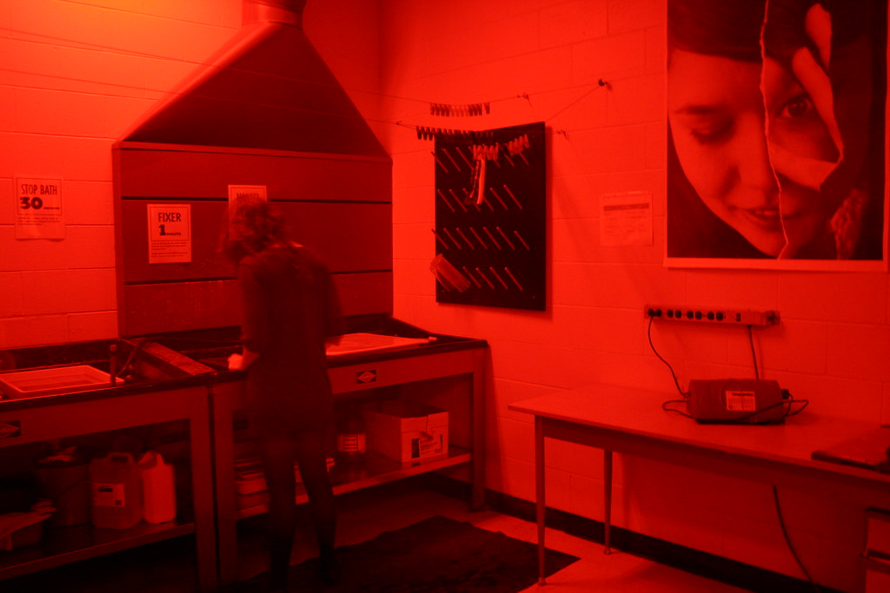

# DE DONKERE KAMER 
## Analoge zwartwit fotografie: van negatief tot afdruk  
*Keywords: fotografie, analoog, scherpstellen, belichten, scherptediepte, ontwikkelen, fixeren, negatief en positief, afdruk, …*     
*tools: analoge camera, spiegelreflex, point and shoot camera, kleinbeeld negatief film, ilford HP5 plus, doka, vergroter, korrelzoeker, ontwikkeltank, ontwikkelbaden, ilford multigrade, …*    

In deze toolkit staat de magie van de donkere kamer centraal. We focussen op de technische weg van belichte filmrol naar fysieke afdruk. Het fotograferen - inclusief de techniek achter belichting, scherpstelling, lenswerking, ... - komt kort aan bod als introductie, maar de echte focus ligt op het labwerk. We maken optimaal gebruik van de doka-faciliteiten en behandelen het volledige ambachtelijke traject: van het ontwikkelen in tanks tot het werken met vergroters en chemische baden voor de perfecte print. We gebruiken hiervoor de donkere kamer bij fotografie. 

### Hand-out
[van belichte film tot print](analoge_fotografie_doka.pdf)

