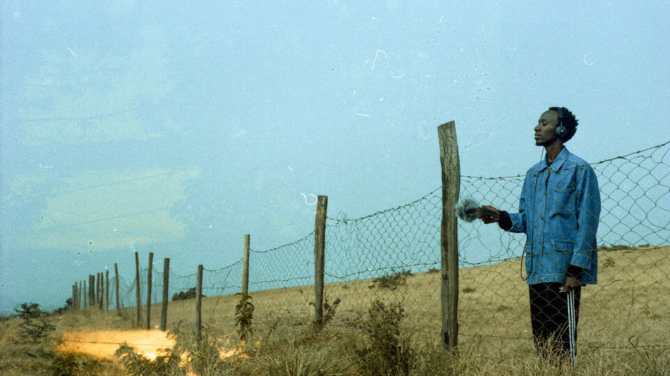

# Converstation with Joseph Kamaru  (KMRU)
#### Thursday, April 2, 17:00 
#### Arca Theater

A conversation with musician and sound-artist [KMRU](https://kmru.info/) on the complex sonic spectrum of our environments and surroundings, the ongoing struggle against sonic colonialities, and the transformative potential of emancipatory listening practices.

    
photo credit: Thukia    

**Joseph Kamaru**, aka **KMRU**, is a sound artist and experimental ambient musician, raised in Nairobi, Kenya, and currently based in Berlin where he is a Master’s student in Sound Studies and Sonic Arts at the Universität der Künste. His works deal with discourses of field recording, improvisation, noise, ambient, machine learning, radio art and expansive hypnotic drones. He has earned international acclaim from his performances in far-flung locales as well as his ambient recordings, including the 2020 album Peel released on Editions Mego.    

In the context of the research project Echoes of Dissent (KASK & Conservatory / School of Arts Gent)
In collaboration with KASK & Conservatory media arts & music production departments
