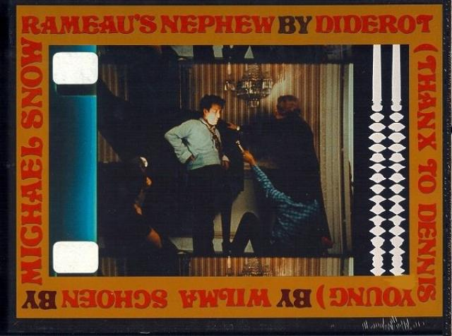

# ‘Rameau’s Nephew’ 
## by Diderot (Thanx to Dennis Young) by Wilma Schoen
### film van Michael Snow op 16mm op groot scherm
#### 26/03/2023 14:30 - 19:00 Zwarte Zaal

Met het overlijden van Michael Snow verdween begin dit jaar een van de voornaamste figuren uit de avant-garde cinema. Kort voor zijn dood stemde de schalkse 94-jarige in de beruchte [Sight and Sound-poll](https://www.bfi.org.uk/sight-and-sound) met de beste films aller tijden nog op drie van zijn eigen klassiekers: Wavelength (1967), La Région Centrale (1971) en het slechts zelden vertoonde Rameau’s Nephew. 

    
*16mm, z/w, stereo, CA, 1974, 268’*

Rameau’s Nephew schetst in 25 episodes een reeks mislukte pogingen van de fictieve regisseur Wilma Schoen (een anagram van Michael Snow) om een echte “talking picture” te maken. Absurditeiten stapelen zich op: spelers worstelen met hun tekst, de klankband ontspoort en de wezenlijke relatie tussen geluid en beeld wordt in twijfel getrokken door Snows heerlijk naïeve en speelse blik. Ondertussen passeert de crème de la crème van de eigentijdse avant-garde de revue: van Chantal Akerman over Jonas Mekas tot Nam June Paik en vele anderen. 

Rameau’s Nephew is uitputtend, zowel in lengte als in geestigheid, en laat de kijker achter in een staat van duizelingwekkend genot en ontzag. Snow omschreef zijn filmversie van Denis Diderots gelijknamige satirische roman als een “muzikale komedie” en het Harvard Film Archive houdt het op “een soort remake van een Jacques Tati-film, gescript door Ludwig Wittgenstein.” 

Deze herdenking wordt voorzien van een gepaste inleiding en zondagse “koffietafel”/bar. De vertoning gaat uitzonderlijk door in de Zwarte Zaal op de KASK-site. 

In samenwerking met ArtCinema OFFoff, KASKcinema en X-Ray. 

> “An achievement of the originality and brilliance of Wavelength. Snow embraces the problems on intimacy of language and thought with such variety, clarity and invention and high humour that again he seems to have made a film out of which an entire future movement could be mined.” — P. Adams Sitney

> “Michael Snow’s Rameau’s Nephew Etc. makes me crazy, makes the top of my head go flying off. I have a need of its particular regenerative insanity at least once a month.” — Amy Taubin

