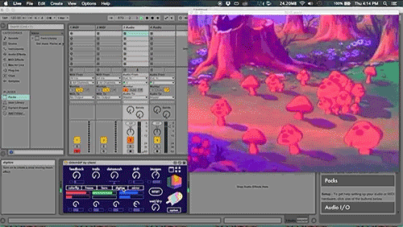

# Ableton Live & M4L ¢σ∂єℓαв
#### dinsdag, 6 & 13 feb. 2024, 9:00 - 12:30

[Ableton Live](https://www.ableton.com/en/s) behoeft eigenlijk geen introductie meer. Het is één van de meest populaire productieprogramma's voor het maken van live muziek, soundscapes en studio-opnames. Met een intuïtieve interface, een uitgebreide collectie instrumenten en samples en een hele batterij aan effecten, is Ableton Live de digital audio workstation (DAW) van vele professionele artiesten als [Daft Punk, Grimes, Modeslektor, Four Tet, Fatima Al Qadiri, SOPHIE, Matmos, Imagine Dragons, Jon Hopkins, ...](https://www.ableton.com/en/blog/categories/artists/) 

[Max for Live](https://www.ableton.com/en/live/max-for-live/) is een extensie voor Ableton die het mogelijk maakt om gebruik te maken van de functionaliteit van [Max](https://cycling74.com/products/max), een visuele programmeertaal voor media. Hiermee kan je eigen effecten, instrumenten en controllers maken, of bestaande Max-patches gebruiken binnen Ableton Live.

Tijdens deze korte introductie in de Live software zien we het gebruik van de interface. Hierna gebruiken we zowel midi als audio sampling om een individuele Live sessie te maken. Met een preset Max patch koppelen we hieraan visuals met ml4 en bekijken de basis functies ervan.

Breng je eigen laptop en koptelefoon mee. Je kan van Ableton Live [een 30 dagen trial versie](https://www.ableton.com/en/trial/) downloaden. 

