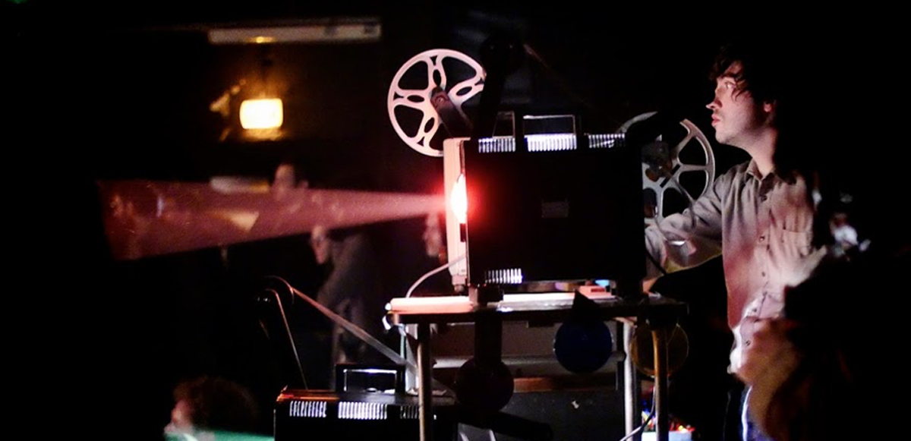
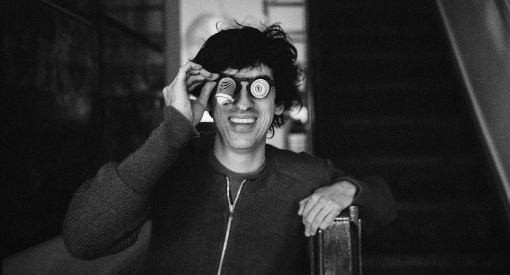

# The Analog World - Floris Vanhoof
#### 12 & 13 nov 24 - 10 tot 17u 
#### 14 nov 24 - 12u tot 20u 
#### Atelier Mediakunst

Tijdens deze driedaagse workshop wordt de digitaal verwende toeschouwer geconfronteerd met de analoge wereld. We verkennen het werkproces en dynamiek van flikkerende dia- en filmprojectoren gecombineerd met elektronische muziekcircuits.    

    

We bewegen ons vrij tussen auditieve en visuele media. We solderen een contactmicrofoon, maken loops met 16mm film, genereren complexiteit met primitieve middelen, tekenen op film, maken grote geluiden met kleine klankcircuits, mengen kleuren met diaprojectoren, luisteren naar een laserstraal, …    

We voorzien voldoende projectoren en kleine instrumenten (optische theremin, kraakdoos,…). Naar wens worden nieuwe media en methoden aangereikt maar  studenten kunnen zeker eigen materiaal en ideeën meebrengen.    

    

Floris Vanhoof (b. 1982, Antwerp, Belgium) explores the intersections of music, visual art, and film. Starting with 16mm experimental films, he moved toward visual experiences challenging perception. Inspired by structural film and early electronic music, he builds installations, creates expanded cinema performances, and releases his music. Vanhoof crafts his own instruments to blend image, light, and sound. As a media archaeologist, he revives analog formats like 16mm film and 35mm slides, not out of nostalgia but for their transparency and rich dynamics. He uses old media to discover new perspectives and experiments with perception by mixing incompatible formats.     

Deze workshop staat open voor alle studenten.    
Je kan je inschrijven per mail naar Hendrik Leper

