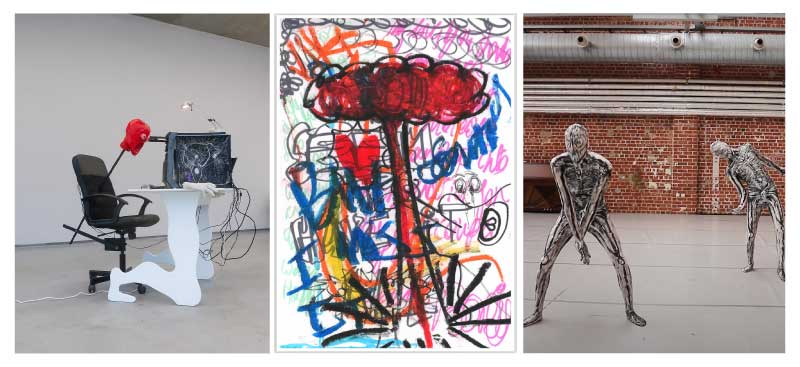

# Lezing Boris Deben
#### Donderdag, 27 februari, 11:30 
#### Black Box Atelier Mediakunst

👑 💀 👺 👁️ 🐸 🤡 🤹🏾 ✨    
**S u r p r i s e ,  s u r p r i s e  !**

===

[Boris Deben](https://www.instagram.com/borisdeben/?hl=en), die ons anderhalf jaar geleden verliet om het Dirty Art Department in Amsterdam op stelten te zetten, komt terug! Al is het maar voor even.
Bart Lodewijks nodigde hem uit om een paar dagen mee te draaien in de tekenateliers, maar hij neemt ook de tijd om jullie mee te nemen in zijn wondere wereld.

Op donderdag 27 februari 11:30 geeft hij in de Blackbox een presentatie over zijn werk en werkwijzen. Mis het niet! Iedereen is welkom.

 

[Boris Deben](https://borisdeben.com/ ) (2002, Brussel) is een multidisciplinair kunstenaar gevestigd in Amsterdam. In zijn werk versmelten sculptuur, installatie, tekening en digitale media tot een fluïde visuele taal.

Met gevonden objecten, elektrische machines en klassieke materialen als hout en gips wekt hij ogenschijnlijk levenloze vormen tot leven. Beweging, geluid en aanraking transformeren deze assemblages tot bezielde entiteiten, balancerend tussen mens en machine, werkelijkheid en fictie.

Fictieve verhalen vormen de ruggengraat van zijn praktijk, waarin hij de wisselwerking tussen lichaam, technologie en maatschappij onderzoekt. Geïnspireerd door queer theorie ondergraaft hij normatieve structuren en speelt hij met identiteitsconstructies, steeds reflecterend op zijn eigen rol als maker.

Zijn werkwijze is vloeibaar en gelaagd: tekeningen groeien uit tot installaties, sculpturen of video’s, conventies worden losgelaten en betekenis verschuift. Zo ontstaat een dynamische wereld waarin beweging en transformatie de toeschouwer uitnodigen om nieuwe verbanden te ontdekken.

Boris behaalde een BFA aan KASK (Gent) en voltooit momenteel zijn MFA aan het Sandberg Instituut (Amsterdam).

    
