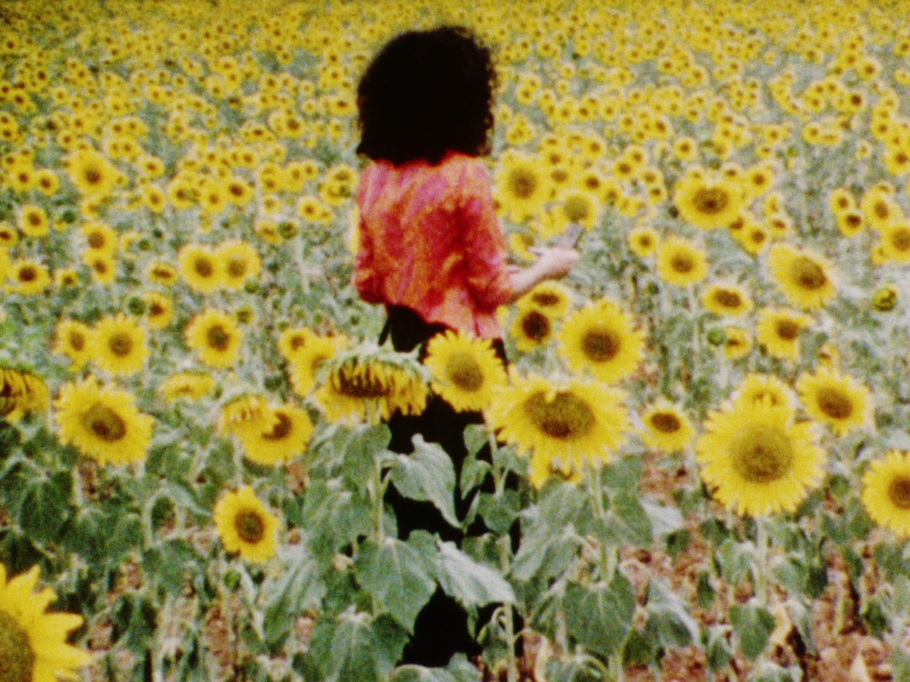
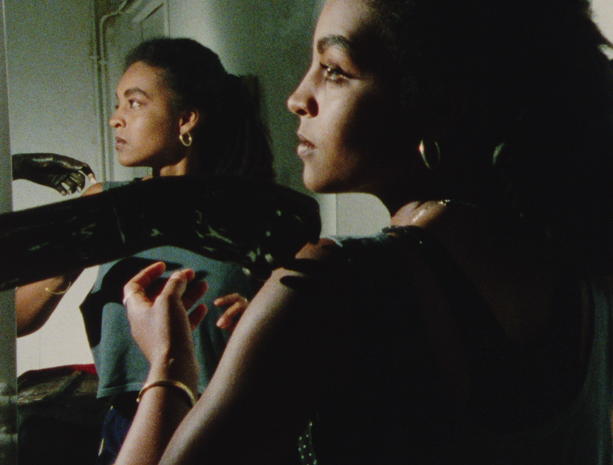

# Cinenova “The Work We Share”
#### lecture & screening
#### KASKcinema
#### donderdag 2 maart, 2023, 15:00 & 20:30

De Britse feministische film- en videodistributeur Cinenova presenteert ['The Work We Share'](https://cinenova.org/project/the-work-we-share/) - een reeks recentelijk gedigitaliseerde films uit de Cinenova-collectie over voorstellingen van gender, ras, seksualiteit, gezondheid en gemeenschap.

### 2/3/2023, 15:00-17:00 - KASKcinema
Op 2 maart om 15u geven Louise Shelley en Charlotte Procter van de Cinenova Working Group een inkijk in hun collectieve werking en de films van Cinenova. Ze geven ook een uitgebreide introductie tot het filmprogramma.

### 2/3/2023, 20:30-22:00 - KASKcinema
De presentatie wordt om 20u gevolgd door de vertoning van 4 films die ingaan op de ervaringen van zwarte feministen, beperkingen, emotioneel en sociaal isolement en de worstelingen met maatschappelijke verwachtingen. Performance, poëzie, surrealisme en experimentele filmtechnieken worden gebruikt om de druk op en belemmering van de geest en het lichaam van vrouwen te onderzoeken en om complexe queer & lesbische relaties en verlangens te verkennen en in beeld te brengen.

Filmprogramma:    
 Back Inside Herself - S. Pearl Sharp, USA, 1984, 4mins, 16mm to DCP    
 A Prayer before Birth - Jacqui Duckworth, UK, 1991,  20mins, 16mm to DCP    
 Now Pretend - L. Franklin Gilliam, USA, 1991, 10mins, 16mm to DCP    
 Loss of Heat - Noski Deville, UK, 1994, 20mins, 16mm to DCP    

[Cinenova](https://cinenova.org/), opgericht in 1991, is een door vrijwilligers gerunde organisatie die meer dan 300 films van feministische film- en videomakers archiveert en distribueert. In de collectie zitten kunstenaarsfilms, narratieve speelfilms, documentaires en educatieve video's van de jaren 1910 tot het begin van de jaren 2000.

