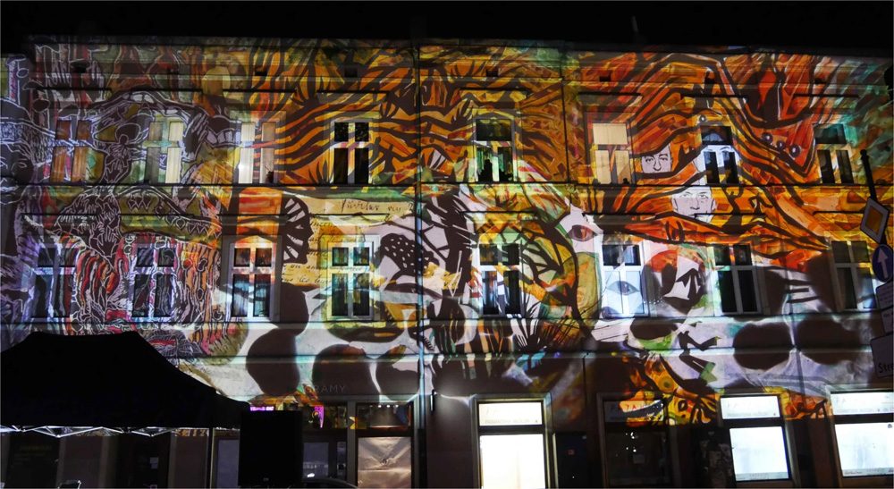
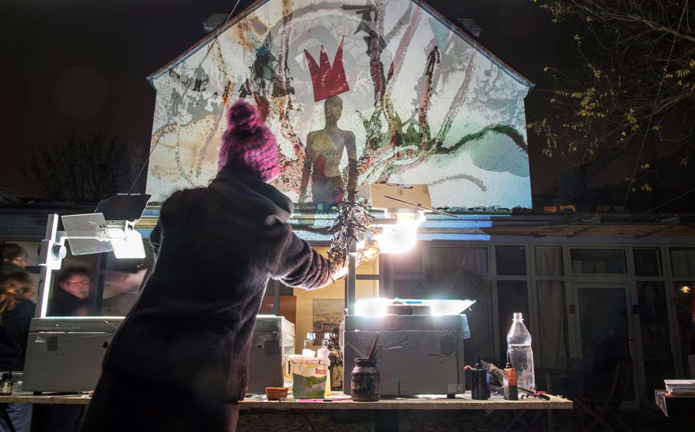

# It’s a question of blue - Claudia Reh
### i.s.m. Lichtfestival Gent 
#### 14 & 15/11/23 - 13u tot 21u 
#### 16/11/23 - 13u tot 22u 
#### + vervolg tijdens het lichtfestival
#### Campus Bijloke + Sleepstraat

    

Claudia Reh is een Duitse lichtkunstenaar die dit jaar één van de geselecteerde kunstenaars is die een grote installatie zal ontwikkelen voor het Lichtfestival Gent (31/01/24 – 04/02/24). Hiervoor werkt ze aan een installatie waarbij ze gebruik maakt van oude overheadprojectors die ze zal presenteren op de gevel van de Heilige Kerstkerk in de Sleepstraat. 
Voor gelijkaardige projecten zie: https://echtzeitlicht.org/livepainting-und-theater/

Het parcours van het lichtfestival loopt dit jaar doorheen de volledige Sleepstraat en in samenwerking met Claudia en de stad Gent worden KASK-studenten uitgenodigd om tijdens het festival eigen (overhead)werk te projecteren op de gevels van de Sleepstraat. Er worden enerzijds eigen artistieke creaties getoond en anderzijds worden er een aantal participatieve samenwerkingen opgezet met bewoners en gebruikers van de Sleepstraat.

Claudia Reh komt tijdens de projectweek een workshop geven waarbij ze studenten wegwijs maakt in allerhande projectietechnieken en zal de creatie van eigen werk begeleiden. De stad Gent heeft een verbindingscoach aangesteld die de studenten die in het participatieve proces geïnteresseerd zijn zal begeleiden. Deze workshop kan bijgevolg leiden tot een langer lopend traject waarbij de resultaten uiteindelijk tijdens het lichtfestival zullen getoond worden.

Deze workshop staat open voor alle studenten.    
Je kan je inschrijven per mail naar jasper.rigole@hogent.be

    

