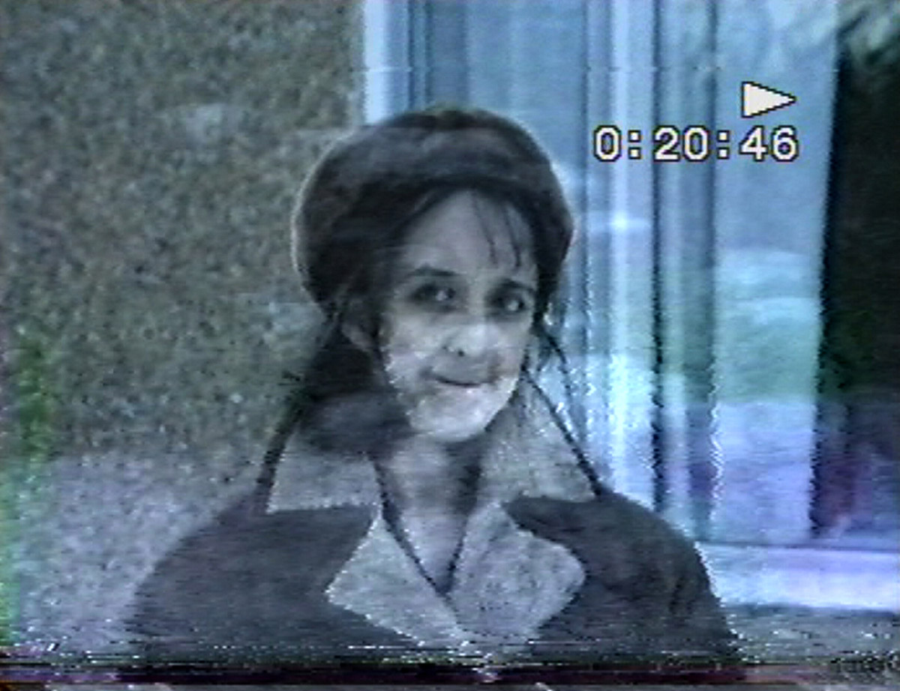
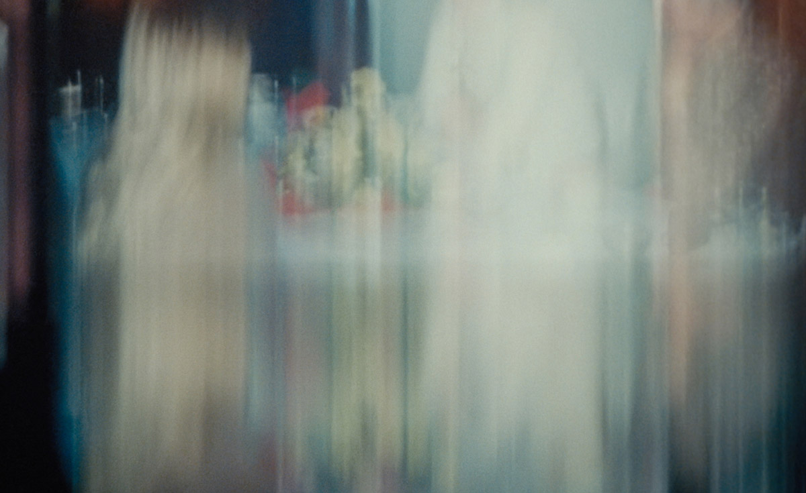

# Alia Syed & Morgan Quaintance
#### lecture 
#### Black box Mediakunst
#### Thursday March 30, 2023, 15:00 - 17:30

Drum roll! [Courtisane Festival](https://courtisane.be/) is soon to begin, and you are all fortunate enough to be granted a free accreditation upon request. Run! Well, [click here](https://courtisane.be/en/accreditations-courtisane-festival), and get yours by Tuesday (21 March).
 
**Another gift 🎀** 
 
We have backstage access to two of the artists from this year’s selection: [Alia Syed](https://www.aliasyed.co.uk) and [Morgan Quaintance](https://morganquaintance.com). 
 
They will visit us at **Media Arts** on **Thursday 30 March** and each give an artist’s talk, sharing insights into their work and their trajectories. Working predominantly in the audio-visual field, from synthesizers to 16 mm, via radio podcasts, found footage montage, and digital films, too, they explore the capacities of both analogue and digital media for their poetics. 

We’ve reserved the black box from **3 pm – 5.30** pm to share this melodic, moving-image-magic moment with you! 
 
[Alia Syed](https://www.aliasyed.co.uk)  is an experimental filmmaker who's interested in story telling, time and memory and the juncture of personal realities which she explores through different subjects positions in relation to culture, diaspora and location.
 
    

[Morgan Quaintance](https://morganquaintance.com) is a London-based artist and writer who “weaves together personal and historical narratives to lay out a rich, layered universe ...  Whether he’s sharing memories of his youth or exploring the echoes of history in race and class, he finds a way, by introducing an edit or a piece of music at the right moment, to tap into the senses.” (MoMA)
 
    
 
Prior to the talks, we will be watching Courtisane films at KASKcinema at 1.15 pm – [short portraits by the great experimental filmmaker Margaret Tait and a post-humous portrait of her by Luke Fowler](https://courtisane.be/en/event/selection-2-margaret-tait-luke-fowler). You are more than welcome to join us: watch together, walk together, talk together, from the cinema to the black box at Media Arts. The more the merrier! All welcome! Bring a friend! 