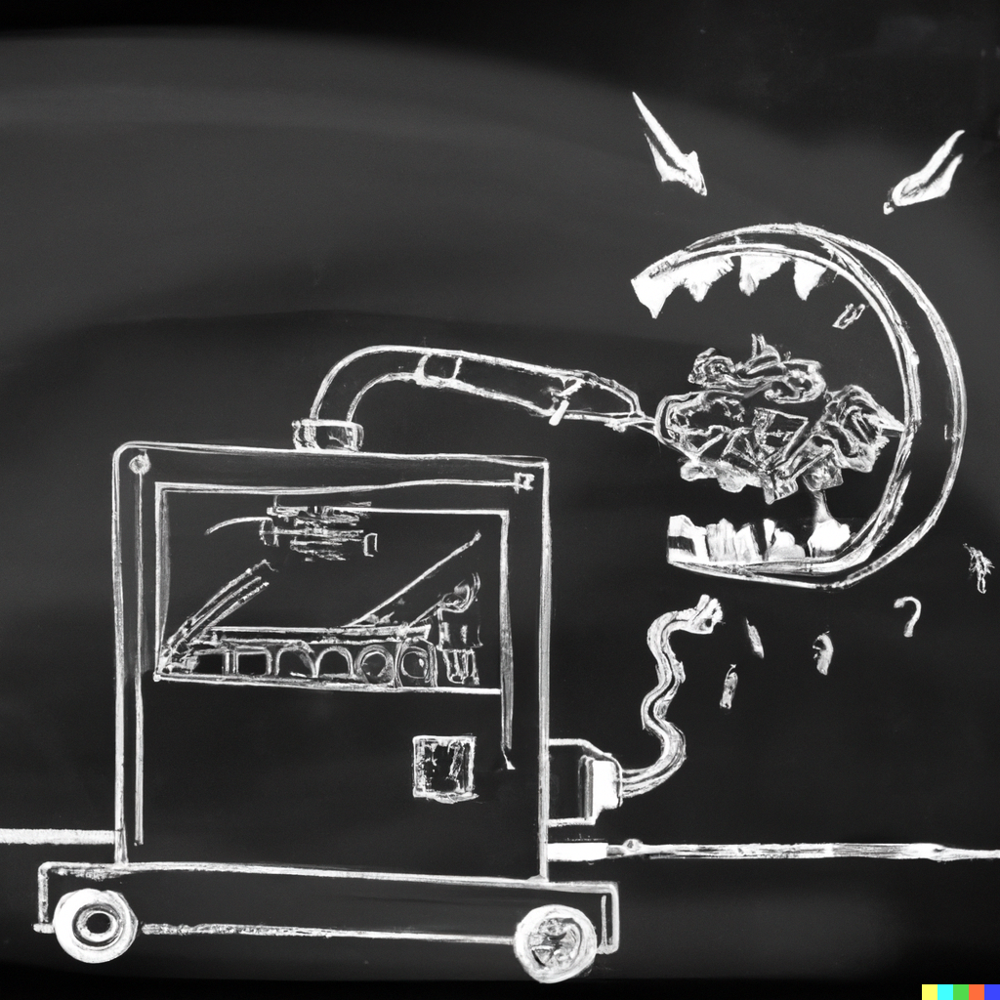

# E.A.T. now
### An international student project on ART & Technology.
#### A creative laboratory between KASK (Gent) & Technikum (Vienna) happening in 3 phases, onsite & online, in Gent & Vienna.
#### 16 & 17/11/2023 & 18 – 22/03/2024

    
Dall-e prompt: a black and white chalkboard drawing of a machine that is eating itself

Dit project is een interdisciplinaire samenwerking tussen kunststudenten van de School of Arts Ghent en technische/computer wetenschappelijke studenten van de [Universiteit voor Toegepaste Wetenschappen Technikum](https://www.technikum-wien.at/) Wenen en richt zich op het delen van kennis tussen twee contrasterende disciplines – kunst en wetenschap/technologie. Deelnemers worden uitgenodigd om samen te werken in duo’s of kleine groepen aan een creatief project op basis van gedeelde interesses en artistieke of technische vaardigheden.

Door verschillende vakgebieden samen te brengen in een kunstzinnige context, hopen we op frisse ideeën en nieuwe benaderingen die de denkrichting van beide studentengroepen verbreden. We dagen studenten uit om na te denken over hoe computercode, robotica, AI en vergelijkbare technologieën artistieke ideeën kunnen uitdrukken en benadrukken de cruciale rol van samenwerking tussen disciplines in creatieve vernieuwing. 

Dit concept is niet nieuw. Een van de meest iconische verhalen is wellicht de geschiedenis van [EAT](https://www.experimentsinartandtechnology.org/), oftewel “Experiments in Art and Technology”, opgericht in 1966 door Billy Klüver. Klüver, een ingenieur, werd benaderd door Jean Tinguely om te helpen met het project "Hommage à New York" voor het MOMA. Dit project omvatte een imposante sculptuur gemaakt van gevonden materialen die zichzelf langzaam vernietigde tijdens de openingsavond. Na dit opmerkelijke evenement vroegen andere kunstenaars, onder wie Robert Rauschenberg, Klüver om hulp bij hun projecten. Klüver nodigde vervolgens andere ingenieurs uit, en na verschillende samenwerkingen ontstond er een netwerk van kunstenaars en ingenieurs onder de naam EAT. Ons project is een knipoog naar dit historische initiatief. EAT now!
 
De workshop verloopt in 3 fases op 3 locaties en wordt geleid door Patrick Loan (Technicum) en Hendrik Leper (KASK). De voertaal is Engels.

**FASE 1 | workshop**
16 & 17/11/2023 (projectweek 1) 10:00 - 18:00
@ KASK Gent, atelier mediakunst & online voor Technicum studenten

**FASE 2  | online samenwerking met een tussentijdse presentatie in januari of februari** (datum tbc)
November ’23 tot maart ’24
@ Online

**FASE 3 | presentatie in Wenen**
18 – 22/03/2024 (projectweek 2) 
@ Ruimte in Technikum-gebouw of WEST space Wenen. 

Praktische details over de reis naar Wenen zullen snel volgen maar het is belangrijk mee te geven dat de reis op eigen kosten is. Tijdens de reis zullen we ongeveer 2 dagen werken aan de presentatie van de projecten en 2 dagen besteden aan bezoeken.

Er kunnen circa 10 studenten uit elke school deelnemen. 

Je kan kandidaat stellen voor dit project kort een kort projectvoorstel in te dienen via [dit formulier](https://forms.gle/V636eh6fcXvqSELn6) (deadline 9/11 middernacht).

