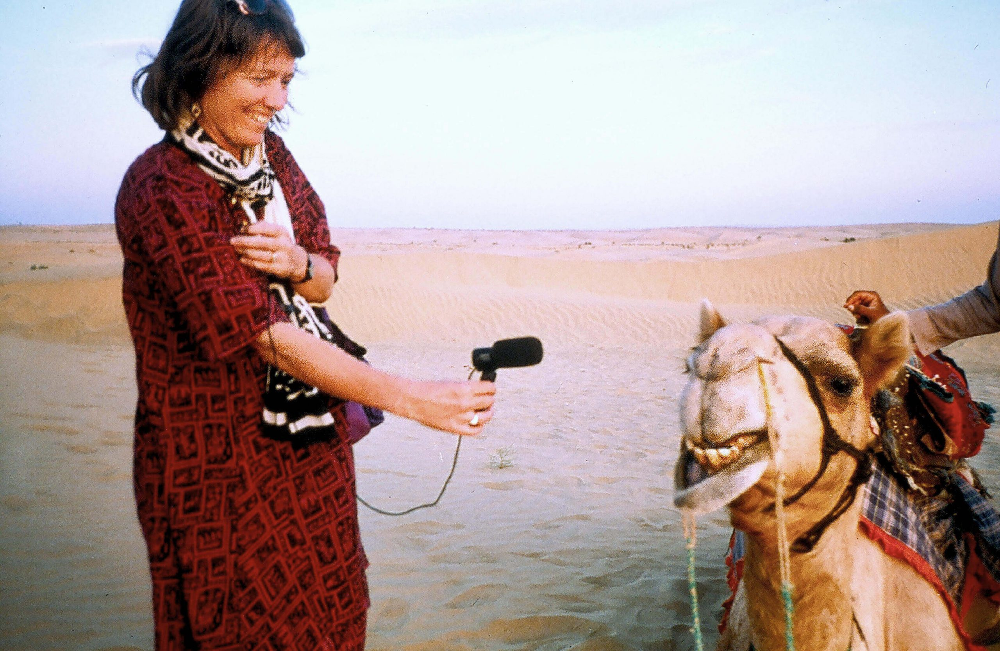

# SOUND ¢σ∂єℓαв
#### dinsdag, 24 & 31 okt 2023

> We cannot close our ears...we cannot help but hearing all sounds
> - Hildegard Westerkamp

Deze workshop in een hands-on introductie in geluid en geluidsopname en -montage technieken. We staan ook stil bij de kunst van het diep luisteren, de geschiedenis van veldopnames en de hedendaagse praktijk van componisten, muzikanten en beeld kunstenaars die met field recording werken.

    
Hildegard Westerkamp interviews a Camel 1992. Photo by Peter Grant.

## Programma
#### Les 1: EARCLEANING & FIELD RECORDING
dinsdag 24/10/23 9:00-12:30    

ear cleaning & deep listening    
technische uitleg diverse recorders en microfoons    
optioneel: korte geschiedenis van field recording    

Meebrengen: 
- een goede (bij voorkeur gesloten) hoofdtelefoon MET DRAAD (niet enkel Bluetooth) (oortjes zijn ook OK maar minder optimaal)
- eventueel audio opname materiaal dat jullie zelf ter beschikking hebben
- een SD kaart

#### Les 2: LISTENING & MONTAGE
dinsdag 31/10/23 9:30-12:30    

opnames beluisteren    
introductie reaper    
montage basics, EQ, effects    
mixen voor koptelefoon of speakers    

Meebrengen: 
- een goede (bij voorkeur gesloten) hoofdtelefoon (oortjes kan ook maar is minder optimaal)
- computer met [Reaper](https://www.reaper.fm) geinstalleerd

