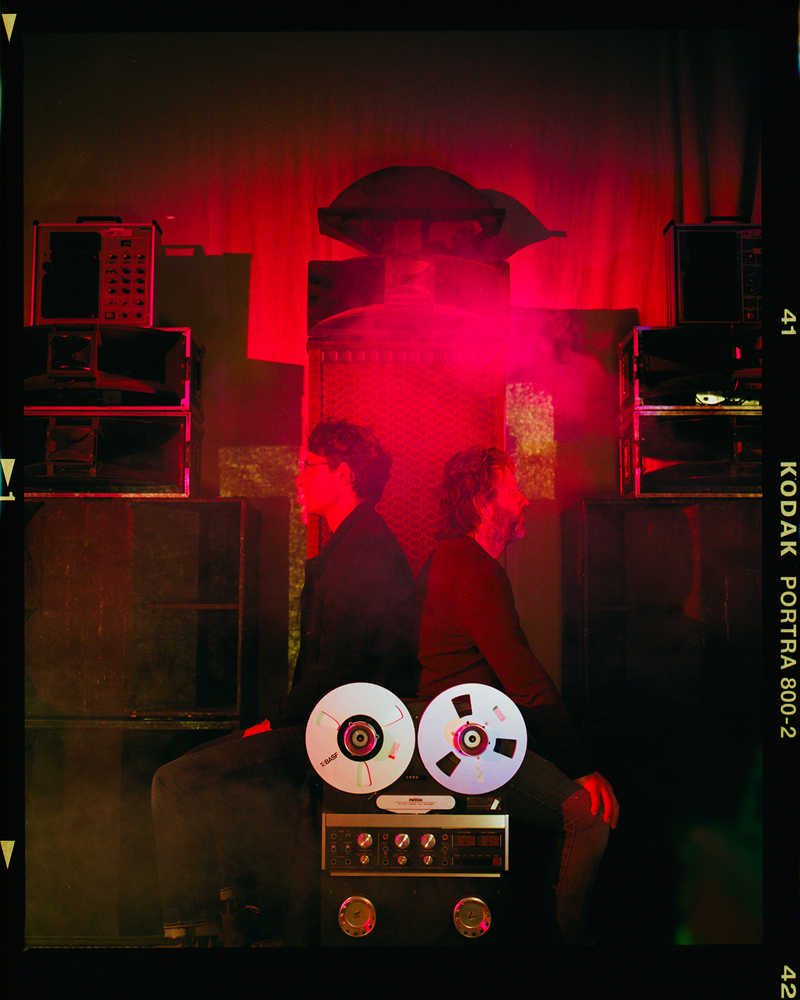

# tape/sound/world shapes world/sound/tape 
# by Het Concreet
#### 16 mrt 26 - 13 to 18h 
#### 17 & 18 mrt 26 - 10 to 18h 
#### Mediakunst Studio

===

**12 places available & open to all students** 

  

During this 3-day workshop we will investigate how magnetic tape can be used as an instrument in the context of electronic live music and sound art. We will dive deep into the use of various forms of tape, the manipulation of tape as a carrier of information and adjacent analog techniques for sound experiments.     

A temporary complete analog studio will be set up as our sonic headquarters from which we will make our surroundings, interests, and amazement audible. These sounds will be used as the starting point for a communal broadcast, using our own analog radio station, which we will build together.    

A DIY-attitude is at the core of Het Concreet’s projects, so the workshop will be highly hands-on. We encourage the contribution of your own instruments, devices, and ideas in this collaborative environment. There is but one rule: we will work without computers or digital instruments.     
    

#### Programme

*Day 1 – Monday 16/3/2026 13:00 – 18:00*    
Introduction    
Listening    
Exploration of instruments and machines    

*Day 2 – Tuesday 17/3/2026 10:00 - 18:00*     
The longest tape loop ever made    
Further exploration of instruments and machines    
Creative networks: how we are all connected     
First test with our broadcast system    

*Day 3 – Wednesday 18/3/2026 10:00 - 18:00*    
Finetuning our broadcast system    
Curation of materials & assemblage of broadcast    
Public live broadcast & performance at 17:00.    

#### Do you want to participate?

We’re seeking 12 students from diverse disciplines with an open, active mindset. No experience with tape or electronics is needed — curiosity and a willingness to experiment matter most. We work beyond fixed roles; everyone is composer, performer, and producer, sharing responsibility. Full availability for all 3 days is required.    

To apply, email hendrik.leper@hogent.be a brief note about your education and your motivation for joining. You’ll be notified by email.     
Deadline to apply: 6/3/2026.    

#### Het Concreet

[Het Concreet](https://hetconcreet.com/) is a Tilburg based sound collective committed to working with analog electronic instruments. The physical and technical nature of analog interfaces — tape, circuit boards, mixing desks — challenges us to rethink how we compose, collaborate, and generate material.    

Artistic practices are defined by and formed through the instruments we choose to work with. We strongly feel it is important to question the conditions that these devices impose on us. Through artistic research, we develop a practice that is both critical and constructive towards analog electronics as compositional tools.    

