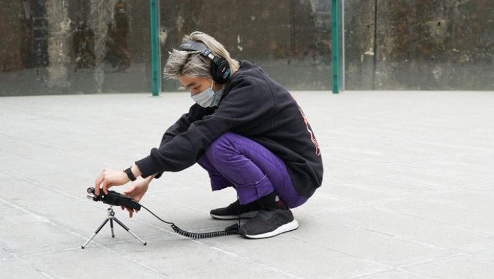
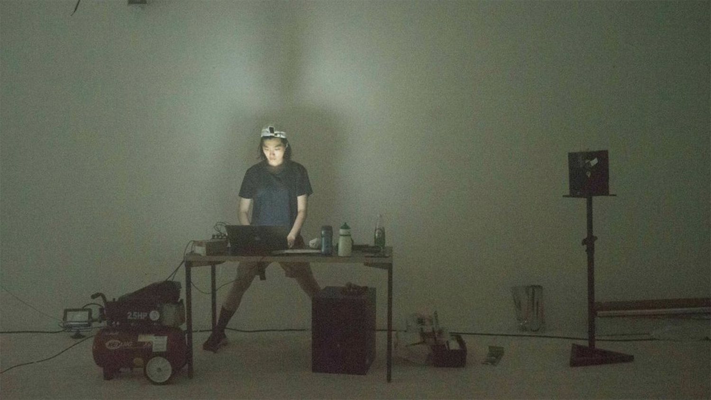

# Into Thin Air
### met Mint Park
#### maandag 17 tem zondag 23 oktober
#### bij Musica & Dommelhof in Pelt

Een intensieve 6-daagse workshop met de internationaal bekende klankkunstenaar Mint Park, in het kader van OORtreders Festival 2022. De deelnemers werken ter plekke in Het Klankenbos rond klankkunst in de publieke ruimte, met het geluid van ‘lucht’ als centraal thema.    

    

SITE SPECIFICS 2022 legt de focus op lucht en het klanklandschap in relatie tot site-specifieke klankcreatie in de omgeving van Het Klankenbos. In groep ontwikkelen de deelnemers verschillende methodieken en werkwijzen om de onzichtbare texturen bloot te leggen die ontstaan door wind en luchtverschuivingen. Tegelijkertijd wordt uitgezoomd op de ruimere klankstructuren in de omgeving, waar mens en natuur naast elkaar staan.    

De deelnemers creëren luisteroefeningen, maken field recordings en bouwen kleine instrumenten om specifieke patronen te onderscheiden of kenmerken in het geluidslandschap van de omgeving te ontwaren. Op die manier krijgen ze de kans om de steeds veranderende relatie tussen de verschillende omgevingsgeluiden aan te wenden als een startpunt voor site-specifieke klankcreatie.    

De workshop werkt toe naar een publieke presentatie op zondagvoormiddag 23 oktober als onderdeel van het [OORtreders festival](http://www.oortreders.com/).

[Mint Park](http://mintpark.net/) is een elektronische muzikant en nieuwe media kunstenaar, oorspronkelijk afkomstig uit Zuid-Korea en gevestigd in Amsterdam. Haar geluidsgedreven praktijk onderzoekt ruimte, textuur en natuurlijke fenomenen. Ze is geïnteresseerd in tussenfases en tussenvormen, in de ambiguïteit en het ambivalente. Haar werk neemt vaak de vorm aan van elektronische muziek, audiovisuele installaties en performances en het ontwerp van interfaces of instrumenten.

Links naar de [Syllabus](syllabus.pdf) met details van de workshop doelstellingen, [ voorgesteld lees- en luistermateriaal](https://www.dropbox.com/scl/fo/mabuldl6qiju33bbnlpa5/h?dl=0&rlkey=f1qt0xlecxgxhgrtw18v08khq).
