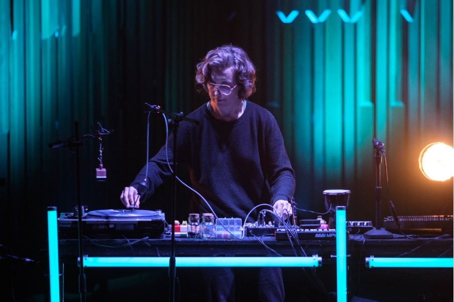

#  Masterclass with Kate Carr
#### Friday, February 21, 10:30 to 12:00 
#### Black Box Media Art Studio

We are excited to invite you to an exclusive masterclass with renowned artist and musician Kate Carr. This inspiring session will take place on Friday, February 21, from 10:30 in the Black Box of the Media Art Studio.    

During the masterclass, [Kate Carr](https://www.gleamingsilverribbon.com/) will provide a unique insight into her artistic journey, sharing stories about her creative work, artistic process, and the evolution she has experienced as both a musician and sound artist. This is a valuable opportunity to engage with an internationally respected creative voice and gain inspiration for your own projects.    
 

Playing at the Barbican in February 2022 Photo: Dmitri Duric.

**Kate Carr** is a sound artist and musician whose work explores the intersection between sound, place, and environment. With a deep fascination for the sonic textures of landscapes, her compositions often blend field recordings and ambient music to craft immersive auditory experiences. Her work has been exhibited and performed worldwide, and she runs the influential label Flaming Pines, which supports experimental sound art projects.    

Don't miss this opportunity! Please announce your participation by mail to hendrik.leper-at-hogent.be     

Prior to this masterclass, there will be [a listening session with Kate Carr](https://schoolofartsgent.be/en/agenda/kate-carr) on Thursday 20/2 [at the Herculeslab](https://schoolofartsgent.be/en/locations/herculeslab) from 16:00 organized by the research cluster [The Art of Resonance – The Resonance of Art](https://schoolofartsgent.be/onderzoek/clusters/the-art-of-resonance-the-resonance-of-art).    
    
