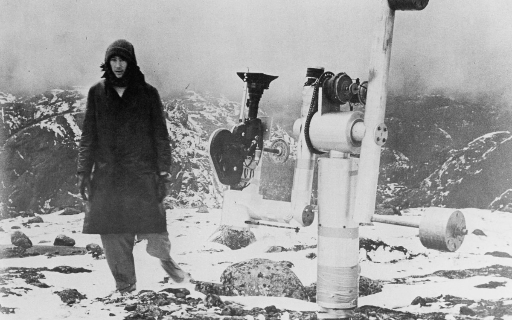
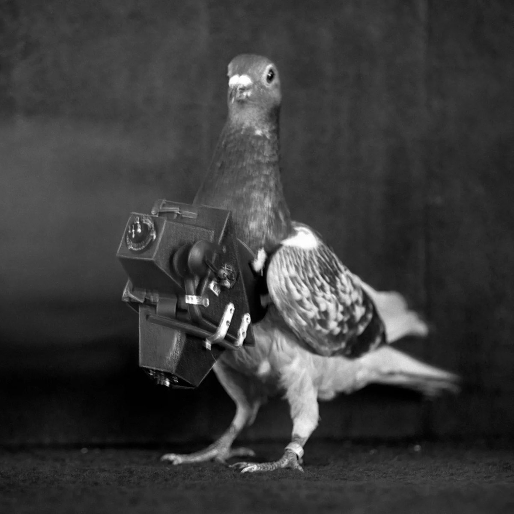

# La Région Centrale
### film van Michael Snow op 16mm op groot scherm
#### 16/11/2022 17:00 - 20:00 Zwarte Zaal

La Région Centrale is een monument in de filmgeschiedenis. Het is de eerste lange film waarin we de wereld zien aan de hand van shots die niet gebaseerd zijn op onze alledaagse manier van kijken. De film werd in 1971 gerealiseerd door Michael Snow, is 180 minuten lang, in 24 uur opgenomen met een robotarm en bestaat volledig uit voorgeprogrammeerde bewegingen.
Je zou kunnen zeggen dat Snow's film gaat over de wereld gezien door het oog van een vlieg. Of je zou kunnen zeggen dat de film gaat over de wereld gezien door Snow's lichaamloze oog, zwevend in een landschap. Of dat het gaat over de wereld gezien vanuit de patrijspoort van een ruimteschip. De film is vooral belangrijk omdat hij onze perceptie en waardering van de wereld en van andere films kan veranderen.

De film wordt ingeleid door een brief die Michael Snow speciaal voor de gelegenheid schreef.

*16mm, z/w, stereo, CA, 1971, 180’ Projectie: Els Van Riel.*

# La Région Péripherique
### workshop onder begeleiding van Anouk De Clercq & Elias Heuninck
#### 17-18/11/2022 10:00 - 17:00 Zwarte Zaal

Met de film van Michael Snow als uitgangspunt, organiseren Anouk De Clercq en Elias Heuninck een tweedaagse workshop waarbij we film op een avontuurlijke manier benaderen. Hoe kan een film worden gemaakt waarin de camera het menselijk oog niet nabootst? Hoe kan een film worden gemaakt die lijkt op iets wat de kijker nog nooit heeft gezien? Hoe kan een film worden gemaakt die niet gebaseerd is op de gewone manier waarop de mens de wereld ziet?

Aan de hand van films, filmfragmenten en experimenten met verschillende tools (touw, plakband, camera’s, robotarm,...) proberen we op de meest vrije manier deze vragen te beantwoorden. Als de camera niet langer een verlenging van het lichaam is maar een zelfstandige sonde, dan leren we een nieuwe beeldtaal kennen.

Studenten kunnen zich inschrijven voor de workshop tot en met 11/11 via mail naar hello@mediakunst.be

*Een initiatief van Atelier Mediakunst in samenwerking met KASKcinema en Zwarte Zaal.*
