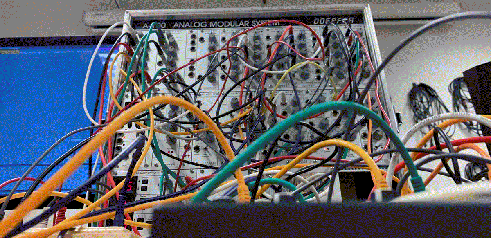

#  Modulaire Synthese ¢σ∂єℓαв
#### donderdag 23 + 28/29/30 nov 2023

Tijdens dit codelab zal je leren werken met modulaire synthesizers. Een modulaire synthesizer is, in het kort uitgelegd, een elektronisch muziekinstrument dat bestaat uit een groot aantal verschillende componenten of modules, die met elkaar worden verbonden door het gebruik te maken van (patch)kabels, schakelaars, schuifregelaars of patchpanelen.    

We starten in groep met het aanleren van de basisprincipes in [VCV-rack](https://vcvrack.com/), een virtuele softwareversie van een eurorack synth waarmee je verschillende modules van verschillende merken aan elkaar kan patchen. VCV-rack software is gratis, open-source en is makkelijk te installeren op je computer. Aangezien iedereen over een computer beschikt leek dit ons de meest geschikte optie om jullie hands-on kennis te laten maken mat modulaire synthese.    

Tijdens een 2e les in kleinere groepen leer je werken met de synths & modules die we in het atelier hebben als het [Doepfer A-100](https://doepfer.de/a100e.htm) system, de [Make Noise O-CTRL](https://www.makenoisemusic.com/synthesizers/ohctrl), [Strega](https://www.makenoisemusic.com/synthesizers/strega), [O-COAST](https://www.makenoisemusic.com/synthesizers/ohcoast) en de [Field Kits van Koma Elektronik](https://koma-elektronik.com/?product=field-kit).    

Dit codelab is voor iedereen die graag kennis wil maken en een breder perspectief wil krijgen over hoe je elektronische klank en muziek kan genereren en kan toepassen in de eigen praktijk.    

De workshop wordt begeleid door MFA student (Vincent Van Asten)[https://www.instagram.com/vanastenvincent/].

## PLANNING
### Lab 1 – Introductie Modulaire Synthese & hands-on met VCV rack
**donderdag 23/11 17:00-20:00**    
**Mezzanine**    
Voor de volledige groep
Installeer VCV-rack op je computer, maak een account aan en breng een degelijke koptelefoon mee (desnoods uit de uitleen).
### Lab 2 – Setup, Patching, Recording
**dinsdag 28/11 17:00-20:00**    
  of    
**woensdag 29/11 17:00-20:00****    
  of    
**donderdag 30/11 17:00-20:00****   
**Soundlab**    
Er kunnen per sessie 5 studenten deelnemen. Schrijf je in voor één van deze momenten via [dit document](https://hogent-my.sharepoint.com/:x:/g/personal/hendrik_leper_hogent_be/EZK3rZFIB4lMmpIjNmJE_BYBYTm-xWSAr3NNskOVjyy0jg?e=YoFGBI).

## INSPIRATIE
* Documentaire [Sisters with Transistors](https://sisterswithtransistors.com/) ([hier](https://www.youtube.com/watch?v=lQPwPE567vI) te bekijken op YT)
*	Playlist [Pioneers of electronic Music](https://open.spotify.com/playlist/37i9dQZF1DWYnq334ufGOA) op Spotify
*	An immersive online exhibition from Google Arts & Culture [Music, Makers & Machines](https://artsandculture.google.com/project/music-makers-and-machines) which celebrates the history of electronic music: its inventors, artists, sounds and technology.
*	[RUISKAMER](https://miryconcertzaal.be/category/ruiskamer/) Een concertreeks van 404 en MIRY Concertzaal (gratis voor KASK studenten mits reservatie)
* ...

## RESOURCES
Via [deze link](https://drive.google.com/drive/folders/1mD1EzkQOcfE2qYcDqIJL41qFatjA-eoM?usp=drive_link) vind je verschillende patches die getoond zijn tijdens de eerste sessie. In de map vind je simpele en complexere patches.    
Via [deze site](https://patchstorage.com/platform/vcv-rack/) kan je nog meer patches downloaden.    
Indien je geïnteresseerd bent in complexere synthese kan je ook een paar tutorials bekijken dat je vindt op youtube, bijv. deze reeks [Let's learn the basics of modular synthesis using the free VCV Rack software](https://www.youtube.com/playlist?list=PLcaEIjiwaCmTpG7i5Gm5jro0M6kXtl-zt)    
Tijdens de workshop hebben we vooral gewerkt rond subtractieve synthese maar er bestaan ook andere types zoals wavetable, fm en additieve synthese. Dit zijn andere manieren voor interessante geluiden te ontwikkelen, die veel gebruikt worden.